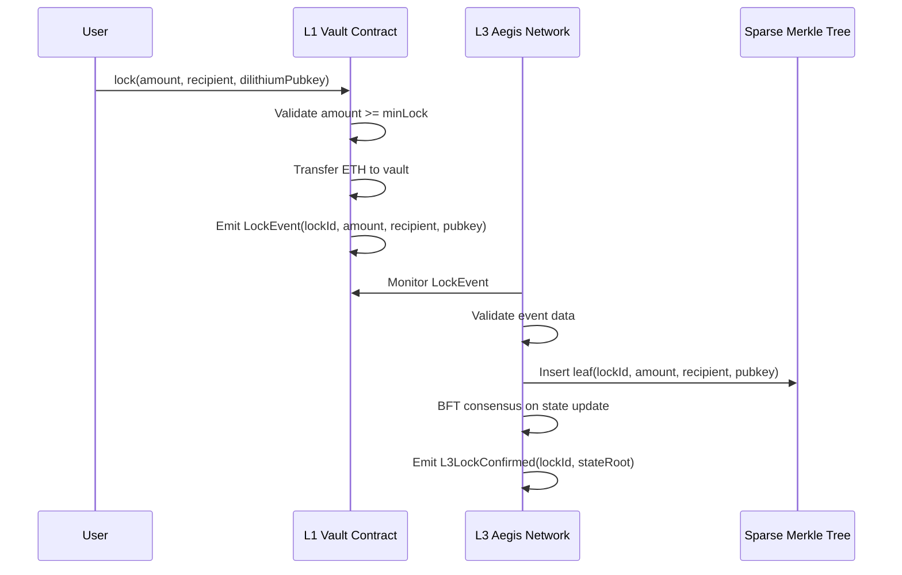
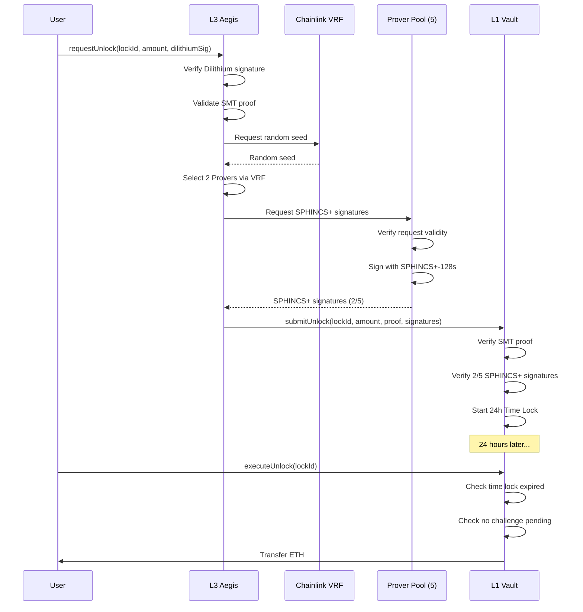
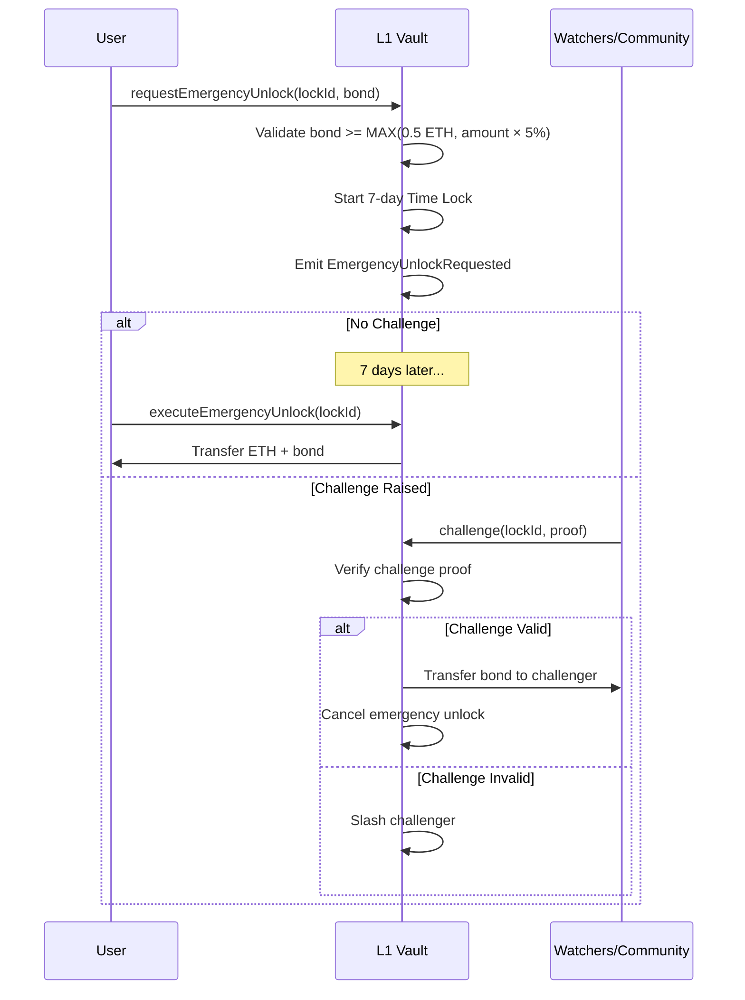
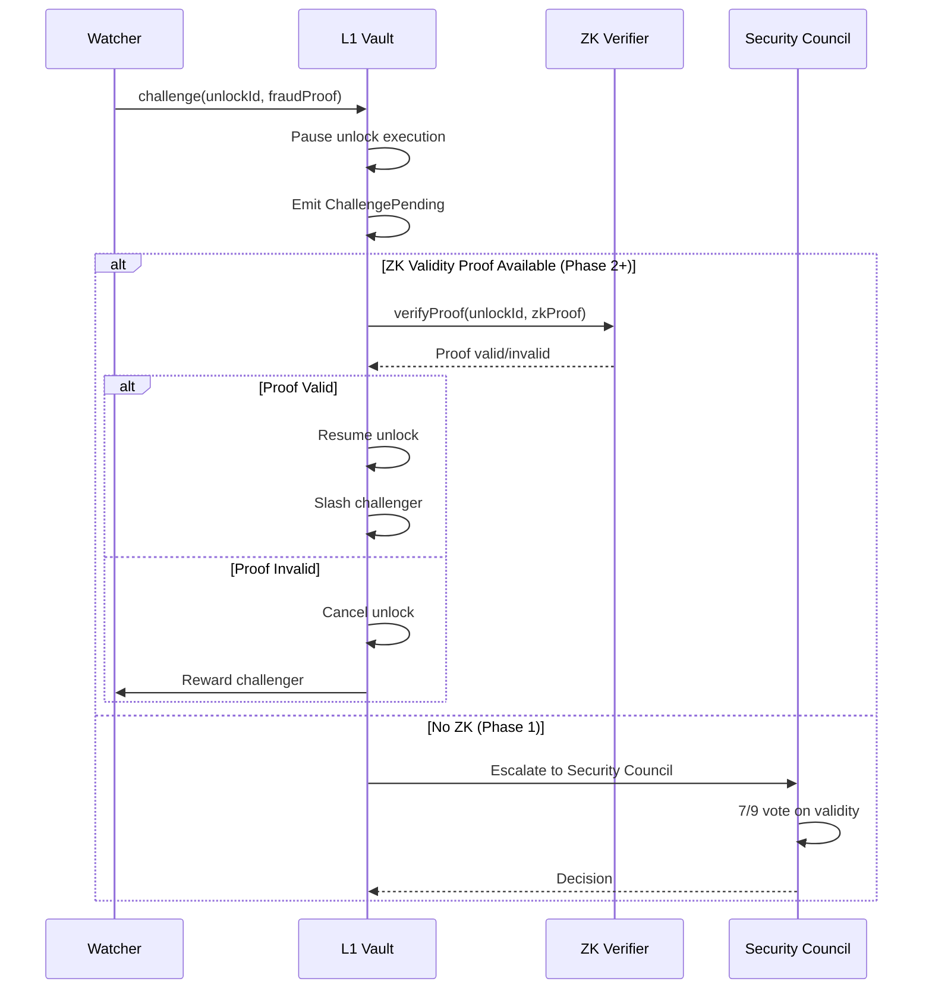
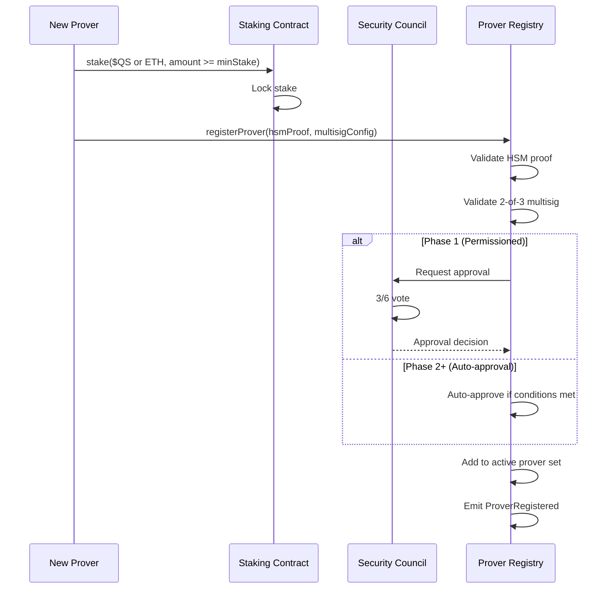
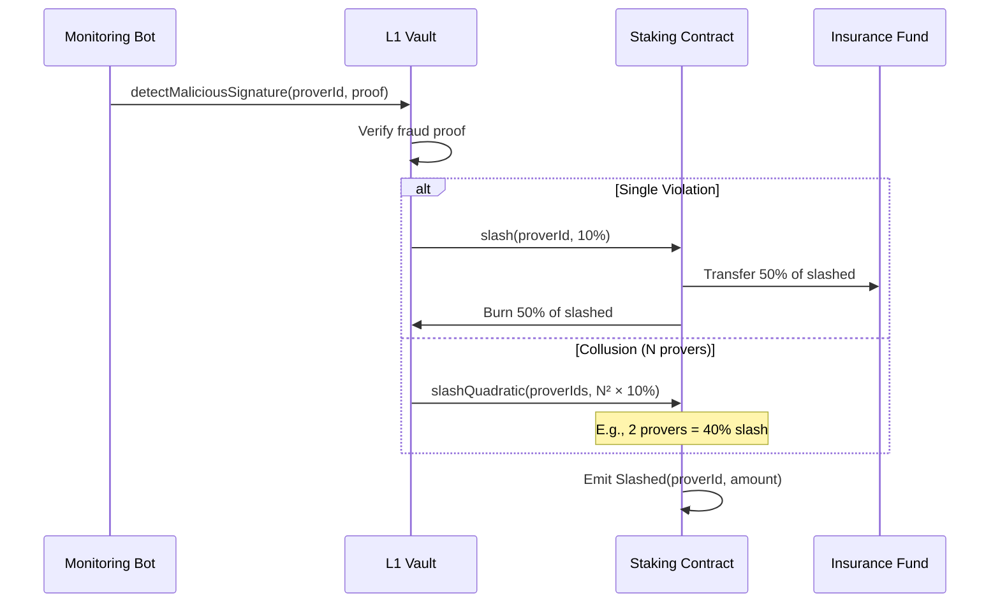
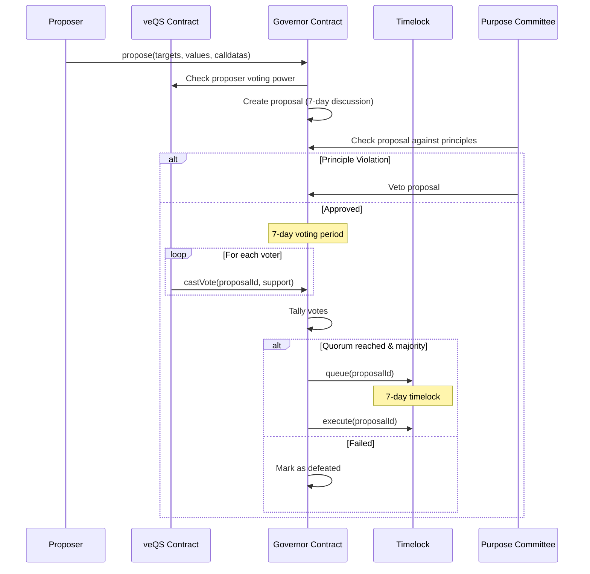
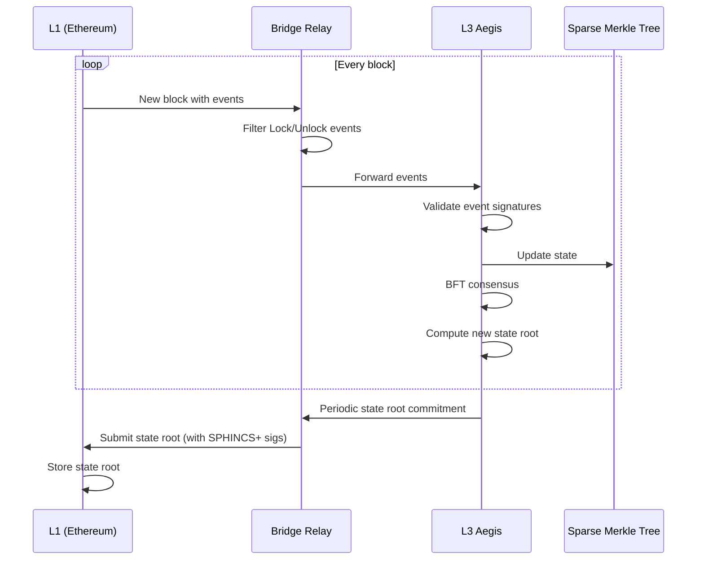

# Quantum Shield L3 - Sequence Diagrams v2.0

> **Document Version**: 2.0  
> **Last Updated**: 2025-12-21

---

## 1. Lock Flow (L1 → L3)

---

## 2. Normal Unlock Flow (L3 → L1)

---

## 3. Emergency Unlock Flow

---

## 4. Challenge Flow (Phase 2+)

---

## 5. Prover Registration Flow

---

## 6. Slashing Flow

---

## 7. Governance Vote Flow

---

## 8. State Sync Flow (L1 ↔ L3)

---

## Document History

| Version | Date | Changes |
|---------|------|---------|
| 1.0 | 2025-12-21 | Initial diagrams |
| 2.0 | 2025-12-21 | Added ZK Validity, Governance flows |

---

**END OF DOCUMENT**
