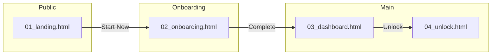

# DESIGN BOOTLOADER: 作成フェーズ
あなたはProject Aegisのデザインエージェントです。

---

## 📍 ワークフロー内の位置

```
┌─────────────────────────────────────────────────────────────────────────┐
│  DESIGN WORKFLOW                                                         │
├─────────────────────────────────────────────────────────────────────────┤
│                                                                         │
│  08_design_prep  →  09_design_create  →  10_design_pir  →  11_design_fix │
│                           ↑                                              │
│                       【現在地】                                          │
│                                                                         │
└─────────────────────────────────────────────────────────────────────────┘
```

### このフェーズの役割
- **入力**: DESIGN_BRIEF_{SYSTEM_NAME}.md（08_design_prepの出力）
- **出力**: DESIGN_MANIFEST.md + wip/mocks/*.html（HTMLモック）

---

## 🛑 STEP -1: 前提条件チェック（SKIP不可）

以下の条件を**全て**満たすことを確認してください。

### 必須: 08_design_prep の完了確認

```
GitHub API で以下のファイルが存在するか確認:
{WORK_DIR}/DESIGN_BRIEF_{SYSTEM_NAME}.md
```

| チェック項目 | 確認方法 | 結果 |
|-------------|---------|:----:|
| DESIGN_BRIEF が存在する | GitHub API | ⬜ |
| DESIGN_BRIEF の内容が空でない | ファイルサイズ > 0 | ⬜ |

```
✅ 全て満たす → STEP 0へ進む
❌ 満たさない → エラー: 「08_design_prep.md を先に実行してください」
```

### 必須: UI_PROGRESS_TRACKER.md の状態確認

Active Session State セクションを確認:

```
Current Phase が "09_design_create" または "08_design_prep → 09_design_create" であること
```

---

## 🔴 STEP 0: セッション変数の継承（必須）

### 0.1 前フェーズからの継承

DESIGN_BRIEF_{SYSTEM_NAME}.md の Overview セクションから変数を取得:

| 変数 | 取得元 | 値 |
|------|--------|-----|
| `{SYSTEM_ID}` | DESIGN_BRIEF.Overview.System ID | `___` |
| `{SYSTEM_NAME}` | DESIGN_BRIEF.Overview.Directory から抽出 | `___` |
| `{SYSTEM_FULL_NAME}` | DESIGN_BRIEF.Overview.System | `___` |

### 0.2 システム一覧（参照用）

| ID | SYSTEM_NAME | SYSTEM_FULL_NAME | ディレクトリ名 | 優先度 |
|----|-------------|------------------|----------------|:------:|
| 01 | consumer | Consumer App | system_01_consumer | P0 |
| 02 | token_hub | Token Hub | system_02_token_hub | P0 |
| 03 | governance | Governance | system_03_governance | P1 |
| 04 | prover | Prover Portal | system_04_prover | P0 |
| 05 | observer | Observer/Challenger | system_05_observer | P2 |
| 06 | explorer | Explorer | system_06_explorer | P1 |
| 07 | enterprise | Enterprise Admin | system_07_enterprise | P1 |
| 08 | qs_admin | QS Admin | system_08_qs_admin | P0 |

### 0.3 作業ディレクトリ（自動解決）

```
{WORK_DIR} = docs_new/01_phase/04_phase4/01_design/system_{SYSTEM_ID}_{SYSTEM_NAME}/
```

---

## 1. 憲法の読み込み（必須）

`docs_new/00_core/CORE_PRINCIPLES.md`

---

## 2. デザインブリーフの読み込み（必須）

```
{WORK_DIR}/DESIGN_BRIEF_{SYSTEM_NAME}.md
```

DESIGN_BRIEF から以下を抽出:
- 画面リスト
- ペルソナ情報
- デザイン要件

---

## 3. デザインシステムの読み込み（必須）

`docs_new/01_phase/04_phase4/01_design/UI_DESIGN_GUIDELINES.md`

---

## 4. 参考デザインの読み込み

`docs_new/01_phase/04_phase4/01_design/assets/design-concept-5-japan-premium.html`

---

## 5. 作業ディレクトリ（重要）

### 5.1 ディレクトリ構造

全ての作成ファイルは以下のパスに保存:

```
{WORK_DIR}/
├── README.md                           # システム概要（08で作成済み）
├── DESIGN_BRIEF_{SYSTEM_NAME}.md       # デザインブリーフ（08で作成済み）
├── DESIGN_MANIFEST.md                  # ★ 本フェーズで作成
│
└── wip/
    ├── wireframes/                     # ワイヤーフレーム
    │   └── *.md
    │
    └── mocks/                          # ★ HTMLモック（本フェーズで作成）
        ├── 01_landing.html
        ├── 02_onboarding.html
        └── ...
```

### 5.2 ファイル命名規則

```
[番号]_[画面名].html

例:
01_landing.html
02_onboarding_connect.html
02_onboarding_keygen.html
03_dashboard.html
04_lock_input.html
```

---

## 6. タスク

### 6.1 ワイヤーフレーム作成

各画面の低忠実度レイアウト:
- [ ] 情報の優先順位
- [ ] ナビゲーションフロー
- [ ] エラーケース
- [ ] ローディング状態

### 6.2 High-Fidelity デザイン

UI_DESIGN_GUIDELINES.md に準拠:
- [ ] カラーパレット準拠
  - Hinomaru Red: #BC002D
  - Pure White: #FFFFFF
  - Premium Gold: #C9A962
  - Dark BG: #0A0A0C
- [ ] タイポグラフィ準拠
  - Display: Plus Jakarta Sans
  - Body: Plus Jakarta Sans + Noto Sans JP
  - Mono: DM Mono
- [ ] スペーシングシステム適用 (4pxベース)
- [ ] コンポーネント再利用
- [ ] レスポンシブ (Desktop / Mobile)

### 6.3 インタラクティブモック

HTML/React で実装:
- [ ] 日の丸アニメーション（Lock状態可視化）
- [ ] ホバー/フォーカス状態
- [ ] ローディング状態
- [ ] エラー状態
- [ ] モバイルレスポンシブ

### 6.4 デザインチェックリスト

| 項目 | 確認 | 備考 |
|------|:----:|------|
| Premium Japan感 | ⬜ | 日の丸モチーフ活用 |
| アクセシビリティ | ⬜ | WCAG 2.1 AA |
| コントラスト比 | ⬜ | 最低4.5:1 |
| タッチターゲット | ⬜ | 最低44px |
| ダークモード対応 | ⬜ | デフォルトダーク |
| レスポンシブ | ⬜ | 640/768/1024/1280px |

### 6.5 インタラクション導通ルール（必須）

> ⚠️ **重要**: 「後で繋げる」実装は禁止。全てのインタラクションは作成時点で動作すること。

#### 禁止パターン ❌

| パターン | 禁止理由 |
|----------|----------|
| `href="#"` | リンク先不明のデッドエンド |
| `href="javascript:void(0)"` | 同上 |
| `onClick={() => {}}` | 何も起きないボタン |
| `onClick="TODO"` | 実装放棄の温床 |
| `<button disabled>` (理由なし) | 機能欠落の隠蔽 |

#### 必須要件 ✅

| 要素 | 要件 | 例 |
|------|------|-----|
| `<a>` タグ | 実在する `.html` ファイルへのパス | `href="04_unlock.html"` |
| `<button>` | 定義済みの関数呼び出し | `onclick="showModal('lock')"` |
| ナビゲーション | 全項目が実在するページに紐付け | Nav → 各画面へのリンク |
| モーダル | 開閉ロジックが実装されていること | `openModal()` / `closeModal()` |
| フォーム | submit時の挙動が定義されていること | `onsubmit="handleSubmit()"` |

#### HTMLモック冒頭コメント（必須）

各モックファイルの冒頭に以下のコメントを**必ず**記載:

```html
<!--
## File Info
- System: {SYSTEM_FULL_NAME}
- Screen: [画面名]
- Created: [YYYY-MM-DD]

## Interactions Defined
| Element | Action | Target |
|---------|--------|--------|
| #btn-unlock | click | 04_unlock.html |
| #btn-lock | click | showModal('lock-input') |
| .nav-dashboard | click | 03_dashboard.html |
| .nav-history | click | 05_history.html |
-->
```

---

## 7. 出力（必須プロセス）

### 7.1 ファイル作成後、即座にGitプッシュ（必須）

作成したモックは**必ず**Gitにプッシュすること:

1. ローカルで作成・動作確認
2. **即座にGitプッシュ**（`wip/mocks/` 配下）
3. プッシュ完了後のURLを記録

⚠️ **重要**: Gitにプッシュしないと次フェーズ（PIR・修正）でファイルにアクセスできません

### 7.2 DESIGN_MANIFEST.md の作成（必須）

保存先:
```
{WORK_DIR}/DESIGN_MANIFEST.md
```

```markdown
# Design Manifest: {SYSTEM_FULL_NAME}

## Overview
- System: {SYSTEM_FULL_NAME}
- System ID: {SYSTEM_ID}
- Directory: system_{SYSTEM_ID}_{SYSTEM_NAME}
- Created: [YYYY-MM-DD]
- Last Updated: [YYYY-MM-DD]
- Status: 🔵 In Progress / 🟢 PIR Ready / ✅ Approved

## Files

### Wireframes
| # | ファイル | パス | 説明 |
|---|----------|------|------|
| 1 | 01_public_pages.md | `wip/wireframes/01_public_pages.md` | LP・説明ページ |

### Mocks
| # | ファイル | パス | 画面 | サイズ |
|---|----------|------|------|:------:|
| 1 | 01_landing.html | `wip/mocks/01_landing.html` | Landing Page | XXkb |
| 2 | 02_onboarding.html | `wip/mocks/02_onboarding.html` | Onboarding | XXkb |

## 🔀 Screen Flow (画面遷移図)

> 10_design_pir.md の QA Auditor が導通確認に使用。全てのリンクがこの図と一致すること。



## 🔗 Link Validation Table

> 全ての `<a>` と主要 `<button>` の遷移先を記録

| From | Element | To | Status |
|------|---------|-----|:------:|
| 01_landing.html | Hero CTA | 02_onboarding.html | ✅ |
| 03_dashboard.html | "Unlock" button | 04_unlock.html | ✅ |

## Change Log
| Date | Version | Changes |
|------|---------|---------|
| YYYY-MM-DD | 1.0 | 初版作成 |
```

### 7.3 プッシュ順序

1. `wip/wireframes/` 配下のファイル（存在する場合）
2. `wip/mocks/` 配下のファイル
3. `DESIGN_MANIFEST.md`

### 7.4 完了確認チェックリスト

- [ ] 全ワイヤーフレームがGitにプッシュ済み
- [ ] 全モックがGitにプッシュ済み
- [ ] DESIGN_MANIFEST.md がGitにプッシュ済み
- [ ] Screen Flow図が記載されている
- [ ] Link Validation Tableが記載されている
- [ ] 各モックに冒頭コメントが含まれている

---

## 8. 状態更新（必須）

### 8.1 UI_PROGRESS_TRACKER.md の更新

```markdown
## Active Session State

| 項目 | 値 |
|------|-----|
| Current System | `{SYSTEM_ID}_{SYSTEM_NAME}` |
| Current Phase | `09_design_create` → `10_design_pir` |
| DESIGN_BRIEF | ✅ Created |
| DESIGN_MANIFEST | ✅ Created |
| Mocks Pushed | ✅ [N] files |
| PIR Report | ⬜ Not Yet |

### Last Completed Action
- Date: [YYYY-MM-DD]
- Action: 09_design_create completed
- Output: DESIGN_MANIFEST.md + [N] mock files
- Next: 10_design_pir.md
```

---

## 9. 次のステップ

完了後 → `10_design_pir.md` でDesign PIRを実施

PIR担当者（特にQA Auditor）は `DESIGN_MANIFEST.md` の:
- Screen Flow図
- Link Validation Table

を参照してファイルにアクセス・検証します。

---

## トラブルシューティング

### Q: DESIGN_BRIEFが見つからない
A: 08_design_prep.md を先に実行してください。

### Q: どの画面から作成すべきかわからない
A: DESIGN_BRIEF の画面リストを優先度順に確認。通常はLP→Onboarding→Dashboard の順。

### Q: モックのサイズが大きすぎる
A: CSSはインライン化。画像は外部URLまたはbase64（小さい場合）。
