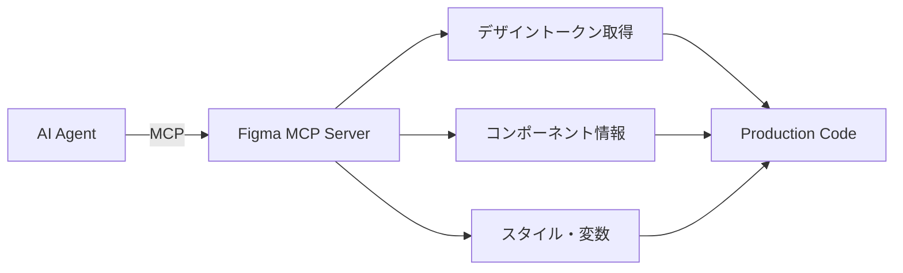

# AI Agentic UI/UX 開発・テスト 世界最高峰手法リサーチ

> **Date**: 2026-01-14
> **Purpose**: AI Agenticシステムを活用したUI/UX開発・テストの最先端手法調査
> **Scope**: 設計 → 実装 → テスト → 品質保証の全フェーズ

---

## Executive Summary

2025-2026年のUI/UX開発は「Agentic AI」へのパラダイムシフトが進行中。
単一AIアシスタントから、複数AIエージェントが協調して開発・テストを自動化する
「Multi-Agent Workflow」が世界最先端の手法として確立されつつある。

### 主要な変化

| 従来 | 2025-2026 |
|------|-----------|
| 単一AIアシスタント | Multi-Agent Team |
| プロンプトベース | ツール使用+推論+行動 |
| 人間がコード生成 | AIが生成→人間がレビュー |
| 手動テスト作成 | AI自動テスト生成+自己修復 |
| 静的デザインシステム | 動的トークン自動管理 |

---

## 1. Design Phase: デザインからコードへ

### 1.1 Generative UI（生成的UI）

2025年最も変革的なトレンドは**Generative UI**。
AIエージェントがユーザーの目的に応じてUIを動的に生成する。

**主要ツール:**

| ツール | 特徴 | 出力 |
|--------|------|------|
| [Vercel v0](https://v0.app/) | 自然言語→React/Next.js/Tailwind | Production-ready code |
| [Figma Make](https://www.figma.com/solutions/ai-design-systems-generator/) | プロンプト→インタラクティブアプリ | Figma + Code |
| [Builder.io](https://www.builder.io/figma-to-code) | Figma→React/Vue/Svelte | Component code |
| [Anima](https://www.animaapp.com/) | Design→Production code | React/HTML |

**Vercel v0の革新:**
- 自然言語プロンプト → 完全動作するReactアプリ
- **Agentic能力**: 調査、推論、デバッグ、計画を自律的に実行
- Claude最適化モデルでコード生成
- shadcn/ui + Tailwind CSS標準出力

```
ユーザー: "ダッシュボードに量子耐性ロックの状態を表示したい"
↓
v0: React + shadcn/ui + Tailwindで完全実装を生成
↓
GitHub連携 → 即座にVercelデプロイ
```

### 1.2 Figma MCP Server（Model Context Protocol）

[Anthropic開発のMCP](https://www.figma.com/blog/design-systems-ai-mcp/)により、AIエージェントがFigmaと直接連携。

**MCP Serverの機能:**



**デザインシステムルール自動生成:**
- コードベースをスキャン → 構造化ルールファイル出力
- トークン定義、コンポーネントライブラリ、命名規則を自動抽出
- エージェントがこのルールに従ってコード生成

### 1.3 Design Token自動化

[Tokens Studio](https://tokens.studio/)や[UXPin AI](https://www.uxpin.com/studio/blog/how-ai-automates-design-tokens-in-the-cloud/)による自動トークン管理。

**AI自動化の範囲:**
- FigmaファイルからToken自動抽出
- セマンティック命名（`primary-action`, `success-state`）
- 変更検出 → リポジトリ・パイプライン自動更新
- **手作業50%削減**

---

## 2. Development Phase: Multi-Agent Workflow

### 2.1 Coding Agent Teams

[InfoWorld](https://www.infoworld.com/article/4035926/multi-agent-ai-workflows-the-next-evolution-of-ai-coding.html)によると、単一エージェントから**チームエージェント**への移行が進行中。

**エージェントチーム構成例:**

```
┌─────────────────────────────────────────────────────┐
│                   Team Lead Agent                    │
│         (人間からの指示を受け、タスクを委任)          │
└─────────────────────────────────────────────────────┘
                          │
       ┌──────────────────┼──────────────────┐
       ▼                  ▼                  ▼
┌─────────────┐   ┌─────────────┐   ┌─────────────┐
│  Frontend   │   │  Backend    │   │  Test       │
│  Agent      │   │  Agent      │   │  Agent      │
└─────────────┘   └─────────────┘   └─────────────┘
       │                  │                  │
       ▼                  ▼                  ▼
┌─────────────┐   ┌─────────────┐   ┌─────────────┐
│  UI Code    │   │  API Code   │   │  E2E Tests  │
└─────────────┘   └─────────────┘   └─────────────┘
                          │
                          ▼
                 ┌─────────────┐
                 │  Review     │
                 │  Agent      │
                 └─────────────┘
```

### 2.2 主要フレームワーク

| フレームワーク | 特徴 | ユースケース |
|---------------|------|-------------|
| [LangGraph](https://www.langchain.com/) | モジュラー、ツールチェーン | 柔軟なワークフロー |
| [AutoGen](https://microsoft.github.io/autogen/) | マルチエージェント協調 | 複雑なパイプライン |
| [CrewAI](https://www.crewai.com/) | ロールベース、モジュラー | 構造化チームワークフロー |
| [MetaGPT](https://github.com/geekan/MetaGPT) | PM/Dev/QAロールシミュレーション | E2Eコードベース生成 |
| [Vercel AI SDK](https://vercel.com/kb/guide/how-to-build-ai-agents-with-vercel-and-the-ai-sdk) | ループ制御、ツール実行 | Web Agent開発 |

### 2.3 Claude Agent SDK

[Anthropic公式SDK](https://www.anthropic.com/engineering/building-agents-with-the-claude-agent-sdk)によるエージェント構築。

**特徴:**
- MCP Serverとの統合（Playwright、Figma等）
- ビジュアルフィードバックループ（スクリーンショット撮影）
- ツール使用の自動オーケストレーション

```typescript
// Claude Agent SDK例
const agent = new ClaudeAgent({
  model: 'claude-opus-4-5-20251101',
  tools: [
    playwrightMCP,  // UI操作
    figmaMCP,       // デザイン参照
    fileSystemMCP,  // ファイル操作
  ],
});

await agent.run('ダッシュボード画面を実装し、Storybookでテストを作成');
```

---

## 3. Testing Phase: AI-Powered Test Automation

### 3.1 Playwright Test Agents

[Microsoft Playwright](https://playwright.dev/)が導入した3つのAIエージェント:

| Agent | 役割 | 効果 |
|-------|------|------|
| **Generator Agent** | ユーザージャーニー → テストスクリプト自動生成 | 手動スクリプティング不要 |
| **Healer Agent** | UI変更検出 → ロケーター自動更新 | テスト保守70%削減 |
| **Planner Agent** | テスト戦略立案 | カバレッジ最適化 |

**自己修復の流れ:**

```
1. テスト失敗検出
2. Healer Agentが失敗ステップを再生
3. 現在UIを検査して同等要素を特定
4. ロケーター更新パッチを提案
5. テスト再実行
```

### 3.2 Claude Computer Use

[Anthropic Computer Use](https://docs.anthropic.com/en/docs/build-with-claude/computer-use)による視覚的UIテスト。

**特徴:**
- 自然言語でテストケース記述
- スクリーンショット認識でUI要素を特定
- マウス・キーボード操作の自動実行

**構成要素:**
1. ヘッドレスブラウザ環境（CI/CD統合可能）
2. エージェントループ（Claude ↔ 環境の連携）
3. ブラウザコントローラー（操作実行）
4. スクリーンショットエージェント（状態キャプチャ）

**ベータ版注意事項:**
- beta header必須: `computer-use-2025-01-24`
- 座標出力でのハルシネーション可能性あり
- 信頼できる環境での使用推奨

### 3.3 Visual AI Testing

| ツール | 特徴 | Storybook統合 |
|--------|------|--------------|
| [Chromatic](https://www.chromatic.com/) | Storybook公式、ブラウザ間テスト | ネイティブ |
| [Applitools](https://applitools.com/solutions/storybook/) | Visual AI、意味的差分検出 | アドオン |
| [Percy](https://www.browserstack.com/guide/what-is-storybook-testing) | BrowserStack、クロスブラウザ | 統合可能 |
| [Checksum](https://checksum.ai/blog/automated-regression-testing) | AI自己修復、Playwright統合 | 対応 |

**Visual AIの優位性:**
- ピクセル比較ではなく**意味的変化**を検出
- ボタン位置ズレ等の実質的バグを識別
- 動的コンテンツやレンダリング差異のノイズを除去

### 3.4 Storybook + AI統合

[Storybook](https://storybook.js.org/docs/writing-tests/visual-testing)でのコンポーネント開発とAIテスト統合。

**ワークフロー:**

```
1. コンポーネント開発（Storybook）
    ↓
2. Story自動生成（AI）
    ↓
3. Visual Snapshot取得（Chromatic）
    ↓
4. 変更検出 → レビュー
    ↓
5. 承認 → Baseline更新
```

**Chromatic AI Pipeline:**
- 開発者/AIのどちらの変更も検出
- 全UIステート、テーマ、ビューポートでスナップショット
- アクセシビリティチェック自動実行

---

## 4. UX Principles for Agentic AI

### 4.1 透明性とトラスト

[UXMatters](https://www.uxmatters.com/mt/archives/2025/12/designing-for-autonomy-ux-principles-for-agentic-ai.php)によるAgentic AIのUX原則。

**必須要素:**
1. **思考ログの可視化**: エージェントの推論過程を表示
2. **介入可能性**: ユーザーがいつでもオーバーライド可能
3. **予測可能性**: 過去のインタラクションから行動を予測可能

### 4.2 Progressive Autonomy（段階的自律性）

```
Level 1: 透明な監視付きアクション
    ↓ 信頼性実証
Level 2: 部分的自律
    ↓ さらなる実証
Level 3: 完全自律（人間は監視のみ）
```

### 4.3 Human-AI Control Balance

[Aufait UX](https://www.aufaitux.com/blog/agentic-ai-design-patterns-enterprise-guide/)のエンタープライズガイド。

**ベストプラクティス:**
- エージェント/ユーザーどちらが制御中か明示
- ワークフロー状態を保持しつつスムーズな制御移譲
- 自律アクション時の控えめな通知

---

## 5. Quantum Shield Phase 6への適用提案

### 5.1 推奨アーキテクチャ

```
┌─────────────────────────────────────────────────────────┐
│                  Design Phase                            │
├─────────────────────────────────────────────────────────┤
│ Figma MCP Server → Design Token自動抽出                  │
│ → Premium Japan Design Systemルール生成                  │
└─────────────────────────────────────────────────────────┘
                          │
                          ▼
┌─────────────────────────────────────────────────────────┐
│                Development Phase                         │
├─────────────────────────────────────────────────────────┤
│ Multi-Agent Team:                                        │
│   • UI Agent (30_ui_impl.md準拠)                        │
│   • API Agent (34_api_impl.md準拠)                      │
│   • i18n Agent (32_i18n_audit.md準拠)                   │
│   • A11y Agent (33_a11y_check.md準拠)                   │
└─────────────────────────────────────────────────────────┘
                          │
                          ▼
┌─────────────────────────────────────────────────────────┐
│                 Testing Phase                            │
├─────────────────────────────────────────────────────────┤
│ • Storybook + Chromatic (コンポーネントVisual)           │
│ • Playwright Test Agents (E2E + 自己修復)                │
│ • Claude Computer Use (探索的テスト)                     │
│ • Applitools Visual AI (クロスブラウザ)                  │
└─────────────────────────────────────────────────────────┘
                          │
                          ▼
┌─────────────────────────────────────────────────────────┐
│                 Review Phase                             │
├─────────────────────────────────────────────────────────┤
│ • Design PIR (31_design_pir.md)                         │
│ • Human-in-the-loop承認                                  │
│ • Progressive Autonomy適用                               │
└─────────────────────────────────────────────────────────┘
```

### 5.2 ツールスタック提案

| Phase | Tool | 理由 |
|-------|------|------|
| Design→Code | Figma MCP + Claude | デザインシステム完全準拠 |
| UI実装 | v0 / Builder.io | React/Next.js/Tailwind標準出力 |
| コンポーネント | Storybook + Chromatic | Visual Testing統合 |
| E2Eテスト | Playwright + Healer Agent | 自己修復でメンテコスト削減 |
| Visual Regression | Applitools Eyes | AI差分検出 |
| 探索的テスト | Claude Computer Use | 自然言語テストケース |

### 5.3 MCP Server構成

```typescript
// Phase 6向けMCP Server構成
const mcpServers = [
  // デザイン参照
  { name: 'figma', config: './figma-mcp.json' },

  // ファイル操作
  { name: 'filesystem', config: './fs-mcp.json' },

  // ブラウザテスト
  { name: 'playwright', config: './playwright-mcp.json' },

  // データベース
  { name: 'postgres', config: './db-mcp.json' },
];
```

### 5.4 期待される効果

| 指標 | 従来 | AI Agentic導入後 |
|------|------|-----------------|
| UI実装時間 | 100% | 40-60%削減 |
| テスト作成時間 | 100% | 70%削減 |
| テスト保守 | 100% | 70%削減（自己修復） |
| Visual Bug検出 | 手動 | 自動100%カバー |
| i18n漏れ | 発見遅延 | 実装時点で検出 |

---

## 6. 実装ロードマップ

### Phase 6-A: 基盤構築（Week 1-2）

1. [ ] Figma MCP Server設定
2. [ ] Storybook + Chromatic導入
3. [ ] Playwright Agent有効化
4. [ ] Design System Rules自動生成

### Phase 6-B: Multi-Agent開発（Week 3-6）

1. [ ] UI Agent構成（v0 + Claude統合）
2. [ ] API Agent構成（モック禁止ルール適用）
3. [ ] Test Agent構成（Generator + Healer）
4. [ ] 8システム並列開発開始

### Phase 6-C: 品質保証（Week 7-8）

1. [ ] Visual Regression全画面実行
2. [ ] Claude Computer Use探索テスト
3. [ ] Accessibility自動監査
4. [ ] Design PIRペルソナレビュー

---

## Sources

### Agentic AI Design Patterns
- [Aufait UX - Top 10 Agentic AI Design Patterns](https://www.aufaitux.com/blog/agentic-ai-design-patterns-enterprise-guide/)
- [UXMatters - Designing for Autonomy](https://www.uxmatters.com/mt/archives/2025/12/designing-for-autonomy-ux-principles-for-agentic-ai.php)
- [DataDrivenInvestor - Using AI Agents to Automate UI/UX Workflows](https://medium.datadriveninvestor.com/using-ai-agents-to-automate-ui-ux-workflows-bbdd629e0ce5)

### Design to Code
- [Figma Blog - Design Systems And AI: Why MCP Servers Are The Unlock](https://www.figma.com/blog/design-systems-ai-mcp/)
- [Vercel - v0 Generative UI](https://vercel.com/blog/announcing-v0-generative-ui)
- [Builder.io - AI-Powered Figma to Code](https://www.builder.io/figma-to-code)
- [Anima - Design to Code Automation](https://www.animaapp.com/)

### Multi-Agent Development
- [InfoWorld - Multi-agent AI workflows](https://www.infoworld.com/article/4035926/multi-agent-ai-workflows-the-next-evolution-of-ai-coding.html)
- [Google - Developer's guide to multi-agent patterns in ADK](https://developers.googleblog.com/developers-guide-to-multi-agent-patterns-in-adk/)
- [CrewAI - The Leading Multi-Agent Platform](https://www.crewai.com/)
- [Vercel - How to build AI Agents with Vercel and the AI SDK](https://vercel.com/kb/guide/how-to-build-ai-agents-with-vercel-and-the-ai-sdk)

### AI Testing
- [Codoid - Playwright Test Agents](https://codoid.com/ai-testing/playwright-test-agent-the-future-of-ai-driven-test-automation/)
- [Anthropic - Computer use tool](https://docs.anthropic.com/en/docs/build-with-claude/computer-use)
- [Shipyard - Playwright Agents with Claude Code](https://shipyard.build/blog/playwright-agents-claude-code/)
- [Chromatic - Visual testing for Storybook](https://www.chromatic.com/storybook)
- [Applitools - Storybook Visual AI](https://applitools.com/solutions/storybook/)
- [Checksum - Automated Regression Testing](https://checksum.ai/blog/automated-regression-testing)

### Design Tokens & Automation
- [Tokens Studio - Design systems, fully automated](https://tokens.studio/)
- [UXPin - How AI Automates Design Tokens](https://www.uxpin.com/studio/blog/how-ai-automates-design-tokens-in-the-cloud/)

---

**END OF RESEARCH**
