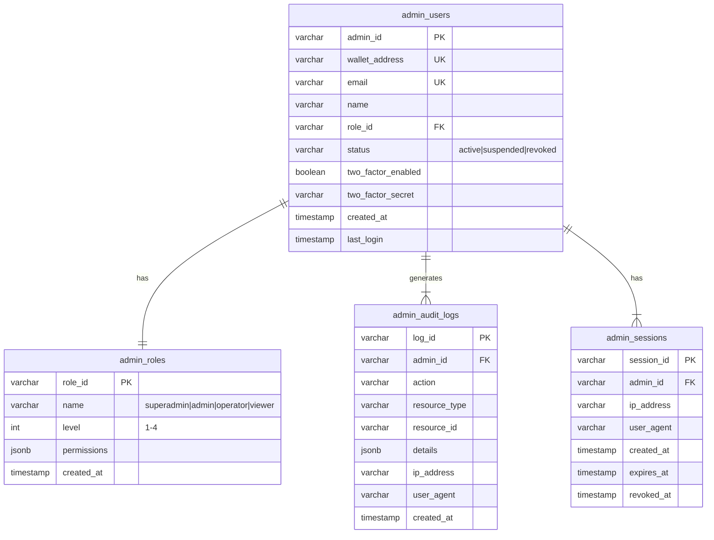
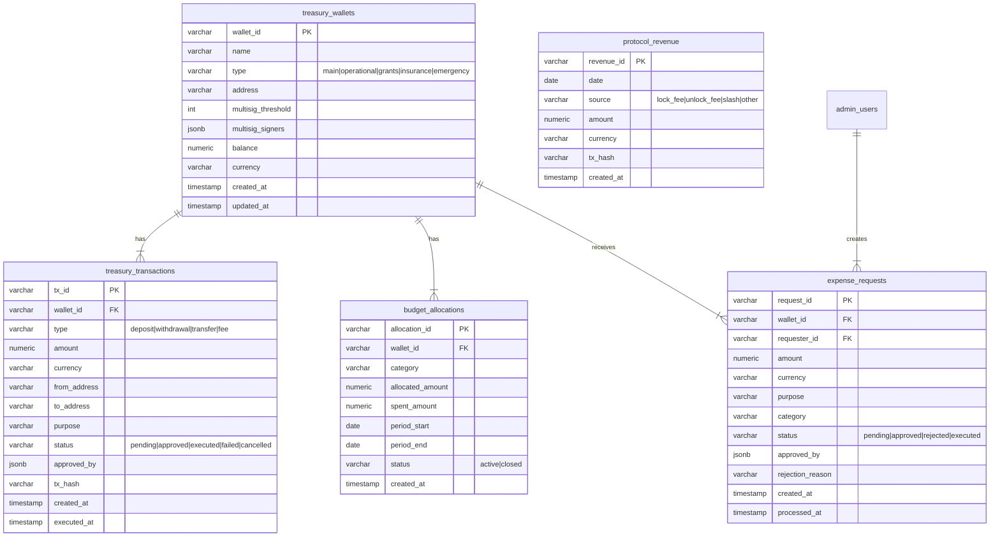
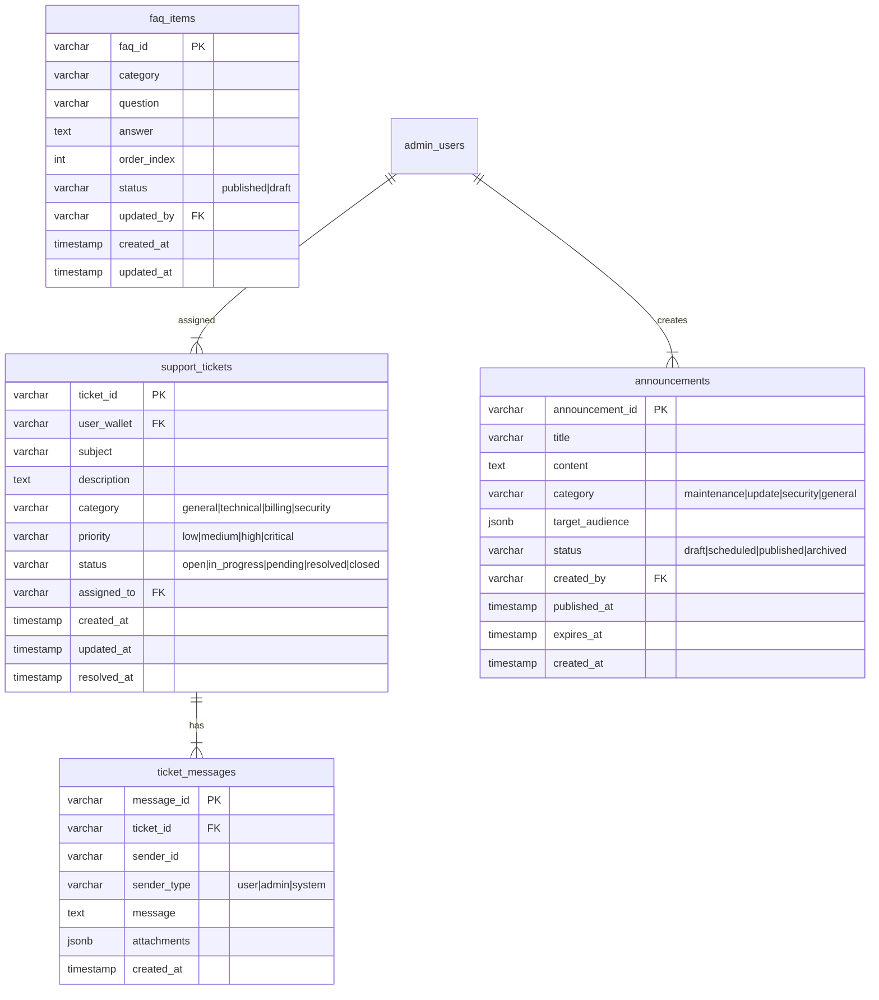
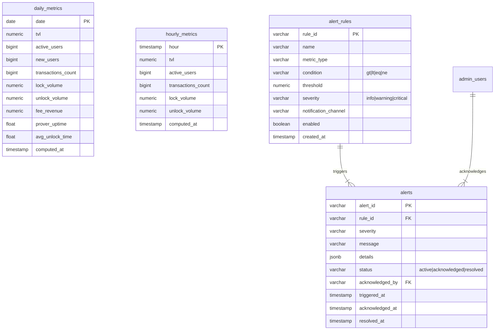

# Quantum Shield Database Design

> **Version**: 1.0
> **Date**: 2026-01-27
> **Status**: Draft

---

## 1. Overview

### 1.1 Database Architecture

```
┌─────────────────────────────────────────────────────────────────┐
│                    Data Storage Strategy                         │
├─────────────────────────────────────────────────────────────────┤
│                                                                 │
│  ┌─────────────────┐  ┌─────────────────┐  ┌─────────────────┐ │
│  │   PostgreSQL    │  │      Redis      │  │   Blockchain    │ │
│  │                 │  │                 │  │                 │ │
│  │  - Users        │  │  - Nonces       │  │  - Locks        │ │
│  │  - Locks (meta) │  │  - Sessions     │  │  - Unlocks      │ │
│  │  - Proposals    │  │  - Queue items  │  │  - Stakes       │ │
│  │  - Votes        │  │  - Cache        │  │  - Governance   │ │
│  │  - Audit logs   │  │  - Rate limits  │  │                 │ │
│  │                 │  │                 │  │                 │ │
│  │  Source of      │  │  High-speed     │  │  Source of      │ │
│  │  truth for      │  │  access layer   │  │  truth for      │ │
│  │  off-chain      │  │                 │  │  on-chain       │ │
│  └─────────────────┘  └─────────────────┘  └─────────────────┘ │
│                                                                 │
└─────────────────────────────────────────────────────────────────┘
```

### 1.2 Technology Stack

| Component | Version | Purpose |
|-----------|---------|---------|
| PostgreSQL | 16 | Primary relational database |
| Redis | 7 | Caching, sessions, ephemeral data |
| Prisma | Latest | ORM for PostgreSQL |

---

## 2. Entity Relationship Diagram

```mermaid
erDiagram
    %% ========================================
    %% Core User Domain
    %% ========================================

    users {
        varchar wallet_address PK "0x..."
        bytea pk_dilithium "ML-DSA-65 public key"
        timestamp created_at
        timestamp last_active
    }

    user_settings {
        varchar wallet_address PK_FK
        varchar email
        varchar language "ja|en"
        boolean notification_email
        boolean notification_browser
        boolean two_factor_enabled
        timestamp updated_at
    }

    user_dilithium_keys {
        varchar key_id PK
        varchar wallet_address FK
        bytea pk_dilithium
        boolean is_active
        timestamp registered_at
        timestamp revoked_at
    }

    users ||--|| user_settings : "has"
    users ||--|{ user_dilithium_keys : "owns"

    %% ========================================
    %% Lock/Unlock Domain
    %% ========================================

    locks {
        varchar lock_id PK "0x... (bytes32)"
        varchar wallet_address FK
        bigint chain_id
        varchar asset "ERC20 address"
        numeric amount "wei"
        bytea dest_addr
        bigint expiry
        bigint nonce
        bytea pk_dilithium
        bytea sig_dilithium
        varchar sr_0 "SHA3-256"
        varchar status "enum"
        varchar l1_tx_hash
        timestamp created_at
        timestamp confirmed_at
    }

    unlock_requests {
        varchar unlock_id PK
        varchar lock_id FK
        varchar wallet_address FK
        bytea dest_addr
        numeric amount
        bytea sig_dilithium
        varchar sr_0
        varchar sr_1
        varchar status
        boolean is_emergency
        numeric bond_amount
        timestamp release_time
        timestamp created_at
    }

    unlock_prover_signatures {
        varchar signature_id PK
        varchar unlock_id FK
        varchar prover_id FK
        bytea sig_sphincs "~8KB"
        varchar sr_0
        varchar sr_1
        boolean is_valid
        timestamp signed_at
    }

    vrf_requests {
        varchar vrf_id PK
        varchar unlock_id FK
        bytea vrf_seed
        jsonb selected_prover_ids "2 of 5"
        jsonb prover_weights
        varchar status
        timestamp requested_at
        timestamp completed_at
    }

    users ||--|{ locks : "creates"
    locks ||--|{ unlock_requests : "has"
    unlock_requests ||--|{ unlock_prover_signatures : "requires"
    unlock_requests ||--|| vrf_requests : "has"

    %% ========================================
    %% Prover Domain
    %% ========================================

    provers {
        varchar prover_id PK
        varchar operator_addr
        bytea sphincs_pubkey
        numeric stake_amount
        bytea hsm_attestation
        varchar status "enum"
        timestamp registered_at
        timestamp approved_at
    }

    prover_exits {
        varchar exit_id PK
        varchar prover_id FK
        timestamp initiated_at
        timestamp unbonding_end
        numeric stake_to_return
        numeric pending_rewards
        varchar status
    }

    prover_metrics {
        varchar prover_id PK_FK
        bigint total_signatures
        bigint signatures_24h
        bigint signatures_7d
        bigint avg_response_time_ms
        float success_rate
        float uptime_percentage
        numeric total_rewards
        timestamp updated_at
    }

    provers ||--|{ unlock_prover_signatures : "provides"
    provers ||--o| prover_exits : "may_have"
    provers ||--|| prover_metrics : "has"

    %% ========================================
    %% Challenge/Slashing Domain
    %% ========================================

    challenges {
        varchar challenge_id PK
        varchar lock_id FK
        varchar unlock_id FK
        varchar challenger
        varchar fraud_proof_hash
        numeric bond
        timestamp challenged_at
        timestamp defense_deadline
        varchar status
        varchar defender
        varchar defense_proof_hash
        timestamp resolved_at
    }

    slashings {
        varchar slashing_id PK
        varchar challenge_id FK
        varchar prover_id FK
        numeric slash_amount
        numeric challenger_reward
        numeric insurance_amount
        numeric burn_amount
        varchar l1_tx_hash
        timestamp slashed_at
    }

    locks ||--o| challenges : "may_have"
    challenges ||--o| slashings : "results_in"
    provers ||--|{ slashings : "receives"

    %% ========================================
    %% Governance Domain
    %% ========================================

    proposals {
        varchar proposal_id PK
        varchar title
        text description
        varchar proposer
        varchar status
        numeric votes_for
        numeric votes_against
        numeric votes_abstain
        numeric quorum
        timestamp start_time
        timestamp end_time
        timestamp created_at
    }

    votes {
        varchar vote_id PK
        varchar proposal_id FK
        varchar voter
        smallint support "0=Against 1=For 2=Abstain"
        numeric weight
        varchar l1_tx_hash
        timestamp voted_at
    }

    proposal_actions {
        varchar action_id PK
        varchar proposal_id FK
        varchar target
        numeric value
        bytea data
        varchar description
        smallint execution_order
    }

    proposals ||--|{ votes : "receives"
    proposals ||--|{ proposal_actions : "contains"

    %% ========================================
    %% Token Hub (veQS) Domain
    %% ========================================

    veqs_locks {
        varchar lock_id PK
        varchar wallet_address FK
        numeric locked_amount
        numeric veqs_value
        timestamp lock_end
        bigint lock_duration_days
        timestamp created_at
    }

    delegations {
        varchar delegation_id PK
        varchar delegator FK
        varchar delegatee FK
        numeric amount
        timestamp delegated_at
    }

    reward_epochs {
        bigint epoch PK
        numeric total_rewards
        numeric total_veqs
        timestamp start_time
        timestamp end_time
        boolean finalized
    }

    reward_claims {
        varchar claim_id PK
        varchar wallet_address FK
        bigint epoch FK
        numeric amount
        varchar l1_tx_hash
        timestamp claimed_at
    }

    users ||--|{ veqs_locks : "holds"
    users ||--|{ delegations : "delegates"
    users ||--|{ reward_claims : "claims"

    %% ========================================
    %% Observer Domain
    %% ========================================

    observers {
        varchar observer_id PK
        varchar wallet_address FK
        varchar status
        numeric total_earnings
        bigint successful_challenges
        bigint failed_challenges
        timestamp registered_at
    }

    observer_earnings {
        varchar earning_id PK
        varchar observer_id FK
        varchar challenge_id FK
        numeric amount
        boolean claimed
        varchar claim_tx_hash
        timestamp earned_at
        timestamp claimed_at
    }

    users ||--o| observers : "may_be"
    observers ||--|{ observer_earnings : "earns"
    challenges ||--|{ observer_earnings : "generates"

    %% ========================================
    %% Audit/System Domain
    %% ========================================

    audit_logs {
        varchar log_id PK
        varchar entity_type
        varchar entity_id
        varchar action
        varchar actor
        jsonb old_values
        jsonb new_values
        varchar ip_address
        timestamp created_at
    }

    system_settings {
        varchar key PK
        jsonb value
        varchar updated_by
        timestamp updated_at
    }
```

---

## 3. Table Definitions

### 3.1 Core Tables

#### users

| Column | Type | Constraints | Description |
|--------|------|-------------|-------------|
| wallet_address | VARCHAR(42) | PK | Ethereum address |
| pk_dilithium | BYTEA | | ML-DSA-65 public key |
| created_at | TIMESTAMP | DEFAULT NOW() | Registration time |
| last_active | TIMESTAMP | | Last activity |

#### locks

| Column | Type | Constraints | Description |
|--------|------|-------------|-------------|
| lock_id | VARCHAR(66) | PK | SHA3-256 hash |
| wallet_address | VARCHAR(42) | FK → users | Owner |
| chain_id | BIGINT | NOT NULL | Destination chain |
| asset | VARCHAR(42) | NOT NULL | ERC20 address |
| amount | NUMERIC(78) | NOT NULL | Amount in wei |
| dest_addr | BYTEA | NOT NULL | Destination address |
| expiry | BIGINT | NOT NULL | Expiry timestamp |
| nonce | BIGINT | NOT NULL | Unique nonce |
| pk_dilithium | BYTEA | NOT NULL | User's Dilithium pubkey |
| sig_dilithium | BYTEA | NOT NULL | ML-DSA-65 signature |
| sr_0 | VARCHAR(66) | NOT NULL | State root at lock |
| status | VARCHAR(20) | DEFAULT 'pending' | Lock status |
| l1_tx_hash | VARCHAR(66) | | L1 transaction hash |
| created_at | TIMESTAMP | DEFAULT NOW() | Creation time |
| confirmed_at | TIMESTAMP | | Confirmation time |

**Status Enum:**
- `pending` - Lock submitted, awaiting confirmation
- `confirmed` - L1 confirmation received
- `locked` - Assets fully locked
- `unlock_pending` - Unlock in progress
- `released` - Assets released
- `emergency_pending` - Emergency unlock in progress
- `challenged` - Under challenge
- `slashed` - Slashed due to fraud

### 3.2 Prover Tables

#### provers

| Column | Type | Constraints | Description |
|--------|------|-------------|-------------|
| prover_id | VARCHAR(66) | PK | Unique identifier |
| operator_addr | VARCHAR(42) | NOT NULL | Operator address |
| sphincs_pubkey | BYTEA | NOT NULL | SPHINCS+ public key |
| stake_amount | NUMERIC(78) | NOT NULL | Staked amount |
| hsm_attestation | BYTEA | | HSM attestation |
| status | VARCHAR(20) | DEFAULT 'pending_approval' | Status |
| registered_at | TIMESTAMP | DEFAULT NOW() | Registration time |
| approved_at | TIMESTAMP | | Approval time |

**Status Enum:**
- `pending_approval` - Awaiting approval
- `active` - Active and can sign
- `inactive` - Temporarily inactive
- `exiting` - Exit initiated
- `exited` - Exit complete
- `slashed` - Slashed for fraud

### 3.3 Challenge Tables

#### challenges

| Column | Type | Constraints | Description |
|--------|------|-------------|-------------|
| challenge_id | VARCHAR(66) | PK | Challenge ID |
| lock_id | VARCHAR(66) | FK → locks | Related lock |
| unlock_id | VARCHAR(66) | FK → unlock_requests | Related unlock |
| challenger | VARCHAR(42) | NOT NULL | Challenger address |
| fraud_proof_hash | VARCHAR(66) | NOT NULL | SHA3-256 of proof |
| bond | NUMERIC(78) | NOT NULL | Challenge bond |
| challenged_at | TIMESTAMP | DEFAULT NOW() | Challenge time |
| defense_deadline | TIMESTAMP | NOT NULL | 48h from challenge |
| status | VARCHAR(20) | DEFAULT 'pending' | Status |
| defender | VARCHAR(42) | | Defender (Prover) |
| defense_proof_hash | VARCHAR(66) | | Defense proof hash |
| resolved_at | TIMESTAMP | | Resolution time |

**Status Enum:**
- `pending` - Awaiting defense or resolution
- `defense_submitted` - Defense submitted
- `resolved_valid` - Challenge upheld (fraud confirmed)
- `resolved_invalid` - Challenge rejected

---

## 4. Indexes

### 4.1 Primary Indexes

```sql
-- Users
CREATE INDEX idx_users_created ON users(created_at DESC);

-- Locks
CREATE INDEX idx_locks_wallet ON locks(wallet_address);
CREATE INDEX idx_locks_status ON locks(status);
CREATE INDEX idx_locks_created ON locks(created_at DESC);
CREATE INDEX idx_locks_chain ON locks(chain_id);

-- Unlock Requests
CREATE INDEX idx_unlocks_lock ON unlock_requests(lock_id);
CREATE INDEX idx_unlocks_wallet ON unlock_requests(wallet_address);
CREATE INDEX idx_unlocks_status ON unlock_requests(status);
CREATE INDEX idx_unlocks_release ON unlock_requests(release_time);

-- Provers
CREATE INDEX idx_provers_status ON provers(status);
CREATE INDEX idx_provers_operator ON provers(operator_addr);

-- Challenges
CREATE INDEX idx_challenges_lock ON challenges(lock_id);
CREATE INDEX idx_challenges_status ON challenges(status);
CREATE INDEX idx_challenges_deadline ON challenges(defense_deadline);

-- Proposals
CREATE INDEX idx_proposals_status ON proposals(status);
CREATE INDEX idx_proposals_end ON proposals(end_time);

-- Votes
CREATE INDEX idx_votes_proposal ON votes(proposal_id);
CREATE INDEX idx_votes_voter ON votes(voter);

-- Audit Logs
CREATE INDEX idx_audit_entity ON audit_logs(entity_type, entity_id);
CREATE INDEX idx_audit_actor ON audit_logs(actor);
CREATE INDEX idx_audit_created ON audit_logs(created_at DESC);
```

### 4.2 Composite Indexes

```sql
-- For common query patterns
CREATE INDEX idx_locks_wallet_status ON locks(wallet_address, status);
CREATE INDEX idx_unlocks_status_release ON unlock_requests(status, release_time);
CREATE INDEX idx_challenges_status_deadline ON challenges(status, defense_deadline);
```

---

## 5. Prisma Schema

```prisma
// prisma/schema.prisma

generator client {
  provider = "prisma-client-js"
}

datasource db {
  provider = "postgresql"
  url      = env("DATABASE_URL")
}

// ============================================
// Core User Models
// ============================================

model User {
  walletAddress String   @id @map("wallet_address") @db.VarChar(42)
  pkDilithium   Bytes?   @map("pk_dilithium")
  createdAt     DateTime @default(now()) @map("created_at")
  lastActive    DateTime? @map("last_active")

  settings      UserSettings?
  dilithiumKeys UserDilithiumKey[]
  locks         Lock[]
  unlockRequests UnlockRequest[]
  veqsLocks     VeqsLock[]
  delegationsGiven Delegation[] @relation("DelegationsGiven")
  delegationsReceived Delegation[] @relation("DelegationsReceived")
  rewardClaims  RewardClaim[]
  observer      Observer?

  @@map("users")
}

model UserSettings {
  walletAddress        String   @id @map("wallet_address") @db.VarChar(42)
  email                String?  @db.VarChar(255)
  language             String   @default("ja") @db.VarChar(5)
  notificationEmail    Boolean  @default(true) @map("notification_email")
  notificationBrowser  Boolean  @default(true) @map("notification_browser")
  twoFactorEnabled     Boolean  @default(false) @map("two_factor_enabled")
  updatedAt            DateTime @default(now()) @updatedAt @map("updated_at")

  user User @relation(fields: [walletAddress], references: [walletAddress])

  @@map("user_settings")
}

model UserDilithiumKey {
  keyId         String    @id @map("key_id") @db.VarChar(66)
  walletAddress String    @map("wallet_address") @db.VarChar(42)
  pkDilithium   Bytes     @map("pk_dilithium")
  isActive      Boolean   @default(true) @map("is_active")
  registeredAt  DateTime  @default(now()) @map("registered_at")
  revokedAt     DateTime? @map("revoked_at")

  user User @relation(fields: [walletAddress], references: [walletAddress])

  @@map("user_dilithium_keys")
}

// ============================================
// Lock/Unlock Models
// ============================================

model Lock {
  lockId        String    @id @map("lock_id") @db.VarChar(66)
  walletAddress String    @map("wallet_address") @db.VarChar(42)
  chainId       BigInt    @map("chain_id")
  asset         String    @db.VarChar(42)
  amount        Decimal   @db.Decimal(78, 0)
  destAddr      Bytes     @map("dest_addr")
  expiry        BigInt
  nonce         BigInt
  pkDilithium   Bytes     @map("pk_dilithium")
  sigDilithium  Bytes     @map("sig_dilithium")
  sr0           String    @map("sr_0") @db.VarChar(66)
  status        LockStatus @default(pending)
  l1TxHash      String?   @map("l1_tx_hash") @db.VarChar(66)
  createdAt     DateTime  @default(now()) @map("created_at")
  confirmedAt   DateTime? @map("confirmed_at")

  user           User            @relation(fields: [walletAddress], references: [walletAddress])
  unlockRequests UnlockRequest[]
  challenges     Challenge[]

  @@index([walletAddress])
  @@index([status])
  @@index([createdAt(sort: Desc)])
  @@map("locks")
}

enum LockStatus {
  pending
  confirmed
  locked
  unlock_pending
  released
  emergency_pending
  challenged
  slashed
}

model UnlockRequest {
  unlockId      String    @id @map("unlock_id") @db.VarChar(66)
  lockId        String    @map("lock_id") @db.VarChar(66)
  walletAddress String    @map("wallet_address") @db.VarChar(42)
  destAddr      Bytes     @map("dest_addr")
  amount        Decimal   @db.Decimal(78, 0)
  sigDilithium  Bytes     @map("sig_dilithium")
  sr0           String    @map("sr_0") @db.VarChar(66)
  sr1           String    @map("sr_1") @db.VarChar(66)
  status        UnlockStatus @default(pending)
  isEmergency   Boolean   @default(false) @map("is_emergency")
  bondAmount    Decimal?  @map("bond_amount") @db.Decimal(78, 0)
  releaseTime   DateTime? @map("release_time")
  createdAt     DateTime  @default(now()) @map("created_at")

  lock       Lock                     @relation(fields: [lockId], references: [lockId])
  user       User                     @relation(fields: [walletAddress], references: [walletAddress])
  signatures UnlockProverSignature[]
  vrfRequest VrfRequest?
  challenges Challenge[]

  @@index([lockId])
  @@index([status])
  @@map("unlock_requests")
}

enum UnlockStatus {
  pending
  vrf_pending
  prover_signing
  submitted
  time_lock
  claimable
  released
  cancelled
}

model UnlockProverSignature {
  signatureId String   @id @map("signature_id") @db.VarChar(66)
  unlockId    String   @map("unlock_id") @db.VarChar(66)
  proverId    String   @map("prover_id") @db.VarChar(66)
  sigSphincs  Bytes    @map("sig_sphincs")
  sr0         String   @map("sr_0") @db.VarChar(66)
  sr1         String   @map("sr_1") @db.VarChar(66)
  isValid     Boolean  @default(true) @map("is_valid")
  signedAt    DateTime @default(now()) @map("signed_at")

  unlockRequest UnlockRequest @relation(fields: [unlockId], references: [unlockId])
  prover        Prover        @relation(fields: [proverId], references: [proverId])

  @@unique([unlockId, proverId])
  @@map("unlock_prover_signatures")
}

model VrfRequest {
  vrfId              String    @id @map("vrf_id") @db.VarChar(66)
  unlockId           String    @unique @map("unlock_id") @db.VarChar(66)
  vrfSeed            Bytes     @map("vrf_seed")
  selectedProverIds  Json      @map("selected_prover_ids")
  proverWeights      Json      @map("prover_weights")
  status             VrfStatus @default(pending)
  requestedAt        DateTime  @default(now()) @map("requested_at")
  completedAt        DateTime? @map("completed_at")

  unlockRequest UnlockRequest @relation(fields: [unlockId], references: [unlockId])

  @@map("vrf_requests")
}

enum VrfStatus {
  pending
  fulfilled
  fallback_used
  failed
}

// ============================================
// Prover Models
// ============================================

model Prover {
  proverId       String       @id @map("prover_id") @db.VarChar(66)
  operatorAddr   String       @map("operator_addr") @db.VarChar(42)
  sphincsPubkey  Bytes        @map("sphincs_pubkey")
  stakeAmount    Decimal      @map("stake_amount") @db.Decimal(78, 0)
  hsmAttestation Bytes?       @map("hsm_attestation")
  status         ProverStatus @default(pending_approval)
  registeredAt   DateTime     @default(now()) @map("registered_at")
  approvedAt     DateTime?    @map("approved_at")

  signatures UnlockProverSignature[]
  exit       ProverExit?
  metrics    ProverMetrics?
  slashings  Slashing[]

  @@index([status])
  @@map("provers")
}

enum ProverStatus {
  pending_approval
  active
  inactive
  exiting
  exited
  slashed
}

model ProverExit {
  exitId         String      @id @map("exit_id") @db.VarChar(66)
  proverId       String      @unique @map("prover_id") @db.VarChar(66)
  initiatedAt    DateTime    @default(now()) @map("initiated_at")
  unbondingEnd   DateTime    @map("unbonding_end")
  stakeToReturn  Decimal     @map("stake_to_return") @db.Decimal(78, 0)
  pendingRewards Decimal     @map("pending_rewards") @db.Decimal(78, 0)
  status         ExitStatus  @default(unbonding)

  prover Prover @relation(fields: [proverId], references: [proverId])

  @@map("prover_exits")
}

enum ExitStatus {
  unbonding
  claimable
  claimed
}

model ProverMetrics {
  proverId          String   @id @map("prover_id") @db.VarChar(66)
  totalSignatures   BigInt   @default(0) @map("total_signatures")
  signatures24h     BigInt   @default(0) @map("signatures_24h")
  signatures7d      BigInt   @default(0) @map("signatures_7d")
  avgResponseTimeMs BigInt   @default(0) @map("avg_response_time_ms")
  successRate       Float    @default(100) @map("success_rate")
  uptimePercentage  Float    @default(100) @map("uptime_percentage")
  totalRewards      Decimal  @default(0) @map("total_rewards") @db.Decimal(78, 0)
  updatedAt         DateTime @default(now()) @updatedAt @map("updated_at")

  prover Prover @relation(fields: [proverId], references: [proverId])

  @@map("prover_metrics")
}

// ============================================
// Challenge/Slashing Models
// ============================================

model Challenge {
  challengeId      String          @id @map("challenge_id") @db.VarChar(66)
  lockId           String          @map("lock_id") @db.VarChar(66)
  unlockId         String?         @map("unlock_id") @db.VarChar(66)
  challenger       String          @db.VarChar(42)
  fraudProofHash   String          @map("fraud_proof_hash") @db.VarChar(66)
  bond             Decimal         @db.Decimal(78, 0)
  challengedAt     DateTime        @default(now()) @map("challenged_at")
  defenseDeadline  DateTime        @map("defense_deadline")
  status           ChallengeStatus @default(pending)
  defender         String?         @db.VarChar(42)
  defenseProofHash String?         @map("defense_proof_hash") @db.VarChar(66)
  resolvedAt       DateTime?       @map("resolved_at")

  lock           Lock              @relation(fields: [lockId], references: [lockId])
  unlockRequest  UnlockRequest?    @relation(fields: [unlockId], references: [unlockId])
  slashing       Slashing?
  observerEarnings ObserverEarning[]

  @@index([lockId])
  @@index([status])
  @@map("challenges")
}

enum ChallengeStatus {
  pending
  defense_submitted
  resolved_valid
  resolved_invalid
}

model Slashing {
  slashingId       String   @id @map("slashing_id") @db.VarChar(66)
  challengeId      String   @unique @map("challenge_id") @db.VarChar(66)
  proverId         String   @map("prover_id") @db.VarChar(66)
  slashAmount      Decimal  @map("slash_amount") @db.Decimal(78, 0)
  challengerReward Decimal  @map("challenger_reward") @db.Decimal(78, 0)
  insuranceAmount  Decimal  @map("insurance_amount") @db.Decimal(78, 0)
  burnAmount       Decimal  @map("burn_amount") @db.Decimal(78, 0)
  l1TxHash         String?  @map("l1_tx_hash") @db.VarChar(66)
  slashedAt        DateTime @default(now()) @map("slashed_at")

  challenge Challenge @relation(fields: [challengeId], references: [challengeId])
  prover    Prover    @relation(fields: [proverId], references: [proverId])

  @@map("slashings")
}

// ============================================
// Governance Models
// ============================================

model Proposal {
  proposalId    String         @id @map("proposal_id") @db.VarChar(66)
  title         String         @db.VarChar(200)
  description   String?
  proposer      String         @db.VarChar(42)
  status        ProposalStatus @default(pending)
  votesFor      Decimal        @default(0) @map("votes_for") @db.Decimal(78, 0)
  votesAgainst  Decimal        @default(0) @map("votes_against") @db.Decimal(78, 0)
  votesAbstain  Decimal        @default(0) @map("votes_abstain") @db.Decimal(78, 0)
  quorum        Decimal        @db.Decimal(78, 0)
  startTime     DateTime?      @map("start_time")
  endTime       DateTime?      @map("end_time")
  createdAt     DateTime       @default(now()) @map("created_at")

  votes   Vote[]
  actions ProposalAction[]

  @@index([status])
  @@map("proposals")
}

enum ProposalStatus {
  pending
  active
  passed
  rejected
  executed
  cancelled
}

model Vote {
  voteId     String   @id @map("vote_id") @db.VarChar(66)
  proposalId String   @map("proposal_id") @db.VarChar(66)
  voter      String   @db.VarChar(42)
  support    Int      @db.SmallInt
  weight     Decimal  @db.Decimal(78, 0)
  l1TxHash   String?  @map("l1_tx_hash") @db.VarChar(66)
  votedAt    DateTime @default(now()) @map("voted_at")

  proposal Proposal @relation(fields: [proposalId], references: [proposalId])

  @@unique([proposalId, voter])
  @@map("votes")
}

model ProposalAction {
  actionId       String @id @map("action_id") @db.VarChar(66)
  proposalId     String @map("proposal_id") @db.VarChar(66)
  target         String @db.VarChar(42)
  value          Decimal @db.Decimal(78, 0)
  data           Bytes
  description    String?
  executionOrder Int    @default(0) @map("execution_order") @db.SmallInt

  proposal Proposal @relation(fields: [proposalId], references: [proposalId])

  @@map("proposal_actions")
}

// ============================================
// Token Hub (veQS) Models
// ============================================

model VeqsLock {
  lockId           String   @id @map("lock_id") @db.VarChar(66)
  walletAddress    String   @map("wallet_address") @db.VarChar(42)
  lockedAmount     Decimal  @map("locked_amount") @db.Decimal(78, 0)
  veqsValue        Decimal  @map("veqs_value") @db.Decimal(78, 0)
  lockEnd          DateTime @map("lock_end")
  lockDurationDays BigInt   @map("lock_duration_days")
  createdAt        DateTime @default(now()) @map("created_at")

  user User @relation(fields: [walletAddress], references: [walletAddress])

  @@map("veqs_locks")
}

model Delegation {
  delegationId String   @id @map("delegation_id") @db.VarChar(66)
  delegator    String   @db.VarChar(42)
  delegatee    String   @db.VarChar(42)
  amount       Decimal  @db.Decimal(78, 0)
  delegatedAt  DateTime @default(now()) @map("delegated_at")

  delegatorUser User @relation("DelegationsGiven", fields: [delegator], references: [walletAddress])
  delegateeUser User @relation("DelegationsReceived", fields: [delegatee], references: [walletAddress])

  @@map("delegations")
}

model RewardEpoch {
  epoch        BigInt   @id
  totalRewards Decimal  @map("total_rewards") @db.Decimal(78, 0)
  totalVeqs    Decimal  @map("total_veqs") @db.Decimal(78, 0)
  startTime    DateTime @map("start_time")
  endTime      DateTime @map("end_time")
  finalized    Boolean  @default(false)

  claims RewardClaim[]

  @@map("reward_epochs")
}

model RewardClaim {
  claimId       String    @id @map("claim_id") @db.VarChar(66)
  walletAddress String    @map("wallet_address") @db.VarChar(42)
  epoch         BigInt
  amount        Decimal   @db.Decimal(78, 0)
  l1TxHash      String?   @map("l1_tx_hash") @db.VarChar(66)
  claimedAt     DateTime  @default(now()) @map("claimed_at")

  user        User        @relation(fields: [walletAddress], references: [walletAddress])
  rewardEpoch RewardEpoch @relation(fields: [epoch], references: [epoch])

  @@map("reward_claims")
}

// ============================================
// Observer Models
// ============================================

model Observer {
  observerId           String   @id @map("observer_id") @db.VarChar(66)
  walletAddress        String   @unique @map("wallet_address") @db.VarChar(42)
  status               String   @default("active")
  totalEarnings        Decimal  @default(0) @map("total_earnings") @db.Decimal(78, 0)
  successfulChallenges BigInt   @default(0) @map("successful_challenges")
  failedChallenges     BigInt   @default(0) @map("failed_challenges")
  registeredAt         DateTime @default(now()) @map("registered_at")

  user     User              @relation(fields: [walletAddress], references: [walletAddress])
  earnings ObserverEarning[]

  @@map("observers")
}

model ObserverEarning {
  earningId   String    @id @map("earning_id") @db.VarChar(66)
  observerId  String    @map("observer_id") @db.VarChar(66)
  challengeId String    @map("challenge_id") @db.VarChar(66)
  amount      Decimal   @db.Decimal(78, 0)
  claimed     Boolean   @default(false)
  claimTxHash String?   @map("claim_tx_hash") @db.VarChar(66)
  earnedAt    DateTime  @default(now()) @map("earned_at")
  claimedAt   DateTime? @map("claimed_at")

  observer  Observer  @relation(fields: [observerId], references: [observerId])
  challenge Challenge @relation(fields: [challengeId], references: [challengeId])

  @@map("observer_earnings")
}

// ============================================
// Audit/System Models
// ============================================

model AuditLog {
  logId      String   @id @map("log_id") @db.VarChar(66)
  entityType String   @map("entity_type") @db.VarChar(50)
  entityId   String   @map("entity_id") @db.VarChar(66)
  action     String   @db.VarChar(50)
  actor      String   @db.VarChar(42)
  oldValues  Json?    @map("old_values")
  newValues  Json?    @map("new_values")
  ipAddress  String?  @map("ip_address") @db.VarChar(45)
  createdAt  DateTime @default(now()) @map("created_at")

  @@index([entityType, entityId])
  @@index([actor])
  @@index([createdAt(sort: Desc)])
  @@map("audit_logs")
}

model SystemSetting {
  key       String   @id @db.VarChar(100)
  value     Json
  updatedBy String?  @map("updated_by") @db.VarChar(42)
  updatedAt DateTime @default(now()) @updatedAt @map("updated_at")

  @@map("system_settings")
}
```

---

## 6. Admin & Treasury Tables

### 6.1 Admin User Management



### 6.2 Treasury Management



### 6.3 Support & Communication



### 6.4 Metrics & Analytics



### 6.5 Prisma Schema - Admin Models

```prisma
// ============================================
// Admin User Models
// ============================================

model AdminUser {
  adminId          String   @id @map("admin_id") @db.VarChar(66)
  walletAddress    String   @unique @map("wallet_address") @db.VarChar(42)
  email            String   @unique @db.VarChar(255)
  name             String   @db.VarChar(100)
  roleId           String   @map("role_id") @db.VarChar(66)
  status           String   @default("active") @db.VarChar(20)
  twoFactorEnabled Boolean  @default(false) @map("two_factor_enabled")
  twoFactorSecret  String?  @map("two_factor_secret") @db.VarChar(255)
  createdAt        DateTime @default(now()) @map("created_at")
  lastLogin        DateTime? @map("last_login")

  role       AdminRole         @relation(fields: [roleId], references: [roleId])
  auditLogs  AdminAuditLog[]
  sessions   AdminSession[]
  expenses   ExpenseRequest[]
  alerts     Alert[]

  @@map("admin_users")
}

model AdminRole {
  roleId      String   @id @map("role_id") @db.VarChar(66)
  name        String   @unique @db.VarChar(50)
  level       Int      @db.SmallInt
  permissions Json
  createdAt   DateTime @default(now()) @map("created_at")

  users AdminUser[]

  @@map("admin_roles")
}

model AdminAuditLog {
  logId        String   @id @map("log_id") @db.VarChar(66)
  adminId      String   @map("admin_id") @db.VarChar(66)
  action       String   @db.VarChar(100)
  resourceType String   @map("resource_type") @db.VarChar(50)
  resourceId   String?  @map("resource_id") @db.VarChar(66)
  details      Json?
  ipAddress    String?  @map("ip_address") @db.VarChar(45)
  userAgent    String?  @map("user_agent") @db.VarChar(500)
  createdAt    DateTime @default(now()) @map("created_at")

  admin AdminUser @relation(fields: [adminId], references: [adminId])

  @@index([adminId])
  @@index([resourceType, resourceId])
  @@index([createdAt(sort: Desc)])
  @@map("admin_audit_logs")
}

model AdminSession {
  sessionId String    @id @map("session_id") @db.VarChar(66)
  adminId   String    @map("admin_id") @db.VarChar(66)
  ipAddress String    @map("ip_address") @db.VarChar(45)
  userAgent String?   @map("user_agent") @db.VarChar(500)
  createdAt DateTime  @default(now()) @map("created_at")
  expiresAt DateTime  @map("expires_at")
  revokedAt DateTime? @map("revoked_at")

  admin AdminUser @relation(fields: [adminId], references: [adminId])

  @@index([adminId])
  @@map("admin_sessions")
}

// ============================================
// Treasury Models
// ============================================

model TreasuryWallet {
  walletId          String   @id @map("wallet_id") @db.VarChar(66)
  name              String   @db.VarChar(100)
  type              String   @db.VarChar(20) // main, operational, grants, insurance, emergency
  address           String   @db.VarChar(42)
  multisigThreshold Int      @map("multisig_threshold")
  multisigSigners   Json     @map("multisig_signers")
  balance           Decimal  @db.Decimal(78, 0)
  currency          String   @default("ETH") @db.VarChar(10)
  createdAt         DateTime @default(now()) @map("created_at")
  updatedAt         DateTime @updatedAt @map("updated_at")

  transactions TreasuryTransaction[]
  budgets      BudgetAllocation[]
  expenses     ExpenseRequest[]

  @@map("treasury_wallets")
}

model TreasuryTransaction {
  txId        String    @id @map("tx_id") @db.VarChar(66)
  walletId    String    @map("wallet_id") @db.VarChar(66)
  type        String    @db.VarChar(20) // deposit, withdrawal, transfer, fee
  amount      Decimal   @db.Decimal(78, 0)
  currency    String    @db.VarChar(10)
  fromAddress String?   @map("from_address") @db.VarChar(42)
  toAddress   String?   @map("to_address") @db.VarChar(42)
  purpose     String?   @db.VarChar(500)
  status      String    @default("pending") @db.VarChar(20)
  approvedBy  Json?     @map("approved_by")
  txHash      String?   @map("tx_hash") @db.VarChar(66)
  createdAt   DateTime  @default(now()) @map("created_at")
  executedAt  DateTime? @map("executed_at")

  wallet TreasuryWallet @relation(fields: [walletId], references: [walletId])

  @@index([walletId])
  @@index([status])
  @@index([createdAt(sort: Desc)])
  @@map("treasury_transactions")
}

model BudgetAllocation {
  allocationId    String   @id @map("allocation_id") @db.VarChar(66)
  walletId        String   @map("wallet_id") @db.VarChar(66)
  category        String   @db.VarChar(100)
  allocatedAmount Decimal  @map("allocated_amount") @db.Decimal(78, 0)
  spentAmount     Decimal  @default(0) @map("spent_amount") @db.Decimal(78, 0)
  periodStart     DateTime @map("period_start") @db.Date
  periodEnd       DateTime @map("period_end") @db.Date
  status          String   @default("active") @db.VarChar(20)
  createdAt       DateTime @default(now()) @map("created_at")

  wallet TreasuryWallet @relation(fields: [walletId], references: [walletId])

  @@index([walletId])
  @@index([periodStart, periodEnd])
  @@map("budget_allocations")
}

model ExpenseRequest {
  requestId       String    @id @map("request_id") @db.VarChar(66)
  walletId        String    @map("wallet_id") @db.VarChar(66)
  requesterId     String    @map("requester_id") @db.VarChar(66)
  amount          Decimal   @db.Decimal(78, 0)
  currency        String    @db.VarChar(10)
  purpose         String    @db.VarChar(500)
  category        String    @db.VarChar(100)
  status          String    @default("pending") @db.VarChar(20)
  approvedBy      Json?     @map("approved_by")
  rejectionReason String?   @map("rejection_reason") @db.VarChar(500)
  createdAt       DateTime  @default(now()) @map("created_at")
  processedAt     DateTime? @map("processed_at")

  wallet    TreasuryWallet @relation(fields: [walletId], references: [walletId])
  requester AdminUser      @relation(fields: [requesterId], references: [adminId])

  @@index([walletId])
  @@index([requesterId])
  @@index([status])
  @@map("expense_requests")
}

model ProtocolRevenue {
  revenueId String   @id @map("revenue_id") @db.VarChar(66)
  date      DateTime @db.Date
  source    String   @db.VarChar(50) // lock_fee, unlock_fee, slash, other
  amount    Decimal  @db.Decimal(78, 0)
  currency  String   @db.VarChar(10)
  txHash    String?  @map("tx_hash") @db.VarChar(66)
  createdAt DateTime @default(now()) @map("created_at")

  @@index([date])
  @@index([source])
  @@map("protocol_revenue")
}

// ============================================
// Support Models
// ============================================

model SupportTicket {
  ticketId    String    @id @map("ticket_id") @db.VarChar(66)
  userWallet  String    @map("user_wallet") @db.VarChar(42)
  subject     String    @db.VarChar(255)
  description String    @db.Text
  category    String    @db.VarChar(50) // general, technical, billing, security
  priority    String    @default("medium") @db.VarChar(20)
  status      String    @default("open") @db.VarChar(20)
  assignedTo  String?   @map("assigned_to") @db.VarChar(66)
  createdAt   DateTime  @default(now()) @map("created_at")
  updatedAt   DateTime  @updatedAt @map("updated_at")
  resolvedAt  DateTime? @map("resolved_at")

  messages TicketMessage[]

  @@index([userWallet])
  @@index([status])
  @@index([priority])
  @@index([assignedTo])
  @@map("support_tickets")
}

model TicketMessage {
  messageId   String   @id @map("message_id") @db.VarChar(66)
  ticketId    String   @map("ticket_id") @db.VarChar(66)
  senderId    String   @map("sender_id") @db.VarChar(66)
  senderType  String   @map("sender_type") @db.VarChar(20) // user, admin, system
  message     String   @db.Text
  attachments Json?
  createdAt   DateTime @default(now()) @map("created_at")

  ticket SupportTicket @relation(fields: [ticketId], references: [ticketId])

  @@index([ticketId])
  @@map("ticket_messages")
}

model Announcement {
  announcementId String    @id @map("announcement_id") @db.VarChar(66)
  title          String    @db.VarChar(255)
  content        String    @db.Text
  category       String    @db.VarChar(50)
  targetAudience Json      @map("target_audience")
  status         String    @default("draft") @db.VarChar(20)
  createdBy      String    @map("created_by") @db.VarChar(66)
  publishedAt    DateTime? @map("published_at")
  expiresAt      DateTime? @map("expires_at")
  createdAt      DateTime  @default(now()) @map("created_at")

  @@index([status])
  @@index([publishedAt(sort: Desc)])
  @@map("announcements")
}

// ============================================
// Metrics Models
// ============================================

model DailyMetric {
  date              DateTime @id @db.Date
  tvl               Decimal  @db.Decimal(78, 0)
  activeUsers       BigInt   @map("active_users")
  newUsers          BigInt   @map("new_users")
  transactionsCount BigInt   @map("transactions_count")
  lockVolume        Decimal  @map("lock_volume") @db.Decimal(78, 0)
  unlockVolume      Decimal  @map("unlock_volume") @db.Decimal(78, 0)
  feeRevenue        Decimal  @map("fee_revenue") @db.Decimal(78, 0)
  proverUptime      Float    @map("prover_uptime")
  avgUnlockTime     Float    @map("avg_unlock_time")
  computedAt        DateTime @default(now()) @map("computed_at")

  @@map("daily_metrics")
}

model AlertRule {
  ruleId              String   @id @map("rule_id") @db.VarChar(66)
  name                String   @db.VarChar(100)
  metricType          String   @map("metric_type") @db.VarChar(50)
  condition           String   @db.VarChar(10) // gt, lt, eq, ne
  threshold           Decimal  @db.Decimal(78, 0)
  severity            String   @db.VarChar(20) // info, warning, critical
  notificationChannel String   @map("notification_channel") @db.VarChar(100)
  enabled             Boolean  @default(true)
  createdAt           DateTime @default(now()) @map("created_at")

  alerts Alert[]

  @@map("alert_rules")
}

model Alert {
  alertId        String    @id @map("alert_id") @db.VarChar(66)
  ruleId         String    @map("rule_id") @db.VarChar(66)
  severity       String    @db.VarChar(20)
  message        String    @db.VarChar(500)
  details        Json?
  status         String    @default("active") @db.VarChar(20)
  acknowledgedBy String?   @map("acknowledged_by") @db.VarChar(66)
  triggeredAt    DateTime  @default(now()) @map("triggered_at")
  acknowledgedAt DateTime? @map("acknowledged_at")
  resolvedAt     DateTime? @map("resolved_at")

  rule        AlertRule  @relation(fields: [ruleId], references: [ruleId])
  acknowledger AdminUser? @relation(fields: [acknowledgedBy], references: [adminId])

  @@index([ruleId])
  @@index([status])
  @@index([triggeredAt(sort: Desc)])
  @@map("alerts")
}
```

---

## 7. Migration Strategy

### 6.1 Initial Migration

```bash
# Initialize Prisma
npx prisma init

# Create initial migration
npx prisma migrate dev --name init

# Apply to production
npx prisma migrate deploy
```

### 6.2 Data Migration from Redis

```typescript
// scripts/migrate-redis-to-postgres.ts
async function migrateLocksFromRedis() {
  const redis = new Redis(process.env.REDIS_URL);
  const prisma = new PrismaClient();

  const lockKeys = await redis.keys('lock:*');

  for (const key of lockKeys) {
    const data = await redis.get(key);
    if (!data) continue;

    const lock = JSON.parse(data);

    await prisma.lock.upsert({
      where: { lockId: lock.lock_id },
      create: {
        lockId: lock.lock_id,
        walletAddress: lock.owner,
        chainId: BigInt(lock.chain_id),
        asset: lock.asset,
        amount: lock.amount,
        destAddr: Buffer.from(lock.dest_addr, 'hex'),
        expiry: BigInt(lock.expiry),
        nonce: BigInt(lock.nonce),
        pkDilithium: Buffer.from(lock.user_public_key.slice(2), 'hex'),
        sigDilithium: Buffer.alloc(0), // Not stored in Redis
        sr0: lock.sr_0,
        status: mapStatus(lock.status),
        createdAt: new Date(lock.created_at * 1000),
      },
      update: {},
    });
  }

  console.log(`Migrated ${lockKeys.length} locks`);
}
```

---

## 8. UI検証で追加が必要なスキーマ（v1.1）

> **注記**: 2026-01-30のPlaywright MCP検証で発見されたUIに存在するがDBスキーマに不足していたテーブル/カラム

### 8.1 Observer練習モード（カラム追加）

```sql
-- observersテーブルへのカラム追加
ALTER TABLE observers
  ADD COLUMN practice_mode_until TIMESTAMP,
  ADD COLUMN practice_mode_earnings DECIMAL(78,0) DEFAULT 0;

-- インデックス追加
CREATE INDEX idx_observers_practice_mode ON observers(practice_mode_until)
  WHERE practice_mode_until IS NOT NULL;
```

### 8.2 Proverティア（カラム追加）

```sql
-- proversテーブルへのカラム追加
ALTER TABLE provers
  ADD COLUMN tier VARCHAR(20) DEFAULT 'standard'
  CHECK (tier IN ('standard', 'professional', 'enterprise'));

-- インデックス追加
CREATE INDEX idx_provers_tier ON provers(tier);
```

### 8.3 Enterprise契約テーブル

```sql
CREATE TABLE enterprise_contracts (
    contract_id VARCHAR(66) PRIMARY KEY,
    prover_id VARCHAR(66) NOT NULL REFERENCES provers(prover_id),
    company_name VARCHAR(255) NOT NULL,
    sla_guarantee DECIMAL(5,2) NOT NULL DEFAULT 99.90,
    minimum_revenue DECIMAL(78,0) NOT NULL,
    start_date DATE NOT NULL,
    end_date DATE NOT NULL,
    status VARCHAR(20) DEFAULT 'active'
      CHECK (status IN ('active', 'expired', 'terminated')),
    created_at TIMESTAMP DEFAULT NOW(),
    updated_at TIMESTAMP DEFAULT NOW()
);

CREATE INDEX idx_enterprise_contracts_prover ON enterprise_contracts(prover_id);
CREATE INDEX idx_enterprise_contracts_status ON enterprise_contracts(status);
```

### 8.4 アンロックリスクスコアテーブル

```sql
CREATE TABLE unlock_risk_scores (
    unlock_id VARCHAR(66) PRIMARY KEY REFERENCES unlock_requests(unlock_id),
    score INT NOT NULL CHECK (score >= 0 AND score <= 100),
    level VARCHAR(10) NOT NULL CHECK (level IN ('low', 'medium', 'high')),
    reasons JSONB NOT NULL DEFAULT '[]'::jsonb,
    calculated_at TIMESTAMP DEFAULT NOW()
);

CREATE INDEX idx_risk_scores_level ON unlock_risk_scores(level);
CREATE INDEX idx_risk_scores_score ON unlock_risk_scores(score DESC);
```

### 8.5 Treasury承認テーブル

```sql
CREATE TABLE treasury_approvals (
    approval_id VARCHAR(66) PRIMARY KEY,
    transfer_id VARCHAR(66) NOT NULL REFERENCES treasury_transactions(tx_id),
    approver_id VARCHAR(66) NOT NULL REFERENCES admin_users(admin_id),
    approver_wallet VARCHAR(42) NOT NULL,
    approved_at TIMESTAMP DEFAULT NOW(),
    signature BYTEA NOT NULL,
    status VARCHAR(20) DEFAULT 'approved'
      CHECK (status IN ('approved', 'rejected')),
    rejection_reason TEXT
);

CREATE INDEX idx_treasury_approvals_transfer ON treasury_approvals(transfer_id);
CREATE INDEX idx_treasury_approvals_approver ON treasury_approvals(approver_id);
CREATE UNIQUE INDEX idx_treasury_approvals_unique ON treasury_approvals(transfer_id, approver_id);
```

### 8.6 Prisma Schema追加

```prisma
// ============================================
// UI検証で追加されたモデル (v1.1)
// ============================================

model EnterpriseContract {
  contractId      String   @id @map("contract_id") @db.VarChar(66)
  proverId        String   @map("prover_id") @db.VarChar(66)
  companyName     String   @map("company_name") @db.VarChar(255)
  slaGuarantee    Decimal  @default(99.90) @map("sla_guarantee") @db.Decimal(5, 2)
  minimumRevenue  Decimal  @map("minimum_revenue") @db.Decimal(78, 0)
  startDate       DateTime @map("start_date") @db.Date
  endDate         DateTime @map("end_date") @db.Date
  status          String   @default("active") @db.VarChar(20)
  createdAt       DateTime @default(now()) @map("created_at")
  updatedAt       DateTime @updatedAt @map("updated_at")

  prover Prover @relation(fields: [proverId], references: [proverId])

  @@index([proverId])
  @@index([status])
  @@map("enterprise_contracts")
}

model UnlockRiskScore {
  unlockId     String   @id @map("unlock_id") @db.VarChar(66)
  score        Int
  level        String   @db.VarChar(10)
  reasons      Json     @default("[]")
  calculatedAt DateTime @default(now()) @map("calculated_at")

  unlockRequest UnlockRequest @relation(fields: [unlockId], references: [unlockId])

  @@index([level])
  @@map("unlock_risk_scores")
}

model TreasuryApproval {
  approvalId      String   @id @map("approval_id") @db.VarChar(66)
  transferId      String   @map("transfer_id") @db.VarChar(66)
  approverId      String   @map("approver_id") @db.VarChar(66)
  approverWallet  String   @map("approver_wallet") @db.VarChar(42)
  approvedAt      DateTime @default(now()) @map("approved_at")
  signature       Bytes
  status          String   @default("approved") @db.VarChar(20)
  rejectionReason String?  @map("rejection_reason") @db.Text

  transfer TreasuryTransaction @relation(fields: [transferId], references: [txId])
  approver AdminUser           @relation(fields: [approverId], references: [adminId])

  @@unique([transferId, approverId])
  @@index([transferId])
  @@index([approverId])
  @@map("treasury_approvals")
}

// Observerモデルの拡張
model Observer {
  // ... 既存フィールド ...
  practiceModeUntil   DateTime? @map("practice_mode_until")
  practiceModeEarnings Decimal  @default(0) @map("practice_mode_earnings") @db.Decimal(78, 0)
}

// Proverモデルの拡張
model Prover {
  // ... 既存フィールド ...
  tier              String   @default("standard") @db.VarChar(20)
  enterpriseContract EnterpriseContract?
}

// UnlockRequestモデルの拡張
model UnlockRequest {
  // ... 既存フィールド ...
  riskScore UnlockRiskScore?
}

// TreasuryTransactionモデルの拡張
model TreasuryTransaction {
  // ... 既存フィールド ...
  approvals TreasuryApproval[]
}

// AdminUserモデルの拡張
model AdminUser {
  // ... 既存フィールド ...
  treasuryApprovals TreasuryApproval[]
}
```

---

## 9. Revision History

| Version | Date | Author | Changes |
|---------|------|--------|---------|
| 1.0 | 2026-01-27 | System | Initial creation |
| 1.1 | 2026-01-30 | Claude | UI検証で発見された不足スキーマ追加（enterprise_contracts, unlock_risk_scores, treasury_approvals, Observer/Prover拡張）|
