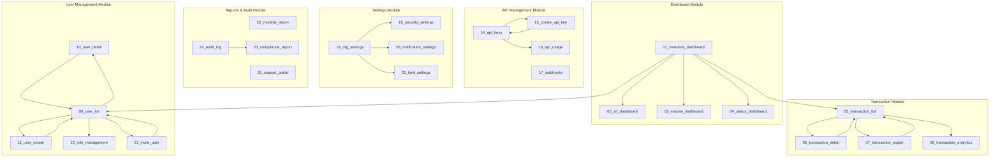

# DESIGN_MANIFEST - Enterprise Admin (System 07)

## 1. Overview
| Item | Value |
|------|-------|
| System ID | 07 |
| System Name | Enterprise Admin |
| Total Screens | 25 |
| Created Date | 2026-01-11 |
| Design Reference | design-concept-5-japan-premium.html |
| Target Persona | 佐藤さん (Service Provider/CTO) |

## 2. Screen Flow Diagram

## 3. Screen List

| ID | File Name | Screen Name | Category | Priority |
|----|-----------|-------------|----------|----------|
| 7-1 | 01_overview_dashboard.html | Overview Dashboard | Dashboard | Phase 1 |
| 7-2 | 02_tvl_dashboard.html | TVL Dashboard | Dashboard | Phase 2 |
| 7-3 | 03_volume_dashboard.html | Volume Dashboard | Dashboard | Phase 2 |
| 7-4 | 04_status_dashboard.html | Status Dashboard | Dashboard | Phase 2 |
| 7-5 | 05_transaction_list.html | Transaction List | Transactions | Phase 1 |
| 7-6 | 06_transaction_detail.html | Transaction Detail | Transactions | Phase 2 |
| 7-7 | 07_transaction_export.html | Transaction Export | Transactions | Phase 3 |
| 7-8 | 08_transaction_analytics.html | Transaction Analytics | Transactions | Phase 3 |
| 7-9 | 09_user_list.html | User List | Users | Phase 1 |
| 7-10 | 10_user_detail.html | User Detail | Users | Phase 2 |
| 7-11 | 11_user_create.html | User Create | Users | Phase 3 |
| 7-12 | 12_role_management.html | Role Management | Users | Phase 3 |
| 7-13 | 13_invite_user.html | Invite User | Users | Phase 3 |
| 7-14 | 14_api_keys.html | API Keys | API | Phase 1 |
| 7-15 | 15_create_api_key.html | Create API Key | API | Phase 3 |
| 7-16 | 16_api_usage.html | API Usage | API | Phase 3 |
| 7-17 | 17_webhooks.html | Webhooks | API | Phase 3 |
| 7-18 | 18_org_settings.html | Organization Settings | Settings | Phase 1 |
| 7-19 | 19_security_settings.html | Security Settings | Settings | Phase 2 |
| 7-20 | 20_notification_settings.html | Notification Settings | Settings | Phase 3 |
| 7-21 | 21_limit_settings.html | Limit Settings | Settings | Phase 3 |
| 7-22 | 22_monthly_report.html | Monthly Report | Reports | Phase 2 |
| 7-23 | 23_compliance_report.html | Compliance Report | Reports | Phase 3 |
| 7-24 | 24_audit_log.html | Audit Log | Reports | Phase 2 |
| 7-25 | 25_support_portal.html | Support Portal | Reports | Phase 3 |

## 4. Link Validation Table

| Source Screen | Element | Target Screen | Status |
|---------------|---------|---------------|--------|
| 01_overview_dashboard | .nav-tvl | 02_tvl_dashboard.html | ✅ |
| 01_overview_dashboard | .nav-volume | 03_volume_dashboard.html | ✅ |
| 01_overview_dashboard | .nav-status | 04_status_dashboard.html | ✅ |
| 01_overview_dashboard | .nav-transactions | 05_transaction_list.html | ✅ |
| 01_overview_dashboard | .nav-users | 09_user_list.html | ✅ |
| 01_overview_dashboard | .nav-api | 14_api_keys.html | ✅ |
| 01_overview_dashboard | .nav-settings | 18_org_settings.html | ✅ |
| 02_tvl_dashboard | .nav-overview | 01_overview_dashboard.html | ✅ |
| 03_volume_dashboard | .nav-overview | 01_overview_dashboard.html | ✅ |
| 04_status_dashboard | .nav-status | 04_status_dashboard.html | ✅ |
| 05_transaction_list | .transaction-row | 06_transaction_detail.html | ✅ |
| 05_transaction_list | #btn-export | 07_transaction_export.html | ✅ |
| 06_transaction_detail | #btn-back | 05_transaction_list.html | ✅ |
| 07_transaction_export | #btn-back | 05_transaction_list.html | ✅ |
| 08_transaction_analytics | .nav-transactions | 05_transaction_list.html | ✅ |
| 09_user_list | .user-row | 10_user_detail.html | ✅ |
| 09_user_list | #btn-add-user | 11_user_create.html | ✅ |
| 09_user_list | #btn-invite | 13_invite_user.html | ✅ |
| 10_user_detail | #btn-back | 09_user_list.html | ✅ |
| 11_user_create | #btn-back | 09_user_list.html | ✅ |
| 12_role_management | .nav-users | 09_user_list.html | ✅ |
| 13_invite_user | #btn-back | 09_user_list.html | ✅ |
| 14_api_keys | #btn-create-key | 15_create_api_key.html | ✅ |
| 15_create_api_key | #btn-back | 14_api_keys.html | ✅ |
| 16_api_usage | .nav-api | 14_api_keys.html | ✅ |
| 17_webhooks | .nav-settings | 18_org_settings.html | ✅ |
| 18_org_settings | .security-link | 19_security_settings.html | ✅ |
| 19_security_settings | .nav-settings | 18_org_settings.html | ✅ |
| 20_notification_settings | .nav-settings | 18_org_settings.html | ✅ |
| 21_limit_settings | .nav-settings | 18_org_settings.html | ✅ |
| 22_monthly_report | .nav-overview | 01_overview_dashboard.html | ✅ |
| 23_compliance_report | .nav-overview | 01_overview_dashboard.html | ✅ |
| 24_audit_log | .nav-overview | 01_overview_dashboard.html | ✅ |
| 25_support_portal | .nav-overview | 01_overview_dashboard.html | ✅ |

## 5. Design System Implementation

### Color Palette
| Token | Value | Usage |
|-------|-------|-------|
| --bg-primary | #0a0a0c | Main background |
| --bg-secondary | #111114 | Card backgrounds |
| --bg-card | #0e0e11 | Elevated cards |
| --bg-sidebar | #0c0c0f | Sidebar background |
| --accent-hinomaru | #bc002d | Primary CTA, brand |
| --accent-gold | #c9a962 | Secondary accent |
| --success | #00c896 | Success states |
| --warning | #f0a030 | Warning states |
| --text-primary | #f8f8fa | Primary text |
| --text-secondary | #9898a0 | Secondary text |
| --text-tertiary | #606068 | Tertiary text |

### Typography
| Token | Value |
|-------|-------|
| --font-body | 'Plus Jakarta Sans', 'Noto Sans JP', sans-serif |
| --font-mono | 'DM Mono', monospace |

### Spacing
| Token | Value |
|-------|-------|
| --space-sm | 8px |
| --space-md | 16px |
| --space-lg | 24px |
| --space-xl | 32px |

### Border Radius
| Token | Value |
|-------|-------|
| --radius-md | 10px |
| --radius-lg | 14px |
| --radius-xl | 20px |

## 6. Component Patterns

### Sidebar Navigation
- Fixed 260px width
- Logo with rotating ring animation
- Sectioned navigation groups
- Active state with hinomaru-dim background

### Data Tables
- Full-width with horizontal scroll
- Sortable columns
- Pagination with page size selector
- Row hover state with subtle background

### Stat Cards
- 4-column grid layout
- Label, value, change indicator
- Monospace font for numbers

### Form Elements
- Dark input backgrounds
- Subtle border default state
- Hinomaru accent on focus
- Toggle switches with green active state

### Action Buttons
- Primary: Hinomaru background
- Ghost: Transparent with dashed border
- Icon + text pattern

## 7. PIR Fix Status
| Check Item | Status |
|------------|--------|
| All screens created | ✅ |
| Navigation links valid | ✅ |
| Design tokens consistent | ✅ |
| Responsive breakpoints | ⏸️ Desktop-first |
| Accessibility landmarks | ✅ |
| Form labels | ✅ |

---
Generated: 2026-01-11
System: Enterprise Admin (07)
