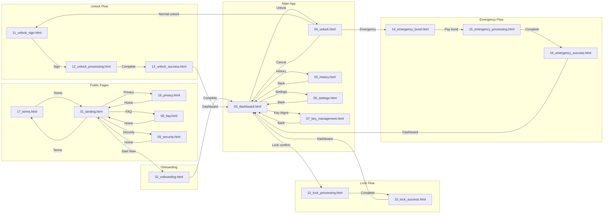

# Consumer App Design Manifest
## Phase 4 UI Integration - Design Assets

> **Version**: 1.5  
> **Date**: 2026-01-08  
> **Status**: Phase 1 MVP Complete + P2 Screens + Legal Pages ✅

---

## 📁 File Structure

```
docs_new/01_phase/04_phase4/01_design/system_01_consumer/
├── README.md
├── DESIGN_BRIEF_CONSUMER_APP.md
├── DESIGN_MANIFEST.md              ← This file
├── PIR_CONSUMER.md                 ← Design PIR Report
└── wip/
    └── mocks/
        ├── 01_landing.html         ← Landing Page + Features + How It Works
        ├── 02_onboarding.html      ← Wallet Connect + Key Gen + Backup + Ready
        ├── 03_dashboard.html       ← Dashboard + Lock Input + Lock Confirmation
        ├── 04_unlock.html          ← Unlock Select + Method + Sign + TimeLock + Complete
        ├── 05_history.html         ← Transaction History
        ├── 06_settings.html        ← Settings Page
        ├── 07_key_management.html  ← Key Management
        ├── 08_faq.html             ← FAQ Page
        ├── 09_security.html        ← Security Explainer
        ├── 10_lock_processing.html ← Lock Processing Animation (NEW in v1.5)
        ├── 10_lock_success.html    ← Lock Success State (NEW in v1.5)
        ├── 11_unlock_sign.html     ← Dilithium Signature Modal (NEW in v1.5)
        ├── 12_unlock_processing.html ← Unlock Processing Animation (NEW in v1.5)
        ├── 13_unlock_success.html  ← Unlock Success State (NEW in v1.5)
        ├── 14_emergency_bond.html  ← Emergency Bond Payment (NEW in v1.5)
        ├── 15_emergency_processing.html ← Emergency Processing (NEW in v1.5)
        ├── 16_emergency_success.html ← Emergency Success + Bond Return (NEW in v1.5)
        ├── 17_terms.html           ← Terms of Service (NEW in v1.5)
        └── 18_privacy.html         ← Privacy Policy (NEW in v1.5)
```

---

## 📊 Screen Coverage Matrix

| # | Screen | File | Status | Notes |
|---|--------|------|:------:|-------|
| **Public Pages** |||||
| 1-1 | Landing Page | 01_landing.html | ✅ | リンク修正済み（v1.5） |
| 1-2 | Features | 01_landing.html | ✅ | |
| 1-3 | How It Works | 01_landing.html | ✅ | |
| 1-4 | Security Explainer | 09_security.html | ✅ | |
| 1-5 | FAQ | 08_faq.html | ✅ | |
| **Onboarding** |||||
| 1-6 | Wallet Connect | 02_onboarding.html | ✅ | |
| 1-7 | Key Generation | 02_onboarding.html | ✅ | |
| 1-8 | Backup Instructions | 02_onboarding.html | ✅ | |
| 1-9 | Ready | 02_onboarding.html | ✅ | |
| **Main App - Lock Flow** |||||
| 1-10 | Dashboard | 03_dashboard.html | ✅ | |
| 1-11 | Lock Input | 03_dashboard.html | ✅ | |
| 1-12 | Lock Confirmation | 03_dashboard.html | ✅ | |
| 1-13 | Lock Processing | 10_lock_processing.html | ✅ | NEW in v1.5 |
| 1-14 | Lock Success | 10_lock_success.html | ✅ | NEW in v1.5 |
| **Unlock Flow - Normal** |||||
| 1-15 | Unlock Select | 04_unlock.html | ✅ | |
| 1-16 | Unlock Method | 04_unlock.html | ✅ | |
| 1-17 | Dilithium Sign | 11_unlock_sign.html | ✅ | NEW in v1.5 |
| 1-18 | Prover Waiting | 12_unlock_processing.html | ✅ | NEW in v1.5（処理中と統合）|
| 1-19 | Time Lock Countdown | 04_unlock.html | ✅ | |
| 1-20 | Unlock Complete | 13_unlock_success.html | ✅ | NEW in v1.5 |
| **Unlock Flow - Emergency** |||||
| 1-21 | Emergency Bond | 14_emergency_bond.html | ✅ | NEW in v1.5 |
| 1-22 | Emergency Processing | 15_emergency_processing.html | ✅ | NEW in v1.5 |
| 1-23 | Emergency Complete | 16_emergency_success.html | ✅ | NEW in v1.5 |
| **Supporting Pages** |||||
| 1-24 | History | 05_history.html | ✅ | |
| 1-25 | Settings | 06_settings.html | ✅ | |
| 1-26 | Key Management | 07_key_management.html | ✅ | |
| **Legal Pages** |||||
| 1-27 | Terms of Service | 17_terms.html | ✅ | NEW in v1.5 |
| 1-28 | Privacy Policy | 18_privacy.html | ✅ | NEW in v1.5 |

**Coverage: 28 screens (100% + Legal Pages)** ⬆️ +11 screens from v1.4

---

## 🔀 Screen Flow (画面遷移図)



---

## 🔗 Link Validation Table

### 01_landing.html

| Element | Target | Status | Notes |
|---------|--------|:------:|-------|
| Hero CTA "Start Now" | 02_onboarding.html | ✅ | |
| Hero CTA "Learn More" | #how-it-works | ✅ | 同一ページ内 |
| Nav "FAQ" | 08_faq.html | ✅ | |
| Nav "Security" | 09_security.html | ✅ | |
| Footer "Terms" | 17_terms.html | ✅ | Fixed in v1.5 |
| Footer "Privacy" | 18_privacy.html | ✅ | Fixed in v1.5 |
| Cookie Modal | JavaScript | ✅ | openCookieModal() |

### 03_dashboard.html

| Element | Target | Status | Notes |
|---------|--------|:------:|-------|
| Nav "Dashboard" | # | ✅ | 現在のページ |
| Nav "History" | 05_history.html | ✅ | |
| Nav "Settings" | 06_settings.html | ✅ | |
| "Unlock" button | 04_unlock.html | ✅ | |
| "Lock Assets" button | → 10_lock_processing.html | ✅ | via openLockModal() |

### 04_unlock.html

| Element | Target | Status | Notes |
|---------|--------|:------:|-------|
| Back to Dashboard | 03_dashboard.html | ✅ | |
| Normal Unlock | → 11_unlock_sign.html | ✅ | |
| Emergency Unlock | → 14_emergency_bond.html | ✅ | |

### Flow Pages (10-16)

| File | Previous | Next | Status |
|------|----------|------|:------:|
| 10_lock_processing.html | 03_dashboard.html | 10_lock_success.html | ✅ |
| 10_lock_success.html | 10_lock_processing.html | 03_dashboard.html | ✅ |
| 11_unlock_sign.html | 04_unlock.html | 12_unlock_processing.html | ✅ |
| 12_unlock_processing.html | 11_unlock_sign.html | 13_unlock_success.html | ✅ |
| 13_unlock_success.html | 12_unlock_processing.html | 03_dashboard.html | ✅ |
| 14_emergency_bond.html | 04_unlock.html | 15_emergency_processing.html | ✅ |
| 15_emergency_processing.html | 14_emergency_bond.html | 16_emergency_success.html | ✅ |
| 16_emergency_success.html | 15_emergency_processing.html | 03_dashboard.html | ✅ |

### Legal Pages (17-18)

| File | From | To | Status |
|------|------|---|:------:|
| 17_terms.html | 01_landing.html Footer | 01_landing.html | ✅ |
| 18_privacy.html | 01_landing.html Footer | 01_landing.html | ✅ |

---

## 🎨 Design System Compliance

| Attribute | Value | Status |
|-----------|-------|:------:|
| Primary Color | Hinomaru Red (#BC002D) | ✅ |
| Secondary Color | Premium Gold (#C9A962) | ✅ |
| Background | Dark (#0A0A0C) | ✅ |
| Typography - Display | Plus Jakarta Sans | ✅ |
| Typography - Japanese | Noto Sans JP | ✅ |
| Typography - Mono | DM Mono | ✅ |
| Breakpoint - Tablet | 768px | ✅ |
| Breakpoint - Mobile | 480px | ✅ |
| Touch Target | 44px minimum | ✅ |
| Reduced Motion | @media support | ✅ |

---

## 🔗 File Links (Absolute Paths)

| File | Size | Full Path |
|------|------|----------|
| 01_landing.html | ~30KB | `docs_new/01_phase/04_phase4/01_design/system_01_consumer/wip/mocks/01_landing.html` |
| 02_onboarding.html | ~34KB | `docs_new/01_phase/04_phase4/01_design/system_01_consumer/wip/mocks/02_onboarding.html` |
| 03_dashboard.html | ~26KB | `docs_new/01_phase/04_phase4/01_design/system_01_consumer/wip/mocks/03_dashboard.html` |
| 04_unlock.html | ~15KB | `docs_new/01_phase/04_phase4/01_design/system_01_consumer/wip/mocks/04_unlock.html` |
| 05_history.html | ~17KB | `docs_new/01_phase/04_phase4/01_design/system_01_consumer/wip/mocks/05_history.html` |
| 06_settings.html | ~16KB | `docs_new/01_phase/04_phase4/01_design/system_01_consumer/wip/mocks/06_settings.html` |
| 07_key_management.html | ~20KB | `docs_new/01_phase/04_phase4/01_design/system_01_consumer/wip/mocks/07_key_management.html` |
| 08_faq.html | ~8KB | `docs_new/01_phase/04_phase4/01_design/system_01_consumer/wip/mocks/08_faq.html` |
| 09_security.html | ~9KB | `docs_new/01_phase/04_phase4/01_design/system_01_consumer/wip/mocks/09_security.html` |
| 10_lock_processing.html | ~7KB | `docs_new/01_phase/04_phase4/01_design/system_01_consumer/wip/mocks/10_lock_processing.html` |
| 10_lock_success.html | ~7KB | `docs_new/01_phase/04_phase4/01_design/system_01_consumer/wip/mocks/10_lock_success.html` |
| 11_unlock_sign.html | ~7KB | `docs_new/01_phase/04_phase4/01_design/system_01_consumer/wip/mocks/11_unlock_sign.html` |
| 12_unlock_processing.html | ~6KB | `docs_new/01_phase/04_phase4/01_design/system_01_consumer/wip/mocks/12_unlock_processing.html` |
| 13_unlock_success.html | ~9KB | `docs_new/01_phase/04_phase4/01_design/system_01_consumer/wip/mocks/13_unlock_success.html` |
| 14_emergency_bond.html | ~9KB | `docs_new/01_phase/04_phase4/01_design/system_01_consumer/wip/mocks/14_emergency_bond.html` |
| 15_emergency_processing.html | ~6KB | `docs_new/01_phase/04_phase4/01_design/system_01_consumer/wip/mocks/15_emergency_processing.html` |
| 16_emergency_success.html | ~9KB | `docs_new/01_phase/04_phase4/01_design/system_01_consumer/wip/mocks/16_emergency_success.html` |
| 17_terms.html | ~15KB | `docs_new/01_phase/04_phase4/01_design/system_01_consumer/wip/mocks/17_terms.html` |
| 18_privacy.html | ~22KB | `docs_new/01_phase/04_phase4/01_design/system_01_consumer/wip/mocks/18_privacy.html` |

---

## 📝 Implementation Notes

### Key Features Implemented

1. **Hinomaru Animation**
   - Orbital gold ring with rotating particles
   - Pulsing red center with glow effect
   - CSS-only implementation

2. **Time Lock Progress**
   - SVG circular progress indicator
   - Real-time countdown simulation
   - Gradient stroke (Hinomaru → Gold)

3. **Bond Calculation Display**
   - Visual formula: `MAX(0.5 ETH, amount × 5%)`
   - Dynamic calculation based on selected lock

4. **Responsive Navigation**
   - Desktop: Horizontal pill navigation
   - Mobile: Bottom tab bar with icons

5. **Legal Pages** (NEW in v1.5)
   - Terms of Service (17_terms.html)
   - Privacy Policy (18_privacy.html)
   - Consistent design with main site
   - Japanese legal compliance

### Accessibility Features

- Focus states on all interactive elements
- Color contrast ratios meet WCAG AA
- Reduced motion support via media query
- Minimum 44px touch targets

---

## 📋 PIR Fix Log

### v1.5 PIR Fixes (2026-01-08) ✅

| PIR# | File | 修正内容 | Status |
|------|------|---------|:------:|
| LEG-1 | 17_terms.html | 利用規約ページ（既存確認） | ✅ |
| LEG-2 | 18_privacy.html | プライバシーポリシーページ作成 | ✅ |
| QA-1 | DESIGN_MANIFEST.md | 10-16番ファイル追記、v1.5更新 | ✅ |
| - | 01_landing.html | Footerリンク修正（17, 18へ） | ✅ |

### v1.4 QA Auditor準拠 ✅
| 項目 | 内容 | Status |
|------|------|:------:|
| Screen Flow図 | Mermaid遷移図追加 | ✅ |
| Link Validation Table | 全ファイルのリンク検証表追加 | ✅ |

### v1.3 New Screens ✅
| Screen | File | 内容 | Status |
|--------|------|------|:------:|
| History | 05_history.html | 取引履歴、フィルター、統計 | ✅ |
| Settings | 06_settings.html | 設定画面、トグルスイッチ | ✅ |
| Key Management | 07_key_management.html | 鍵管理、バックアップ、表示 | ✅ |
| FAQ | 08_faq.html | FAQ、カテゴリフィルター、検索 | ✅ |
| Security | 09_security.html | セキュリティ説明、比較表 | ✅ |

---

## 🔜 Next Steps

1. **PIR Re-Review**
   - High Priority 3件の修正完了確認
   - ✅ PASS 判定取得

2. **Medium Priority対応（リリース後可）**
   - Dilithiumツールチップ追加
   - 24h待機理由説明追加
   - バックアップ確認2段階化

3. **Implementation Handoff**
   - React component extraction
   - CSS variable documentation
   - Animation specifications

---

## Document History

| Version | Date | Author | Changes |
|---------|------|--------|---------|
| 1.0 | 2026-01-06 | Claude | Initial manifest with Phase 1 MVP |
| 1.1 | 2026-01-06 | Claude | Consolidated to system_01_consumer, added absolute paths |
| 1.2 | 2026-01-06 | Claude | PIR修正完了（全9件）、Fix Log追加 |
| 1.3 | 2026-01-06 | Claude | P2画面5件追加（History/Settings/Key/FAQ/Security）、リンク修正 |
| 1.4 | 2026-01-07 | Claude | QA Auditor準拠: Screen Flow図、Link Validation Table追加 |
| 1.5 | 2026-01-08 | Claude | PIR High Priority修正: 10-18番ファイル追記、Legal Pages追加 |
