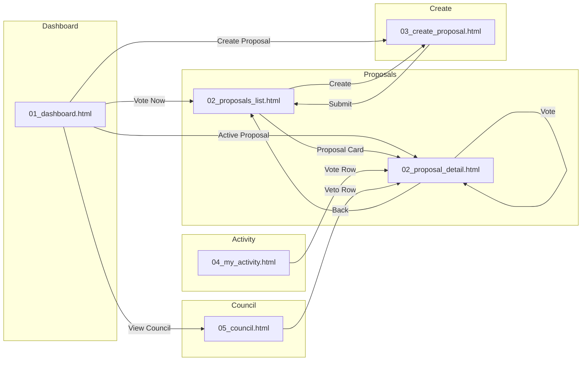

# Design Manifest: Governance

## Overview

| 項目 | 値 |
|------|-----|
| System | Governance |
| System ID | 03 |
| Directory | system_03_governance |
| Created | 2026-01-10 |
| Last Updated | 2026-01-10 |
| Status | 🟢 PIR Ready |

---

## Files

### Mocks

| # | ファイル | パス | 画面 | サイズ |
|---|----------|------|------|:------:|
| 1 | 01_dashboard.html | `wip/mocks/01_dashboard.html` | Governance Dashboard + My Voting Power | ~25kb |
| 2 | 02_proposals_list.html | `wip/mocks/02_proposals_list.html` | Proposals List (Active/Passed/Defeated) | ~22kb |
| 3 | 02_proposal_detail.html | `wip/mocks/02_proposal_detail.html` | Proposal Detail + Vote Interface + Vote Success | ~24kb |
| 4 | 03_create_proposal.html | `wip/mocks/03_create_proposal.html` | Create Proposal (Step 1-3 + Submit) | ~20kb |
| 5 | 04_my_activity.html | `wip/mocks/04_my_activity.html` | My Activity (Votes/Proposals/Delegations) | ~18kb |
| 6 | 05_council.html | `wip/mocks/05_council.html` | Council Dashboard + Emergency + Veto History | ~20kb |

**Total: 6 files**

---

## 🔀 Screen Flow (画面遷移図)

---

## 🔗 Link Validation Table

### 01_dashboard.html

| Element | Target | Status |
|---------|--------|:------:|
| Nav: Dashboard | 01_dashboard.html | ✅ |
| Nav: Proposals | 02_proposals_list.html | ✅ |
| Nav: Create | 03_create_proposal.html | ✅ |
| Nav: My Activity | 04_my_activity.html | ✅ |
| Vote Now button | 02_proposals_list.html | ✅ |
| Create Proposal button | 03_create_proposal.html | ✅ |
| Active Proposal cards | 02_proposal_detail.html | ✅ |
| View Council button | 05_council.html | ✅ |

### 02_proposals_list.html

| Element | Target | Status |
|---------|--------|:------:|
| Nav links | All pages | ✅ |
| Create Proposal button | 03_create_proposal.html | ✅ |
| Proposal cards | 02_proposal_detail.html | ✅ |
| Filter buttons | filterProposals() | ✅ |

### 02_proposal_detail.html

| Element | Target | Status |
|---------|--------|:------:|
| Nav links | All pages | ✅ |
| Breadcrumb: Proposals | 02_proposals_list.html | ✅ |
| Vote For button | openVoteModal('for') | ✅ |
| Vote Against button | openVoteModal('against') | ✅ |
| Abstain button | openVoteModal('abstain') | ✅ |
| Confirm Vote button | submitVote() | ✅ |
| Success: Back to Proposals | 02_proposals_list.html | ✅ |

### 03_create_proposal.html

| Element | Target | Status |
|---------|--------|:------:|
| Nav links | All pages | ✅ |
| Cancel button | 01_dashboard.html | ✅ |
| Type selection | selectType() | ✅ |
| Next/Back buttons | nextStep()/prevStep() | ✅ |
| Submit button | submitProposal() → 02_proposals_list.html | ✅ |

### 04_my_activity.html

| Element | Target | Status |
|---------|--------|:------:|
| Nav links | All pages | ✅ |
| Tab buttons | switchTab() | ✅ |
| Vote rows | 02_proposal_detail.html | ✅ |

### 05_council.html

| Element | Target | Status |
|---------|--------|:------:|
| Nav links | All pages | ✅ |
| Tab buttons | switchTab() | ✅ |
| Veto row | 02_proposal_detail.html | ✅ |

---

## Screen Coverage

| # | Screen (from DESIGN_BRIEF) | Covered In | Status |
|---|----------------------------|------------|:------:|
| 3-1 | Governance Dashboard | 01_dashboard.html | ✅ |
| 3-2 | My Voting Power | 01_dashboard.html | ✅ |
| 3-3 | Proposals List | 02_proposals_list.html | ✅ |
| 3-4 | Proposal Detail | 02_proposal_detail.html | ✅ |
| 3-5 | Vote Interface | 02_proposal_detail.html (modal) | ✅ |
| 3-6 | Vote Success | 02_proposal_detail.html (overlay) | ✅ |
| 3-7 | Create Step 1: Type | 03_create_proposal.html | ✅ |
| 3-8 | Create Step 2: Details | 03_create_proposal.html | ✅ |
| 3-9 | Create Step 3: Preview | 03_create_proposal.html | ✅ |
| 3-10 | Create Submit | 03_create_proposal.html | ✅ |
| 3-11 | My Votes | 04_my_activity.html (tab) | ✅ |
| 3-12 | My Proposals | 04_my_activity.html (tab) | ✅ |
| 3-13 | Received Delegations | 04_my_activity.html (tab) | ✅ |
| 3-14 | Council Dashboard | 05_council.html | ✅ |
| 3-15 | Emergency Actions | 05_council.html (tab) | ✅ |
| 3-16 | Veto History | 05_council.html (tab) | ✅ |

**Coverage: 16/16 screens (100%)**

---

## Design Checklist

| 項目 | 状態 | 備考 |
|------|:----:|------|
| Premium Japan感 | ✅ | 日の丸ロゴ、Gold/Hinomaru配色 |
| Dark Theme | ✅ | #0a0a0c背景 |
| Typography | ✅ | Plus Jakarta Sans + Noto Sans JP |
| Color Palette | ✅ | UI_DESIGN_GUIDELINES準拠 |
| Vote Colors | ✅ | For=Green, Against=OrangeRed, Abstain=Gray |
| Responsive | ✅ | 768px, 1024pxブレークポイント |
| Navigation | ✅ | 全ページ共通ヘッダー |
| 冒頭コメント | ✅ | 全ファイルにInteractions Defined記載 |
| リンク導通 | ✅ | href="#"なし、全て実在ファイル |

---

## Change Log

| Date | Version | Changes |
|------|---------|---------|
| 2026-01-10 | 1.0 | 初版作成 - 6モックファイル |
| 2026-01-10 | 1.1 | PIR指摘対応 - フッター外部リンク修正（Medium #1-7） |

---

**END OF MANIFEST**
