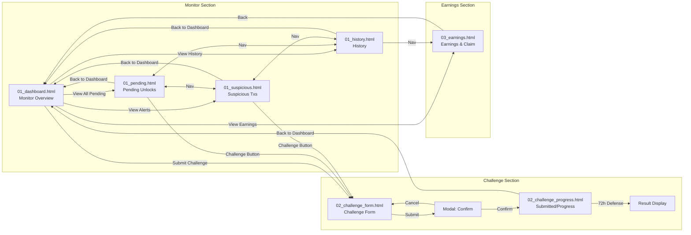

# Design Manifest: Observer/Challenger

## Overview
- System: Observer/Challenger
- System ID: 05
- Directory: system_05_observer
- Created: 2026-01-10
- Last Updated: 2026-01-10
- Status: 🟢 PIR Ready

## Files

### Wireframes
| # | ファイル | パス | 説明 |
|---|----------|------|------|
| - | N/A | - | ワイヤーフレームはスキップ（High-Fidelity直接作成） |

### Mocks
| # | ファイル | パス | 画面 | サイズ |
|---|----------|------|------|:------:|
| 1 | 01_dashboard.html | `wip/mocks/01_dashboard.html` | Monitor Overview | 30KB |
| 2 | 01_pending.html | `wip/mocks/01_pending.html` | Pending Unlocks | 22KB |
| 3 | 01_suspicious.html | `wip/mocks/01_suspicious.html` | Suspicious Transactions | 18KB |
| 4 | 01_history.html | `wip/mocks/01_history.html` | Monitor History | 16KB |
| 5 | 02_challenge_form.html | `wip/mocks/02_challenge_form.html` | Challenge Form + Confirm | 18KB |
| 6 | 02_challenge_progress.html | `wip/mocks/02_challenge_progress.html` | Challenge Progress + Result + Submitted | 20KB |
| 7 | 03_earnings.html | `wip/mocks/03_earnings.html` | Earnings & Claim | 23KB |

**合計: 7ファイル / 10画面**

## 🔀 Screen Flow (画面遷移図)

> 10_design_pir.md の QA Auditor が導通確認に使用。全てのリンクがこの図と一致すること。

## 🔗 Link Validation Table

> 全ての `<a>` と主要 `<button>` の遷移先を記録

### 01_dashboard.html (Monitor Overview)
| From | Element | To | Status |
|------|---------|-----|:------:|
| 01_dashboard.html | Nav: Pending | 01_pending.html | ✅ |
| 01_dashboard.html | Nav: Suspicious | 01_suspicious.html | ✅ |
| 01_dashboard.html | Nav: History | 01_history.html | ✅ |
| 01_dashboard.html | Nav: Earnings | 03_earnings.html | ✅ |
| 01_dashboard.html | "View All" (Pending) | 01_pending.html | ✅ |
| 01_dashboard.html | "View All" (Alerts) | 01_suspicious.html | ✅ |
| 01_dashboard.html | Challenge Button | 02_challenge_form.html | ✅ |
| 01_dashboard.html | View Earnings | 03_earnings.html | ✅ |

### 01_pending.html (Pending Unlocks)
| From | Element | To | Status |
|------|---------|-----|:------:|
| 01_pending.html | Nav: Dashboard | 01_dashboard.html | ✅ |
| 01_pending.html | Nav: Suspicious | 01_suspicious.html | ✅ |
| 01_pending.html | Nav: History | 01_history.html | ✅ |
| 01_pending.html | Nav: Earnings | 03_earnings.html | ✅ |
| 01_pending.html | Challenge Button | 02_challenge_form.html | ✅ |
| 01_pending.html | Back to Dashboard | 01_dashboard.html | ✅ |

### 01_suspicious.html (Suspicious Transactions)
| From | Element | To | Status |
|------|---------|-----|:------:|
| 01_suspicious.html | Nav: Dashboard | 01_dashboard.html | ✅ |
| 01_suspicious.html | Nav: Pending | 01_pending.html | ✅ |
| 01_suspicious.html | Nav: History | 01_history.html | ✅ |
| 01_suspicious.html | Nav: Earnings | 03_earnings.html | ✅ |
| 01_suspicious.html | Submit Challenge | 02_challenge_form.html | ✅ |

### 01_history.html (Monitor History)
| From | Element | To | Status |
|------|---------|-----|:------:|
| 01_history.html | Nav: Dashboard | 01_dashboard.html | ✅ |
| 01_history.html | Nav: Pending | 01_pending.html | ✅ |
| 01_history.html | Nav: Suspicious | 01_suspicious.html | ✅ |
| 01_history.html | Nav: Earnings | 03_earnings.html | ✅ |
| 01_history.html | View Details | 02_challenge_progress.html | ✅ |

### 02_challenge_form.html (Challenge Form)
| From | Element | To | Status |
|------|---------|-----|:------:|
| 02_challenge_form.html | Nav: Dashboard | 01_dashboard.html | ✅ |
| 02_challenge_form.html | Nav: Pending | 01_pending.html | ✅ |
| 02_challenge_form.html | Nav: History | 01_history.html | ✅ |
| 02_challenge_form.html | Cancel | 01_dashboard.html | ✅ |
| 02_challenge_form.html | Submit (Modal) | showConfirmModal() | ✅ |
| 02_challenge_form.html | Confirm (Modal) | 02_challenge_progress.html | ✅ |
| 02_challenge_form.html | Cancel (Modal) | closeModal() | ✅ |

### 02_challenge_progress.html (Challenge Progress)
| From | Element | To | Status |
|------|---------|-----|:------:|
| 02_challenge_progress.html | Nav: Dashboard | 01_dashboard.html | ✅ |
| 02_challenge_progress.html | Nav: Pending | 01_pending.html | ✅ |
| 02_challenge_progress.html | Nav: History | 01_history.html | ✅ |
| 02_challenge_progress.html | Nav: Earnings | 03_earnings.html | ✅ |
| 02_challenge_progress.html | Back to Dashboard | 01_dashboard.html | ✅ |
| 02_challenge_progress.html | Claim Rewards | 03_earnings.html | ✅ |

### 03_earnings.html (Earnings & Claim)
| From | Element | To | Status |
|------|---------|-----|:------:|
| 03_earnings.html | Nav: Dashboard | 01_dashboard.html | ✅ |
| 03_earnings.html | Nav: Pending | 01_pending.html | ✅ |
| 03_earnings.html | Nav: Suspicious | 01_suspicious.html | ✅ |
| 03_earnings.html | Nav: History | 01_history.html | ✅ |
| 03_earnings.html | Claim Button | claimRewards() | ✅ |
| 03_earnings.html | Back to Dashboard | 01_dashboard.html | ✅ |

## Interaction Summary

### Modals
| Screen | Modal ID | Trigger | Function |
|--------|----------|---------|----------|
| 02_challenge_form.html | #confirm-modal | Submit Button | showConfirmModal() / closeModal() |

### JavaScript Functions
| Function | Screen | Description |
|----------|--------|-------------|
| `showConfirmModal()` | 02_challenge_form.html | チャレンジ確認モーダル表示 |
| `closeModal()` | 02_challenge_form.html | モーダルを閉じる |
| `submitChallenge()` | 02_challenge_form.html | チャレンジ送信処理 |
| `toggleRowDetails()` | 01_pending.html | 行展開/折りたたみ |
| `applyFilters()` | 01_pending.html, 01_history.html | フィルター適用 |
| `exportCSV()` | 01_history.html | CSV出力 |
| `claimRewards()` | 03_earnings.html | 報酬請求処理 |
| `calculateROI()` | 03_earnings.html | ROI計算 |

## Design Notes

### ペルソナ対応
- **中村さん**（セキュリティリサーチャー、★★★★★）
  - デスクトップ最適化（PC利用率99%）
  - 高密度データ表示
  - リアルタイム更新対応
  - テクニカル用語そのまま使用

### デザインシステム準拠
- Hinomaru Red: #BC002D（プライマリアクション）
- Premium Gold: #C9A962（セカンダリ、報酬関連）
- Dark Background: #0A0A0C
- 4px スペーシングシステム
- Plus Jakarta Sans / Noto Sans JP / DM Mono

## Change Log
| Date | Version | Changes |
|------|---------|---------|
| 2026-01-10 | 1.0 | 初版作成 - 7ファイル/10画面のHTMLモック完成 |
