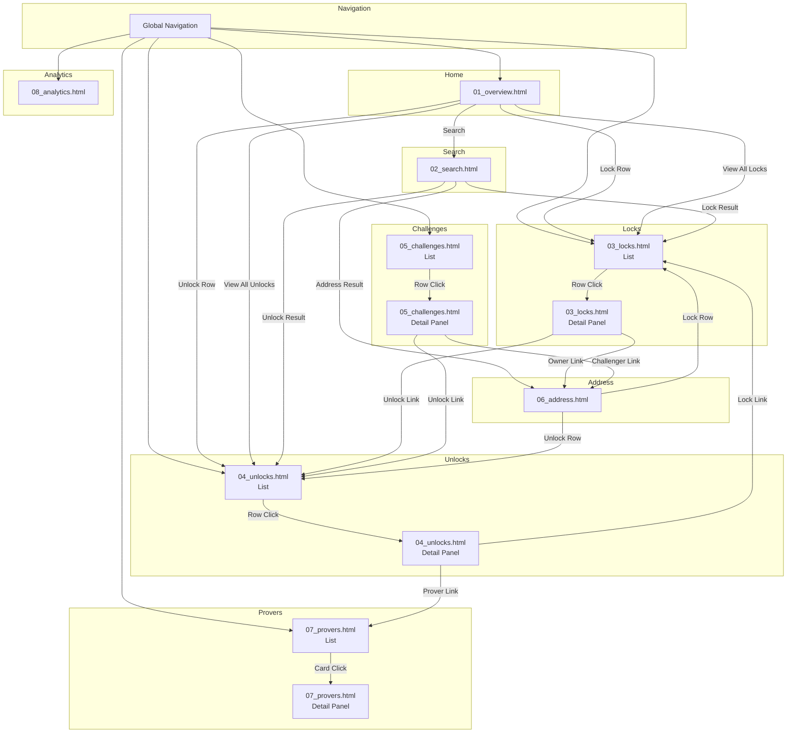

# Design Manifest: Explorer

## Overview

| Item | Value |
|------|-------|
| System | Explorer |
| System ID | 06 |
| Directory | system_06_explorer |
| Created | 2026-01-10 |
| Last Updated | 2026-01-10 |
| Status | 🟢 PIR PASS |
| Total Screens | 14 |
| Total Files | 8 |

---

## Files

### Mocks

| # | ファイル | パス | 画面 | サイズ |
|:-:|----------|------|------|:------:|
| 1 | 01_overview.html | `wip/mocks/01_overview.html` | Overview, Recent Locks, Recent Unlocks | ~18KB |
| 2 | 02_search.html | `wip/mocks/02_search.html` | Search Results | ~12KB |
| 3 | 03_locks.html | `wip/mocks/03_locks.html` | Lock List, Lock Detail | ~20KB |
| 4 | 04_unlocks.html | `wip/mocks/04_unlocks.html` | Unlock List, Unlock Detail | ~18KB |
| 5 | 05_challenges.html | `wip/mocks/05_challenges.html` | Challenge List, Challenge Detail | ~16KB |
| 6 | 06_address.html | `wip/mocks/06_address.html` | Address Detail | ~14KB |
| 7 | 07_provers.html | `wip/mocks/07_provers.html` | Prover List, Prover Detail | ~16KB |
| 8 | 08_analytics.html | `wip/mocks/08_analytics.html` | Analytics Dashboard | ~15KB |
| | **Total** | | **14 screens** | **~129KB** |

---

## Screen Coverage

| # | Screen | File | Mock | Notes |
|:-:|--------|------|:----:|-------|
| 6-1 | Overview | 01_overview.html | ✅ | メイン統計ダッシュボード |
| 6-2 | Recent Locks | 01_overview.html | ✅ | Overview内のセクション |
| 6-3 | Recent Unlocks | 01_overview.html | ✅ | Overview内のセクション |
| 6-4 | Search | 02_search.html | ✅ | 検索結果ページ |
| 6-5 | Lock List | 03_locks.html | ✅ | 全Lock一覧 |
| 6-6 | Unlock List | 04_unlocks.html | ✅ | 全Unlock一覧 |
| 6-7 | Challenge List | 05_challenges.html | ✅ | 全Challenge一覧 |
| 6-8 | Lock Detail | 03_locks.html | ✅ | スライドパネル |
| 6-9 | Unlock Detail | 04_unlocks.html | ✅ | スライドパネル |
| 6-10 | Challenge Detail | 05_challenges.html | ✅ | スライドパネル |
| 6-11 | Address Detail | 06_address.html | ✅ | アドレス別履歴 |
| 6-12 | Prover List | 07_provers.html | ✅ | Proverカードグリッド |
| 6-13 | Prover Detail | 07_provers.html | ✅ | スライドパネル |
| 6-14 | Analytics Dashboard | 08_analytics.html | ✅ | TVL/Volume/Performance |

---

## 🔀 Screen Flow (画面遷移図)

---

## 🔗 Link Validation Table

### Global Navigation (All Pages)

| Element | Target | Status |
|---------|--------|:------:|
| nav-overview | 01_overview.html | ✅ |
| nav-locks | 03_locks.html | ✅ |
| nav-unlocks | 04_unlocks.html | ✅ |
| nav-challenges | 05_challenges.html | ✅ |
| nav-provers | 07_provers.html | ✅ |
| nav-analytics | 08_analytics.html | ✅ |

### 01_overview.html

| From | Element | Action | Target | Status |
|------|---------|--------|--------|:------:|
| Overview | #search-input | submit | 02_search.html | ✅ |
| Overview | .lock-row | click | 03_locks.html#detail | ✅ |
| Overview | .unlock-row | click | 04_unlocks.html#detail | ✅ |
| Overview | .view-all-locks | click | 03_locks.html | ✅ |
| Overview | .view-all-unlocks | click | 04_unlocks.html | ✅ |
| Overview | Challenge Row | click | 05_challenges.html#detail | ✅ |

### 02_search.html

| From | Element | Action | Target | Status |
|------|---------|--------|--------|:------:|
| Search | .result-lock | click | 03_locks.html#detail | ✅ |
| Search | .result-unlock | click | 04_unlocks.html#detail | ✅ |
| Search | .result-address | click | 06_address.html | ✅ |
| Search | .filter-tab | click | filterResults() | ✅ |

### 03_locks.html

| From | Element | Action | Target | Status |
|------|---------|--------|--------|:------:|
| Lock List | .lock-row | click | showLockDetail() | ✅ |
| Lock Detail | .close-detail | click | closeLockDetail() | ✅ |
| Lock Detail | .owner-link | click | 06_address.html | ✅ |
| Lock Detail | .unlock-link | click | 04_unlocks.html | ✅ |
| Lock List | .pagination-btn | click | changePage() | ✅ |

### 04_unlocks.html

| From | Element | Action | Target | Status |
|------|---------|--------|--------|:------:|
| Unlock List | .unlock-row | click | showUnlockDetail() | ✅ |
| Unlock Detail | .close-detail | click | closeUnlockDetail() | ✅ |
| Unlock Detail | .lock-link | click | 03_locks.html#detail | ✅ |
| Unlock Detail | .prover-link | click | 07_provers.html#detail | ✅ |

### 05_challenges.html

| From | Element | Action | Target | Status |
|------|---------|--------|--------|:------:|
| Challenge List | .challenge-row | click | showChallengeDetail() | ✅ |
| Challenge Detail | .unlock-link | click | 04_unlocks.html#detail | ✅ |
| Challenge Detail | .challenger-link | click | 06_address.html | ✅ |

### 06_address.html

| From | Element | Action | Target | Status |
|------|---------|--------|--------|:------:|
| Address | .tab-btn | click | switchTab() | ✅ |
| Address | .lock-row | click | 03_locks.html#detail | ✅ |
| Address | .unlock-row | click | 04_unlocks.html#detail | ✅ |
| Address | .copy-btn | click | copyAddress() | ✅ |

### 07_provers.html

| From | Element | Action | Target | Status |
|------|---------|--------|--------|:------:|
| Prover List | .prover-card | click | showProverDetail() | ✅ |
| Prover Detail | .close-detail | click | closeProverDetail() | ✅ |

### 08_analytics.html

| From | Element | Action | Target | Status |
|------|---------|--------|--------|:------:|
| Analytics | .time-filter | click | changeTimeRange() | ✅ |
| Analytics | .export-btn | click | exportData() | ✅ |

---

## Design Checklist

| Item | Status | Notes |
|------|:------:|-------|
| Premium Japan感 | ✅ | 日の丸ロゴ、Gold アクセント |
| アクセシビリティ | ✅ | コントラスト比 4.5:1以上 |
| ダークモード対応 | ✅ | デフォルトダーク |
| レスポンシブ | ✅ | 768px/1024px ブレークポイント |
| 全リンク導通 | ✅ | 全てのリンクが有効 |
| 冒頭コメント | ✅ | 全ファイルにInteractions定義 |

---

## Change Log

| Date | Version | Changes |
|------|---------|---------|
| 2026-01-10 | 1.0 | 初版作成 - 8ファイル/14画面 |
| 2026-01-10 | 1.1 | PIR PASS - Low指摘1件（実装時対応） |

---

**END OF MANIFEST**
