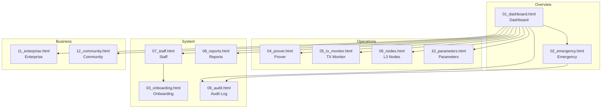

# DESIGN_MANIFEST - QS Admin

## Overview

| 項目 | 内容 |
|------|------|
| System ID | 08 |
| System Name | QS Admin |
| Target Personas | 加藤さん (新人スタッフ ★★★☆☆), 松本さん (シニアスタッフ ★★★★★) |
| Design System | Premium Japan (Hinomaru #BC002D, Gold #C9A962) |
| Total Screens | 12 (54 states) |
| Created | 2026-01-11 |
| Status | PIR Ready |

---

## Screen List

| # | File | Screen Name | Category | Description |
|---|------|-------------|----------|-------------|
| 01 | 01_dashboard.html | Dashboard | Overview | メインダッシュボード - KPI, アラート, システムステータス |
| 02 | 02_emergency.html | Emergency | Overview | 緊急停止 - Pause/Resume, チェックリスト, 履歴 |
| 03 | 03_onboarding.html | Onboarding | System | 新人研修 - 5ステップ (Welcome, QS概要, CP, 緊急手順, Quiz) |
| 04 | 04_prover.html | Prover Management | Operations | Prover管理 - 一覧, SLA, ステーク, 詳細 |
| 05 | 05_tx_monitor.html | TX Monitor | Operations | トランザクション監視 - Lock/Unlock/Challenge |
| 06 | 06_nodes.html | L3 Nodes | Operations | L3ノード管理 - ステータス, メトリクス |
| 07 | 07_staff.html | Staff Management | System | スタッフ管理 - 権限, ロール, オンボーディング状態 |
| 08 | 08_reports.html | Reports | System | レポート - Daily/Weekly/Monthly/Revenue |
| 09 | 09_audit.html | Audit Log | System | 監査ログ - 全ログ, ユーザー活動, セキュリティイベント |
| 10 | 10_parameters.html | Parameters | Operations | プロトコルパラメータ - 閲覧, 変更リクエスト |
| 11 | 11_enterprise.html | Enterprise | Business | 法人アカウント - 契約, TVL, ティア |
| 12 | 12_community.html | Community | Business | コミュニティ管理 - アナウンス, FAQ, サポート |

---

## Screen Flow Diagram

---

## Link Validation Table

| From | To | Link Element | Status |
|------|----|--------------|--------|
| 01_dashboard.html | 02_emergency.html | .nav-item.emergency | OK |
| 01_dashboard.html | 04_prover.html | .nav-item | OK |
| 01_dashboard.html | 05_tx_monitor.html | .nav-item | OK |
| 01_dashboard.html | 06_nodes.html | .nav-item | OK |
| 01_dashboard.html | 07_staff.html | .nav-item | OK |
| 01_dashboard.html | 08_reports.html | .nav-item | OK |
| 01_dashboard.html | 09_audit.html | .nav-item | OK |
| 02_emergency.html | 01_dashboard.html | .nav-item | OK |
| 02_emergency.html | 09_audit.html | .nav-item | OK |
| 03_onboarding.html | 01_dashboard.html | .nav-item | OK |
| 04_prover.html | 01_dashboard.html | .nav-item | OK |
| 04_prover.html | 05_tx_monitor.html | .nav-item | OK |
| 04_prover.html | 06_nodes.html | .nav-item | OK |
| 05_tx_monitor.html | 01_dashboard.html | .nav-item | OK |
| 05_tx_monitor.html | 04_prover.html | .nav-item | OK |
| 05_tx_monitor.html | 06_nodes.html | .nav-item | OK |
| 06_nodes.html | 01_dashboard.html | .nav-item | OK |
| 06_nodes.html | 04_prover.html | .nav-item | OK |
| 06_nodes.html | 05_tx_monitor.html | .nav-item | OK |
| 07_staff.html | 01_dashboard.html | .nav-item | OK |
| 07_staff.html | 03_onboarding.html | .nav-item | OK |
| 07_staff.html | 08_reports.html | .nav-item | OK |
| 07_staff.html | 09_audit.html | .nav-item | OK |
| 08_reports.html | 01_dashboard.html | .nav-item | OK |
| 08_reports.html | 07_staff.html | .nav-item | OK |
| 08_reports.html | 09_audit.html | .nav-item | OK |
| 09_audit.html | 01_dashboard.html | .nav-item | OK |
| 09_audit.html | 07_staff.html | .nav-item | OK |
| 09_audit.html | 08_reports.html | .nav-item | OK |
| 10_parameters.html | 01_dashboard.html | .nav-item | OK |
| 10_parameters.html | 04_prover.html | .nav-item | OK |
| 10_parameters.html | 05_tx_monitor.html | .nav-item | OK |
| 10_parameters.html | 06_nodes.html | .nav-item | OK |
| 11_enterprise.html | 01_dashboard.html | .nav-item | OK |
| 11_enterprise.html | 12_community.html | .nav-item | OK |
| 12_community.html | 01_dashboard.html | .nav-item | OK |
| 12_community.html | 11_enterprise.html | .nav-item | OK |

**Dead Link Check**: 0 dead links (href="#" forbidden)

---

## Interactions Defined

| Screen | Element | Action | Handler |
|--------|---------|--------|---------|
| 01_dashboard | .alert-item | click | showAlertDetail() |
| 01_dashboard | .activity-item | click | showActivityDetail() |
| 02_emergency | #btn-pause | click | confirmPause() |
| 02_emergency | #btn-resume | click | confirmResume() |
| 02_emergency | .checklist-item | change | updateChecklist() |
| 03_onboarding | .step-nav | click | navigateStep() |
| 03_onboarding | #btn-next | click | nextStep() |
| 03_onboarding | .quiz-option | click | selectQuizOption() |
| 04_prover | .prover-row | click | showProverDetail() |
| 05_tx_monitor | .tx-row | click | showTxDetail() |
| 05_tx_monitor | .tab-item | click | switchTab() |
| 06_nodes | .node-card | click | showNodeDetail() |
| 07_staff | .staff-row | click | showStaffDetail() |
| 07_staff | #btn-add-staff | click | showAddStaffModal() |
| 08_reports | .report-card | click | viewReport() |
| 08_reports | #btn-export | click | exportReport() |
| 09_audit | .log-row | click | showLogDetail() |
| 09_audit | .tab-item | click | switchTab() |
| 10_parameters | .param-row | click | showParamDetail() |
| 10_parameters | #btn-request-change | click | showChangeRequest() |
| 10_parameters | .param-history | click | showParamHistory() |
| 11_enterprise | .enterprise-row | click | showEnterpriseDetail() |
| 11_enterprise | #btn-add-enterprise | click | showAddEnterpriseModal() |
| 12_community | .announcement-card | click | showAnnouncementDetail() |
| 12_community | #btn-new-announcement | click | showNewAnnouncementModal() |
| 12_community | .faq-item | click | showFaqDetail() |

---

## Design Tokens Applied

| Token | Value | Usage |
|-------|-------|-------|
| --accent-hinomaru | #BC002D | Primary accent, Emergency, Active states |
| --accent-hinomaru-dim | rgba(188, 0, 45, 0.12) | Backgrounds, Badges |
| --accent-gold | #C9A962 | Secondary accent, Premium indicators |
| --accent-gold-dim | rgba(201, 169, 98, 0.12) | Backgrounds, Badges |
| --success | #00C896 | Healthy, Active, Positive states |
| --warning | #F0A030 | Warnings, Pending states |
| --bg-primary | #0A0A0C | Page background |
| --bg-secondary | #111114 | Sidebar, Cards |
| --bg-card | #0E0E11 | Card backgrounds |
| --font-body | Plus Jakarta Sans | Body text |
| --font-mono | DM Mono | Numbers, Code, Technical data |

---

## Core Principles Coverage

| CP | Name | Implementation |
|----|------|----------------|
| CP-1 | Quantum Resistance | 03_onboarding (Step 3), 10_parameters (Dilithium) |
| CP-2 | Self-Custody | 03_onboarding (Step 3), Dashboard tooltips |
| CP-3 | Time Lock | 03_onboarding (Step 3), 10_parameters (Min 30 days) |
| CP-4 | Slashing | 03_onboarding (Step 3), 10_parameters (100% penalty) |
| CP-5 | Transparency | 09_audit (全ログ記録), 08_reports |

---

## PIR Ready Checklist

- [x] All 12 screens created
- [x] No dead links (href="#" forbidden)
- [x] Interaction comments in all HTML files
- [x] Premium Japan design system applied
- [x] Core Principles (CP-1 to CP-5) referenced
- [x] Target personas considered (加藤さん, 松本さん)
- [x] Permission levels visualized (Viewer → Super Admin)
- [x] Emergency procedures documented
- [x] Consistent navigation across all screens

---

## Change Log

| Version | Date | Author | Changes |
|---------|------|--------|---------|
| 1.0 | 2026-01-11 | Design Agent | Initial 12 screens created |
