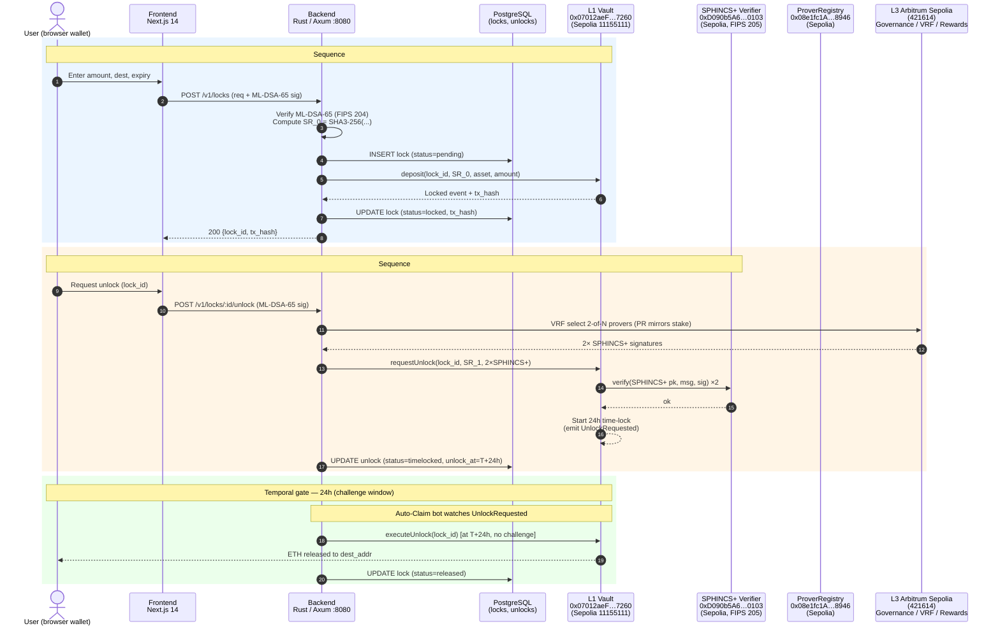

# Quantum Shield — Architecture Diagram (Lock + Normal Unlock)

> Source-of-truth: `.claude/rules/blockchain.md`, `docs/core/SEQUENCES.md` (§1, §2),
> `CLAUDE.md`, `src/api/api/src/types.rs`. Addresses below are verbatim from
> `.claude/rules/blockchain.md`.
>
> Note: `docs/core/SEQUENCES.md` line 85 still cites a legacy Vault address
> (`0x6F88…1c67`). The authoritative address is the one in
> `.claude/rules/blockchain.md` (`0x0701…7260`).
> [VERIFY: founder confirmation — refresh `SEQUENCES.md` to match `blockchain.md`.]

---

## Output 1: Mermaid diagram (Sequences #1 + #2)



---

## Output 2: Narrative (~150 words, EF-reviewer pitch)

Quantum Shield separates the **hot signing path** (ML-DSA-65, FIPS 204) used for
every user request from the **cold settlement path** (SPHINCS+ / SLH-DSA,
FIPS 205) used by an N-of-M prover quorum to authorise withdrawals on-chain.
This dual-signature design is defence-in-depth: a break in either lattice or
hash-based assumptions still leaves one independent NIST-standardised barrier.
**L1 (Ethereum Sepolia, chain 11155111)** is the custody anchor — `Vault`
(`0x07012aeF…7260`), `ProverRegistry` (`0x08e1fc1A…8946`) and the on-chain
`SPHINCS+ Verifier` (`0xD090b5A6…0103`) hold funds and enforce a 24-hour
time-lock. **L3 (Arbitrum Sepolia, chain 421614, deployed 2026-03-03)** hosts
governance, veQS staking and prover/observer reward economics — cheap-gas
surface that never touches user principal. Lock + Normal Unlock are
deployed on testnet today; emergency unlock, observer challenges,
slashing and governance ship across Phases 2-5. Unlike QRL’s own-chain
liquidity trap, QS keeps assets on Ethereum; unlike MPC custodians, QS
relies on standardised post-quantum primitives, not threshold-ECDSA secret
sharing whose security collapses under Shor.

---

## Output 3: Founder action — export Mermaid → PNG

```
## Founder action: export Mermaid → PNG
```

Pick **one** of the three options below to produce `architecture.png` for the
ESP form upload:

1. **mermaid.live (browser, zero-install — easiest)**
   Open https://mermaid.live/ , paste the diagram block above into the left
   pane, then click `Actions → PNG` (top-right). Save as
   `docs/grants/architecture/architecture.png`.

2. **mermaid-cli via npx (one-shot, no global install)**
   ```bash
   cd /home/user/quantum-shield/docs/grants/architecture
   # Extract just the mermaid block into a .mmd file first:
   awk '/^```mermaid$/{flag=1;next}/^```$/{flag=0}flag' QS_LOCK_FLOW_diagram.md > QS_LOCK_FLOW.mmd
   npx -y -p @mermaid-js/mermaid-cli mmdc \
     -i QS_LOCK_FLOW.mmd \
     -o architecture.png \
     -t neutral -b white -w 1600
   ```

3. **Docker (if Chromium sandbox blocks npx)**
   ```bash
   cd /home/user/quantum-shield/docs/grants/architecture
   docker run --rm -u "$(id -u):$(id -g)" -v "$PWD:/data" \
     minlag/mermaid-cli:latest \
     -i QS_LOCK_FLOW.mmd -o architecture.png -t neutral -b white -w 1600
   ```

After export, attach `architecture.png` (and optionally this `.md` file as a
caption source) to the ESP Track A application.
