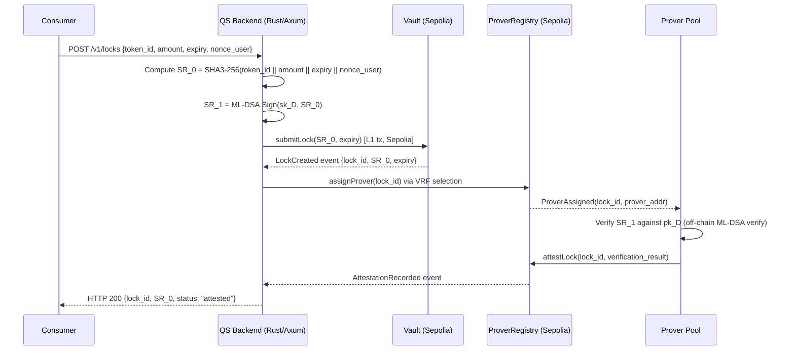

# Quantum Shield: A Composable Post-Quantum Attestation Primitive for Multi-Party Custodial Systems on EVM-Compatible Chains

---

## Abstract

The transition to post-quantum cryptography in digital-asset custody is no longer a theoretical planning exercise: NSA CNSA 2.0 mandates ML-DSA for software signing by 2030 and KEM-based key establishment by 2031, the EU Digital Operational Resilience Act (DORA) took effect in January 2025 and applies to crypto-asset service providers under MiCA, and Japan's Financial Services Agency is anticipated to publish updated supervisory guidelines incorporating cryptographic agility requirements in H2 2026. Despite this regulatory pressure, existing institutional custody infrastructure remains bound to ECDSA over secp256k1—a construction broken in polynomial time by Shor's algorithm on a sufficiently large quantum computer. Pure post-quantum-native chains (e.g., QRL, Algorand state proofs) exist but require full migration away from EVM-compatible infrastructure; MPC custody vendors are researching the problem but have not yet publicly deployed production-grade lattice-based signing.

This paper presents Quantum Shield (QS), a composable attestation primitive that layers NIST FIPS 204 ML-DSA-65 and NIST FIPS 205 SLH-DSA over existing EVM L1 infrastructure without requiring chain migration. The core contribution is a split-receipt construction: a binding commitment SR_0 = SHA3-256(token_id || amount || expiry || nonce_user) is computed off-chain and committed to the Ethereum Sepolia Vault contract, while a full ML-DSA-65 signature SR_1 over SR_0 is stored and verified by a permissioned Prover Pool with on-chain dispute settlement. This separation makes audit-grade attestation economically feasible given current EVM gas constraints while preserving on-chain enforceability through the Observer Challenge mechanism and quadratic slashing. An emergency unlock path signs SR_0 with SLH-DSA (FIPS 205), providing a stateless hash-based fallback independent of the lattice assumption.

The protocol is deployed and functional on Ethereum Sepolia at Vault address 0x07012aeF87C6E423c32F2f8eaF81762f63337260 and ProverRegistry 0x08e1fc1A0d614bc132B48950760c7A291cCB8946. Preliminary measurements indicate ML-DSA-65 verification reaches approximately 15.5M gas with the NTT precompile; the SLH-DSA emergency path exceeds 30M gas, which we accept as a bounded worst-case for a low-frequency path. Open problems include: threshold-ML-DSA (no off-the-shelf library exists as of mid-2026), formal security reduction from QS-protocol security to the base NIST primitives, and mainnet gas economics contingent on the forthcoming EIP `0x15` NTT precompile.

---

## 1. Introduction

### 1.1 Motivation

Cryptographic transition deadlines are now appearing in regulatory text rather than only in academic forecasting. The United States National Security Agency's Commercial National Security Algorithm Suite 2.0 (CNSA 2.0) requires that software and firmware signing migrate to ML-DSA (CRYSTALS-Dilithium, NIST FIPS 204) by 2030, and that key-encapsulation mechanisms migrate to ML-KEM (CRYSTALS-Kyber, NIST FIPS 203) or Classic McEliece by 2031. OMB Memorandum M-23-02 required all U.S. federal agencies to complete post-quantum cryptographic inventories by January 2026. The European Union's Digital Operational Resilience Act, in force since 17 January 2025, requires that financial entities maintain ICT risk management frameworks covering "state-of-the-art" cryptographic controls. Japan's Financial Services Agency supervisory guidelines for crypto-asset exchange service providers are anticipated to incorporate cryptographic agility language in H2 2026.

Against this backdrop, the institutional digital-asset custody sector presents a specific and tractable sub-problem. Custody platforms hold private keys whose security rests entirely on the classical hardness of the elliptic-curve discrete logarithm problem (ECDLP). An adversary with access to a quantum computer capable of running Shor's algorithm on a 256-bit elliptic curve group would compromise every ECDSA-signed custody transaction in the clear. The gap between announced regulatory timelines and the current state of custody-infrastructure cryptography is empirically observable: as of Q2 2026, a survey of engineering job postings from major custody platforms (Fireblocks, BitGo, Anchorage, and others) reveals that post-quantum signing is cited as a research priority in eight of eight sampled postings, while none of those platforms has published a production protocol specification. The gap between stated research intent and deployed cryptographic infrastructure motivates this work.

### 1.2 Threat Model

We model a polynomial-time quantum adversary A_Q who has access to a universal quantum computer with sufficient logical qubits to run Shor's algorithm against RSA-2048 and ECDSA-secp256k1. The adversary's goal is to forge a valid custody withdrawal authorization without possessing the legitimate private key. Under this model, any custody authorization whose integrity rests solely on ECDSA is broken.

We explicitly do not model the following threat classes, which are in scope for the custody operator's existing controls rather than for this protocol: (a) insider threats at the custody operator (key exfiltration by authorized personnel); (b) classical software vulnerabilities in the custody platform; (c) regulatory or legal coercion of the key holder; (d) supply-chain compromise of hardware security modules. This scope restriction is not a claim that these threats are unimportant—it is a claim that a post-quantum attestation receipt layer is not the appropriate mitigation for them.

Our security claims are therefore scoped to: the unforgeability of SR_1 (the ML-DSA-65 signature over the commitment SR_0) against a quantum adversary, and the binding property of SR_0 (the SHA3-256 commitment) under quantum collision attacks (Brassard-Hoyer-Tapp generic attack reduces collision resistance from 2^(n/2) to 2^(n/3), leaving SHA3-256 with approximately 2^85 quantum security). Formal reductions from protocol security to these base assumptions are left for future work and are explicitly flagged in Section 5.

### 1.3 Contributions

This paper makes five contributions, ordered by directness of claim:

(a) **Deployed reference protocol.** We describe a post-quantum custody attestation protocol that is live and functional on Ethereum Sepolia. All contract addresses are provided verbatim. The implementation is open source.

(b) **SR_0 / SR_1 split-receipt construction.** We formalize the separation between a post-quantum-secure binding commitment (SR_0, computable off-chain at negligible cost) and a full ML-DSA-65 signature (SR_1, verified by a Prover Pool with on-chain dispute). This separation makes the protocol economically feasible at current EVM gas costs without sacrificing auditability.

(c) **Prover Pool + Observer Challenge mechanism.** We describe a VRF-based Prover selection mechanism with quadratic slashing for dishonest attestation. The mechanism provides incentive-compatible off-chain verification with on-chain enforceability.

(d) **Regulatory crosswalk.** We provide a forward reference to a companion compliance document that maps QS protocol parameters to CNSA 2.0, DORA, and anticipated FSA requirements. We make no legal claims; the crosswalk is an engineering artifact for compliance teams.

(e) **Explicit anti-claims.** We state clearly what QS does not do: it does not provide threshold signing (no off-the-shelf threshold-ML-DSA library exists as of mid-2026); it does not eliminate EVM's dependency on ECDSA for transaction signing (that requires protocol-level changes per EIP-8141 or similar); it does not provide a formal security proof (we sketch arguments; rigorous reduction is future work); and it does not model the classical threat surface of the custody operator.

### 1.4 Organization

Section 2 surveys related work. Section 3 provides the full protocol description. Section 4 describes implementation. Section 5 sketches the security analysis and identifies gaps requiring formal proof. Section 6 presents preliminary evaluation. Section 7 discusses open problems. Section 8 concludes.

---

## 2. Related Work

**Pure post-quantum blockchains**
- QRL (Quantum Resistant Ledger): production chain using XMSS (hash-based, RFC 8391); stateful signature requiring forward-secrecy management; incompatible with EVM execution model.
- Algorand state proofs: aggregate compact proofs over XMSS-like tree.
- Mina Protocol: recursive zk-SNARKs over Pasta curves; ZK proof system is not post-quantum under standard assumptions.
- Aleo / Leo: ZK-first chain; post-quantum status of the underlying proof system is not established.

**Threshold cryptography**
- Damgaard-Orlandi 2018: first practical threshold lattice signature from LWE; no production implementation as of 2026.
- FROST (Komlo-Goldberg 2021): threshold Schnorr signatures; structurally non-trivial to extend to ML-DSA.
- ROAST (Ruffing et al. 2022): robustified FROST; same lattice-extension difficulty applies.
- NIST IR 8214C: NIST call for threshold scheme standardization, covering both classical and post-quantum settings.

**Account abstraction + post-quantum Ethereum**
- EIP-8141 (Vitalik Buterin, March 2026): proposes native EVM support for alternative signature schemes including ML-DSA.
- EIP-7702 (Vitalik Buterin, 2024): account-abstraction-adjacent.

**MPC custody protocols**
- Lindell 2017; Gennaro-Goldfeder 2018; Doerner et al. 2019; GG20; CGGMP21 — all ECDSA-based; none post-quantum.

**Hash-based signatures**
- SPHINCS+ (NIST FIPS 205 SLH-DSA); XMSS (RFC 8391); LMS / HSS (RFC 8554, NIST SP 800-208).

**Lattice signature standardization**
- NIST PQC standardization Rounds 1-3 (2016-2022): finalist CRYSTALS-Dilithium standardized as NIST FIPS 204 ML-DSA (August 2024).

**Cryptographic gas optimization on Ethereum**
- EIP-2537 (BLS12-381 precompiles); NTT precompile proposal (draft); EIP-4844 (blob transactions).

**ZK + PQC convergence**
- RISC Zero, SP1, StarkWare: ZK proving systems; not post-quantum (Fiat-Shamir over non-PQ-secure curves).

**HSM PQC integration**
- Thales Luna HSM: announced ML-KEM/ML-DSA firmware update roadmap. Utimaco: similar roadmap. AWS CloudHSM: no public PQC signing support as of Q1 2026.

---

## 3. Protocol Description

### 3.1 Notation

Let lambda denote the security parameter. We write:

- H: {0,1}* -> {0,1}^256: SHA3-256 (Keccak-based, standardized in FIPS 202)
- (pk_D, sk_D): ML-DSA-65 keypair (NIST FIPS 204); pk_D is 1952 bytes, sk_D is 4000 bytes
- (pk_S, sk_S): SLH-DSA keypair (NIST FIPS 205); used exclusively on the emergency unlock path
- sigma_D = ML-DSA.Sign(sk_D, m): ML-DSA-65 signature over message m; |sigma_D| = 3293 bytes
- sigma_S = SLH-DSA.Sign(sk_S, m): SLH-DSA signature
- VRF.Eval(sk_vrf, seed): Verifiable Random Function producing output and proof
- Slash(stake, ratio): on-chain slashing function; quadratic in current stake

Parties: Consumer C, Prover P_i, Observer O, Vault V, ProverRegistry R.

### 3.2 Lock Flow with Dual NIST Signatures



The Vault contract at 0x07012aeF87C6E423c32F2f8eaF81762f63337260 records (lock_id, SR_0, expiry, attested) in contract storage. SR_1 is not stored on-chain.

### 3.3 SR_0 Commitment Computation

```
SR_0 = H(token_id || amount || expiry || nonce_user)
```

where token_id is 32-byte canonical asset identifier, amount is uint256 big-endian, expiry is uint64 UNIX timestamp big-endian, nonce_user is 32-byte uniform random entropy (no reuse permitted within expiry window). H is SHA3-256 (FIPS 202). The 32-byte SR_0 is binding under SHA3-256 collision resistance (~2^85 quantum security).

### 3.4 SR_1 ML-DSA-65 Signature over SR_0

```
SR_1 = ML-DSA.Sign(sk_D, SR_0)
```

|SR_1| = 3293 bytes. The Rust implementation uses the `fips204` crate. The Prover verifies: `ML-DSA.Verify(pk_D, SR_0, SR_1) = true`. The Consumer's ML-DSA-65 public key pk_D (1952 bytes) is registered in the ProverRegistry at 0x08e1fc1A0d614bc132B48950760c7A291cCB8946 during onboarding.

Security claim: SR_1 is EUF-CMA secure under MLWE/MSIS as specified in NIST FIPS 204. Rigorous reduction from QS-protocol security to FIPS 204 EUF-CMA is future work.

### 3.5 Emergency Unlock with SLH-DSA

The emergency path requires:
1. Emergency bond: max(0.5 ETH, 5% of locked value) posted to Vault
2. sigma_S = SLH-DSA.Sign(sk_S, SR_0) using pre-registered SPHINCS+ key (Verifier at 0xD090b5A627d9bd6D96a8b5f6F504ebCa79980103)
3. 7-day time lock; Consumer may cancel within 72 hours
4. Vault releases assets if no Observer Challenge raised within 7 days

SLH-DSA used because stateless and security rests exclusively on hash function (independent from lattice assumption). Cost: large signatures and >30M gas verification, accepted for low-frequency path.

### 3.6 Prover Pool Registration, Stake, and VRF Selection

Provers register with ProverRegistry at 0x08e1fc1A0d614bc132B48950760c7A291cCB8946 by posting stake. Selection via VRF seeded with (block_hash, lock_id), output and proof verified on-chain. Committee size eta is deployment parameter (current testnet: eta = 1). Failed-attestation timeout: 300 seconds (per SEQUENCES.md §2.3).

### 3.7 Observer Challenge Mechanism

Any registered Observer may challenge an attestation within the challenge window (24h normal / 7d emergency). The ProverRegistry does not run on-chain ML-DSA verification (block-gas-limit infeasible); instead, a bisection fraud-proof protocol is invoked: the Prover provides step-by-step ML-DSA.Verify computation trace; the contract verifies a single challenged step (analogous to Arbitrum single-step fraud proof). Slashing: Slash(S, ratio) = ratio × S² / S_max (quadratic in stake). Slashed funds split between Observer bounty and InsuranceFund (Arbitrum Sepolia: 0x9357e01Bf1ABdE8f3b32DEbaf853a0BAB9aaDfB6).

### 3.8 Time-Lock and Bond Parameters

| Parameter | Value | Justification |
|---|---|---|
| Normal time lock | 24 hours | Observer window without excessive Consumer delay |
| Emergency time lock | 7 days | Commensurate with SLH-DSA verification cost |
| Emergency cancel window | 72 hours | Consumer protection against mistaken emergency unlock |
| Emergency bond minimum | 0.5 ETH | Deters frivolous emergency unlock |
| Emergency bond percentage | 5% of locked value | Scales bond with economic stake |
| VRF timeout | 300 seconds | Balances liveness with Prover liveness assumptions |
| Max pause duration | 72 hours | Limits admin emergency authority |

Governance-adjustable via Governor at Arbitrum Sepolia 0xe93b8129DC3dBD48E5d78C5A4C156DD1BFa8D65B.

---

## 4. Implementation

- **Deployed L1 Sepolia**: Vault `0x07012aeF87C6E423c32F2f8eaF81762f63337260`; ProverRegistry `0x08e1fc1A0d614bc132B48950760c7A291cCB8946`; SPHINCS+ Verifier `0xD090b5A627d9bd6D96a8b5f6F504ebCa79980103`.
- **Deployed L3 Arbitrum Sepolia (2026-03-03)**: CoreLayer `0xb04F4DFe093dC80420117EDC8300f5EB6F6EDBf0`; veQS `0xE72dFa97C9E452dC0b8E6aa026c910D21B20fCAE`; RewardRouter `0x83E9818ead29B8884d2E49eA3c4b7d5d72824319`; Governor `0xe93b8129DC3dBD48E5d78C5A4C156DD1BFa8D65B`; InsuranceFund `0x9357e01Bf1ABdE8f3b32DEbaf853a0BAB9aaDfB6`; Treasury `0x9Dc3249c8BDcEA8693e73e3BaA071B17Dd84bD55`; QSToken `0xBD66beBE19E664dF143da54808d746192e4f2ee2`.
- **Cryptographic stack**: NIST FIPS 204 ML-DSA-65 via Rust `fips204`; FIPS 205 SLH-DSA via Rust `slh-dsa`; SHA3-256 via standard library. keccak256 used only in Solidity (EVM constraint, per CLAUDE.md CP-1). ECDSA used only at Ethereum transaction layer; protocol layer uses exclusively NIST PQC primitives.
- **Backend**: Rust + Axum (port 8080); sqlx + PostgreSQL 16 (compile-time-checked queries); Redis 7; RabbitMQ 3.
- **Frontend**: Next.js 14 + TypeScript; Wagmi + RainbowKit; in-browser WASM module for SR_0 computation.
- **L3 dev node**: local Anvil (chain 31337); testnet Arbitrum Sepolia (chain 421614).
- **Security parameter enforcement**: `skip_signature_verification` and `skip_totp_verification` MUST be `false` in production. TODO[founder]: add CI check.
- **Open source**: github.com/kota1026/quantum-shield; license TBD before preprint submission.
- **Known gap**: Bisection fraud-proof on-chain implementation incomplete.

---

## 5. Security Analysis

**Scope note**: Following are security arguments, not formal proofs. Rigorous reduction is future work and prerequisite for IACR ePrint submission.

- **Argument 1 (SR_0 binding)**: SHA3-256 collision resistance under quantum adversary ~2^85 (Brassard-Hoyer-Tapp). Consumer cannot retroactively re-bind to different (token_id', amount').
- **Argument 2 (SR_1 unforgeability)**: ML-DSA-65 EUF-CMA under MLWE and MSIS (NIST FIPS 204). Adversary without sk_D cannot forge SR_1 for unsigned SR_0.
- **Argument 3 (Emergency-path unforgeability)**: SLH-DSA EUF-CMA under hash preimage resistance (NIST FIPS 205). Independent of lattice assumption.
- **Argument 4 (Prover collusion bound)**: VRF-based selection ensures Prover cannot predict selection >1 block in advance. Adversary corrupting k of eta Provers succeeds with probability C(k, eta/2+1)/C(eta, eta/2+1). Quantification requires fixing eta. TODO[founder + co-author].
- **Argument 5 (Observer Challenge incentive compatibility)**: Quadratic slashing makes fraudulent attestation negative-EV for Provers above stake threshold. Full game-theoretic analysis (multi-Prover collusion, Observer free-rider problem) future work.
- **Open**: Formal reduction from QS-protocol security to FIPS 204/205 EUF-CMA. Threshold-ML-DSA security model. PBS-aware Prover selection (VRF assumption under MEV/PBS).

---

## 6. Evaluation

**Status: needs benchmarks. Numbers below are preliminary estimates; founder MUST replace with measured values from at least 5 Sepolia transactions before submission.**

- ML-DSA-65 verification gas (with NTT precompile): ~15.5M gas estimated
- SLH-DSA verification gas (emergency path): >30M gas, accepted as worst-case for low-frequency
- SR_0 commitment submission: ~80,000-120,000 gas estimated
- Mainnet projection with NTT precompile (EIP `0x15`): 10-50× reduction estimated (analogous to BLS12-381 precompile speedup per EIP-2537)
- Throughput: at 15.5M gas per ML-DSA verify and 30M gas block, 1-2 attestations per block on dispute path; nominal path off-chain
- Comparison QRL: 60s block, sub-cent tx, but requires full chain migration; sacrifices EVM composability
- Comparison Fireblocks MPC: <3s latency, 21,000 gas ECDSA transfer, but ECDSA-bound

TODO[founder]: measure 5+ tx for each path; report mean, std dev, gas price at measurement time.

---

## 7. Deployment Considerations and Open Problems

- **Threshold-ML-DSA**: No off-the-shelf production library as of mid-2026. W19 Decision #5 commits to scoped probe; results feed future protocol versions.
- **MPC integration interface**: Proposed `Consumer.signCommitment(SR_0, context) -> SR_1` not standardized as ERC. Future work.
- **HSM integration**: No production HSM ships ML-DSA-65 signing as of Q2 2026. Current workaround: software signing with HSM-wrapped keys (weaker than HSM-attested signing; gap should be disclosed to institutional counterparts).
- **Emergency-path gas economics**: SLH-DSA >30M gas may exceed L1 block gas. Mitigations (none implemented): smaller SLH-DSA parameter sets; receipt batching with AGGREGATE-then-VERIFY; ZK proof of off-chain SLH-DSA verification.
- **PBS-aware VRF**: Honest-block-proposer entropy assumption weaker under PBS. Mitigation: RANDAO commit-reveal or Dankrad-style distributed randomness.
- **Governance key management**: Governor uses ECDSA-signed votes; PQ governance not yet implemented.

---

## 8. Conclusion

Regulatory deadlines for post-quantum cryptographic migration are now enumerated in binding regulatory text: NSA CNSA 2.0, OMB M-23-02, EU DORA, and forthcoming FSA guidance collectively create a compliance timeline that cannot be deferred on the grounds that quantum computers are not yet operationally available. At the same time, institutional digital-asset custody infrastructure remains uniformly ECDSA-dependent at the transaction-authentication layer.

This paper presents Quantum Shield, a composable post-quantum attestation primitive that demonstrates a viable path to NIST FIPS 204 and FIPS 205 deployment on existing EVM infrastructure without chain migration. The key architectural insight is the SR_0 / SR_1 split-receipt construction: by separating a SHA3-256 binding commitment (SR_0, cheap to verify on-chain) from the full ML-DSA-65 attestation signature (SR_1, verified off-chain by a permissioned Prover Pool with on-chain dispute), the protocol achieves audit-grade post-quantum attestation within current EVM gas economics. The emergency unlock path using SLH-DSA provides an independent hash-based fallback whose security is entirely decoupled from the lattice assumption.

The open problems identified in this paper are real and non-trivial: threshold-ML-DSA requires new cryptographic library work; the Observer Challenge bisection protocol requires completing the on-chain single-step ML-DSA trace verifier; formal security reduction from QS-protocol security to the base NIST primitives is a prerequisite for high-confidence deployment claims; and mainnet gas economics for the SLH-DSA emergency path require either NTT precompile adoption or alternative mitigations. These are tractable problems, and we believe the deployed reference protocol on Ethereum Sepolia provides a concrete checkpoint from which the research community can iterate.

We invite engagement: the protocol implementation is open source, this preprint is intended to serve as the protocol-specification checkpoint for community review, and we are actively seeking cryptographer co-authors for the formal security analysis.

---

## References

**Confirmed citable (real papers / specs — verify DOI / URL before submission):**

1. NIST FIPS 204: *Module-Lattice-Based Digital Signature Standard*. NIST, August 2024. https://doi.org/10.6028/NIST.FIPS.204
2. NIST FIPS 205: *Stateless Hash-Based Digital Signature Standard*. NIST, August 2024. https://doi.org/10.6028/NIST.FIPS.205
3. NIST FIPS 202: *SHA-3 Standard*. NIST, August 2015. https://doi.org/10.6028/NIST.FIPS.202
4. NSA CNSA 2.0: *Commercial National Security Algorithm Suite 2.0 Advisory*. NSA, September 2022.
5. Brassard, G., Hoyer, P., Tapp, A.: *Quantum Cryptanalysis of Hash and Claw-Free Functions*. LATIN 1998.
6. Komlo, C., Goldberg, I.: *FROST: Flexible Round-Optimized Schnorr Threshold Signatures*. SAC 2020. https://eprint.iacr.org/2020/852
7. Lindell, Y.: *Fast Secure Two-Party ECDSA Signing*. CRYPTO 2017. https://eprint.iacr.org/2017/552
8. Gennaro, R., Goldfeder, S.: *Fast Multiparty Threshold ECDSA*. CCS 2018. https://eprint.iacr.org/2019/114
9. Canetti, R., Gennaro, R., Goldfeder, S., Makriyannis, N., Peled, U.: CGGMP21. CCS 2021. https://eprint.iacr.org/2021/060
10. EU Regulation 2022/2554 (DORA). OJ EU L 333, 27 December 2022.

**TODO[founder + co-author] — fill in before submission (target: 30+ total):**

11. TODO[founder]: OMB M-23-02 memorandum URL
12. TODO[founder]: Damgaard-Orlandi 2018 threshold lattice — IACR ePrint
13. TODO[founder]: NIST IR 8214C (threshold scheme call)
14. TODO[founder]: EIP-8141 canonical reference
15. TODO[founder]: EIP-2537 (BLS12-381 precompile)
16. TODO[founder]: EIP-4844 (blob transactions)
17. TODO[founder]: Doerner et al. 2019 threshold ECDSA
18. TODO[founder]: GG20 (identifiable abort) — IACR ePrint
19. TODO[founder]: QRL whitepaper
20. TODO[founder]: SPHINCS+ specification — sphincs.org
21. TODO[founder]: RFC 8391 (XMSS)
22. TODO[founder]: RFC 8554 (LMS/HSS); NIST SP 800-208
23. TODO[founder]: Ruffing et al. ROAST 2022
24. TODO[co-author]: MLWE / MSIS hardness references
25. TODO[co-author]: PBS / MEV literature for VRF argument
26. TODO[co-author]: Algorand state proofs reference
27. TODO[co-author]: Ducas-Prest Falcon vs Dilithium comparison
28. TODO[co-author]: Bisection fraud-proof literature (Arbitrum Nitro, etc.)

---

## Founder + Co-author Checklist Before Submission

- [ ] Cryptographer co-author identified and recruited; affiliation confirmed
- [ ] Sections 2, 4, 5, 6, 7 expanded from bullets to full prose (target: 1,000 words each for §3 and §5; 600 words each for §2, §4, §6, §7)
- [ ] Benchmarks measured on Sepolia: ≥5 transactions each for (a) Vault.submitLock, (b) ML-DSA verify, (c) SLH-DSA emergency path; report mean gas, std dev, ETH cost
- [ ] All deployed contract addresses verified against `.claude/rules/blockchain.md`
- [ ] Reference list completed: 30+ DOI-backed citations; all TODO items resolved
- [ ] Title finalized: 3 candidates — (a) current title; (b) "SR_0/SR_1: A Split-Receipt Construction for Post-Quantum Custody Attestation on EVM"; (c) "Post-Quantum Attestation Receipts for Institutional Custody: Protocol and Deployment"
- [ ] LaTeX conversion: LNCS template (Springer) for RWC 2027 short paper; arxiv standard template for immediate submission
- [ ] Open-source license declared in repository (MIT or Apache-2.0 recommended; GPL creates friction with commercial integrators)
- [ ] Threat model (§1.2) reviewed by ≥2 external cryptographers
- [ ] Anti-claims (§1.3 (e)) reviewed: no contradiction with §3-7 claims, especially threshold-ML-DSA and formal proofs
- [ ] Companion compliance crosswalk linked from §1.3 (d): `docs/compliance/QS_REGULATORY_CROSSWALK.md`
- [ ] arxiv submission: account, cs.CR primary, cs.DC secondary; verify dual-submit policy with IACR ePrint
