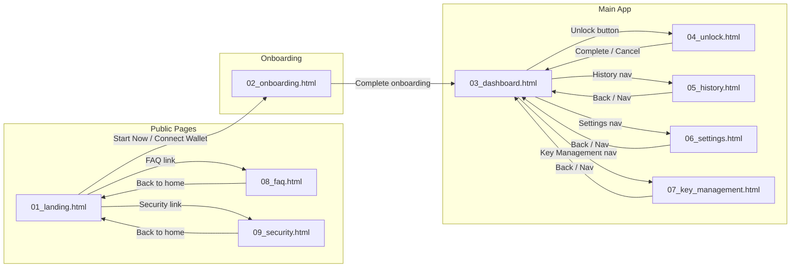

# Consumer App Design Manifest
## Phase 4 UI Integration - Design Assets

> **Version**: 1.4  
> **Date**: 2026-01-07  
> **Status**: Phase 1 MVP Complete + P2 Screens Added ✅

---

## 📁 File Structure

```
docs_new/01_phase/04_phase4/01_design/system_01_consumer/
├── README.md
├── DESIGN_BRIEF_CONSUMER_APP.md
├── DESIGN_MANIFEST.md              ← This file
├── PIR_CONSUMER.md                 ← Design PIR Report
└── wip/
    └── mocks/
        ├── 01_landing.html         ← Landing Page + Features + How It Works (リンク修正済み)
        ├── 02_onboarding.html      ← Wallet Connect + Key Gen + Backup + Ready
        ├── 03_dashboard.html       ← Dashboard + Lock Input + Lock Confirmation
        ├── 04_unlock.html          ← Unlock Select + Method + Sign + TimeLock + Complete
        ├── 05_history.html         ← Transaction History (NEW)
        ├── 06_settings.html        ← Settings Page (NEW)
        ├── 07_key_management.html  ← Key Management (NEW)
        ├── 08_faq.html             ← FAQ Page (NEW)
        └── 09_security.html        ← Security Explainer (NEW)
```

---

## 📊 Screen Coverage Matrix

| # | Screen | File | Status | Notes |
|---|--------|------|:------:|-------|
| **Public Pages** |||||
| 1-1 | Landing Page | 01_landing.html | ✅ | リンク修正、Cookie設定モーダル追加 |
| 1-2 | Features | 01_landing.html | ✅ | |
| 1-3 | How It Works | 01_landing.html | ✅ | |
| 1-4 | Security Explainer | 09_security.html | ✅ | NEW - P2完了 |
| 1-5 | FAQ | 08_faq.html | ✅ | NEW - P2完了 |
| **Onboarding** |||||
| 1-6 | Wallet Connect | 02_onboarding.html | ✅ | |
| 1-7 | Key Generation | 02_onboarding.html | ✅ | |
| 1-8 | Backup Instructions | 02_onboarding.html | ✅ | |
| 1-9 | Ready | 02_onboarding.html | ✅ | |
| **Main App** |||||
| 1-10 | Dashboard | 03_dashboard.html | ✅ | |
| 1-11 | Lock Input | 03_dashboard.html | ✅ | |
| 1-12 | Lock Confirmation | 03_dashboard.html | ✅ | |
| 1-13 | Lock Processing | - | ⬜ | P2 |
| 1-14 | Lock Success | - | ⬜ | P2 |
| **Unlock Flow** |||||
| 1-15 | Unlock Select | 04_unlock.html | ✅ | |
| 1-16 | Unlock Method | 04_unlock.html | ✅ | |
| 1-17 | Dilithium Sign | 04_unlock.html | ✅ | |
| 1-18 | Prover Waiting | - | ⬜ | P2 |
| 1-19 | Emergency Bond | 04_unlock.html | ✅ | |
| 1-20 | Time Lock Countdown | 04_unlock.html | ✅ | |
| 1-21 | Unlock Complete | 04_unlock.html | ✅ | |
| **Supporting Pages** |||||
| 1-22 | History | 05_history.html | ✅ | NEW - P2完了 |
| 1-23 | Emergency Complete | - | ⬜ | P2 |
| 1-24 | Settings | 06_settings.html | ✅ | NEW - P2完了 |
| 1-25 | Key Management | 07_key_management.html | ✅ | NEW - P2完了 |

**Coverage: 17/25 screens (68%)** ⬆️ +5 screens

---

## 🔀 Screen Flow (画面遷移図) 🆕

> QA Auditor が導通確認に使用します。全てのリンクがこの図と一致すること。



---

## 🔗 Link Validation Table 🆕

> 全ての `<a>` と主要 `<button>` の遷移先を検証

### 01_landing.html

| Element | Target | Status | Notes |
|---------|--------|:------:|-------|
| Hero CTA "Start Now" | 02_onboarding.html | ✅ | |
| Hero CTA "Learn More" | #how-it-works | ✅ | 同一ページ内 |
| Nav "FAQ" | 08_faq.html | ✅ | |
| Nav "Security" | 09_security.html | ✅ | |
| Footer "Terms" | # | ⚠️ | TODO: 利用規約ページ |
| Footer "Privacy" | # | ⚠️ | TODO: プライバシーページ |
| Cookie Modal | JavaScript | ✅ | openCookieModal() |

### 02_onboarding.html

| Element | Target | Status | Notes |
|---------|--------|:------:|-------|
| Step 4 "Go to Dashboard" | 03_dashboard.html | ✅ | |
| Back button (各ステップ) | JavaScript | ✅ | prevStep() |

### 03_dashboard.html

| Element | Target | Status | Notes |
|---------|--------|:------:|-------|
| Nav "Dashboard" | # | ✅ | 現在のページ |
| Nav "History" | 05_history.html | ✅ | |
| Nav "Settings" | 06_settings.html | ✅ | |
| "Unlock" button | 04_unlock.html | ✅ | |
| "Lock Assets" button | JavaScript | ✅ | openLockModal() |

### 04_unlock.html

| Element | Target | Status | Notes |
|---------|--------|:------:|-------|
| Back to Dashboard | 03_dashboard.html | ✅ | |
| Cancel button | 03_dashboard.html | ✅ | |
| Complete → Dashboard | 03_dashboard.html | ✅ | |

### 05_history.html

| Element | Target | Status | Notes |
|---------|--------|:------:|-------|
| Nav links | 各ページ | ✅ | |
| CSV Export | JavaScript | ✅ | exportCSV() |

### 06_settings.html

| Element | Target | Status | Notes |
|---------|--------|:------:|-------|
| Nav links | 各ページ | ✅ | |
| Toggle switches | JavaScript | ✅ | |

### 07_key_management.html

| Element | Target | Status | Notes |
|---------|--------|:------:|-------|
| Nav links | 各ページ | ✅ | |
| "Backup" button | JavaScript | ✅ | openBackupModal() |
| "Reveal Key" button | JavaScript | ✅ | revealKey() |

### 08_faq.html / 09_security.html

| Element | Target | Status | Notes |
|---------|--------|:------:|-------|
| "Back to Home" | 01_landing.html | ✅ | |
| Nav links | 各ページ | ✅ | |

---

## 🎨 Design System Compliance

| Attribute | Value | Status |
|-----------|-------|:------:|
| Primary Color | Hinomaru Red (#BC002D) | ✅ |
| Secondary Color | Premium Gold (#C9A962) | ✅ |
| Background | Dark (#0A0A0C) | ✅ |
| Typography - Display | Plus Jakarta Sans | ✅ |
| Typography - Japanese | Noto Sans JP | ✅ |
| Typography - Mono | DM Mono | ✅ |
| Breakpoint - Tablet | 768px | ✅ |
| Breakpoint - Mobile | 480px | ✅ |
| Touch Target | 44px minimum | ✅ |
| Reduced Motion | @media support | ✅ |

---

## 🔗 File Links (Absolute Paths)

| File | Size | Full Path |
|------|------|----------|
| 01_landing.html | ~44KB | `docs_new/01_phase/04_phase4/01_design/system_01_consumer/wip/mocks/01_landing.html` |
| 02_onboarding.html | ~25KB | `docs_new/01_phase/04_phase4/01_design/system_01_consumer/wip/mocks/02_onboarding.html` |
| 03_dashboard.html | ~29KB | `docs_new/01_phase/04_phase4/01_design/system_01_consumer/wip/mocks/03_dashboard.html` |
| 04_unlock.html | ~33KB | `docs_new/01_phase/04_phase4/01_design/system_01_consumer/wip/mocks/04_unlock.html` |
| 05_history.html | ~18KB | `docs_new/01_phase/04_phase4/01_design/system_01_consumer/wip/mocks/05_history.html` |
| 06_settings.html | ~14KB | `docs_new/01_phase/04_phase4/01_design/system_01_consumer/wip/mocks/06_settings.html` |
| 07_key_management.html | ~20KB | `docs_new/01_phase/04_phase4/01_design/system_01_consumer/wip/mocks/07_key_management.html` |
| 08_faq.html | ~16KB | `docs_new/01_phase/04_phase4/01_design/system_01_consumer/wip/mocks/08_faq.html` |
| 09_security.html | ~15KB | `docs_new/01_phase/04_phase4/01_design/system_01_consumer/wip/mocks/09_security.html` |

---

## 📝 Implementation Notes

### Key Features Implemented

1. **Hinomaru Animation**
   - Orbital gold ring with rotating particles
   - Pulsing red center with glow effect
   - CSS-only implementation

2. **Time Lock Progress**
   - SVG circular progress indicator
   - Real-time countdown simulation
   - Gradient stroke (Hinomaru → Gold)

3. **Bond Calculation Display**
   - Visual formula: `MAX(0.5 ETH, amount × 5%)`
   - Dynamic calculation based on selected lock

4. **Responsive Navigation**
   - Desktop: Horizontal pill navigation
   - Mobile: Bottom tab bar with icons

5. **Cookie Settings Modal** (NEW in v1.3)
   - Full modal implementation
   - Toggle switches for analytics/marketing
   - Save/reject functionality

6. **Transaction History** (NEW in v1.3)
   - Filter by type (Lock/Unlock/Pending/Emergency)
   - Stats summary row
   - CSV export button

7. **Key Management** (NEW in v1.3)
   - Backup modal with step-by-step guide
   - Secret key reveal with confirmation
   - Copy functionality

### Accessibility Features

- Focus states on all interactive elements
- Color contrast ratios meet WCAG AA
- Reduced motion support via media query
- Minimum 44px touch targets

---

## 📋 PIR Fix Log (v1.2 → v1.3)

### v1.2 PIR Fixes ✅
| PIR# | File | 修正内容 | Status |
|------|------|---------|:------:|
| #1-#9 | Various | Legal/UX fixes | ✅ Complete |

### v1.3 New Screens ✅
| Screen | File | 内容 | Status |
|--------|------|------|:------:|
| History | 05_history.html | 取引履歴、フィルター、統計 | ✅ |
| Settings | 06_settings.html | 設定画面、トグルスイッチ | ✅ |
| Key Management | 07_key_management.html | 鍵管理、バックアップ、表示 | ✅ |
| FAQ | 08_faq.html | FAQ、カテゴリフィルター、検索 | ✅ |
| Security | 09_security.html | セキュリティ説明、比較表 | ✅ |

### v1.3 Link Fixes ✅
| File | 修正内容 | Status |
|------|---------|:------:|
| 01_landing.html | Hero CTAs → 02_onboarding.html | ✅ |
| 01_landing.html | Nav links → FAQ/Security pages | ✅ |
| 01_landing.html | Mobile menu implementation | ✅ |
| 01_landing.html | Cookie settings modal | ✅ |
| 01_landing.html | Footer links → proper pages | ✅ |

### v1.4 QA Auditor準拠 ✅
| 項目 | 内容 | Status |
|------|------|:------:|
| Screen Flow図 | Mermaid遷移図追加 | ✅ |
| Link Validation Table | 全ファイルのリンク検証表追加 | ✅ |
| 既知のTODO | Footer Terms/Privacy（⚠️マーク） | 📝 |

---

## 🔜 Next Steps

1. **Remaining P2 Screens**
   - Lock Processing/Success states
   - Prover Waiting state
   - Emergency Complete state

2. **Footer Links**
   - Terms of Service page
   - Privacy Policy page

3. **Integration Testing**
   - Cross-page navigation verification
   - Mobile responsiveness check
   - Accessibility audit

4. **Implementation Handoff**
   - React component extraction
   - CSS variable documentation
   - Animation specifications

---

## Document History

| Version | Date | Author | Changes |
|---------|------|--------|---------|
| 1.0 | 2026-01-06 | Claude | Initial manifest with Phase 1 MVP |
| 1.1 | 2026-01-06 | Claude | Consolidated to system_01_consumer, added absolute paths |
| 1.2 | 2026-01-06 | Claude | PIR修正完了（全9件）、Fix Log追加 |
| 1.3 | 2026-01-06 | Claude | P2画面5件追加（History/Settings/Key/FAQ/Security）、リンク修正 |
| 1.4 | 2026-01-07 | Claude | QA Auditor準拠: Screen Flow図、Link Validation Table追加 |
