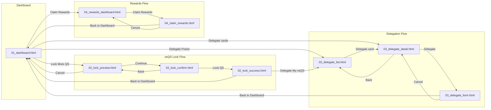

# Token Hub Design Manifest
## Phase 4 UI Integration - Design Assets

> **Version**: 1.1  
> **Date**: 2026-01-10  
> **Status**: 🟢 PIR Ready

---

## Overview

- **System**: Token Hub
- **System ID**: 02
- **Directory**: system_02_token_hub
- **Created**: 2026-01-08
- **Last Updated**: 2026-01-10
- **Design System**: Premium Japan v1.0 (UI_DESIGN_GUIDELINES.md)

---

## 📁 File Structure

```
docs_new/01_phase/04_phase4/01_design/system_02_token_hub/
├── README.md
├── DESIGN_BRIEF_token_hub.md
├── DESIGN_MANIFEST.md              ← This file
└── wip/
    └── mocks/
        ├── 01_dashboard.html
        ├── 02_lock_preview.html
        ├── 02_lock_confirm.html
        ├── 02_lock_success.html
        ├── 03_delegate_list.html
        ├── 03_delegate_detail.html
        ├── 03_delegate_form.html
        ├── 04_rewards_dashboard.html
        └── 04_claim_rewards.html
```

---

## 📊 Screen Coverage Matrix

| # | Screen | File | Status | Notes |
|---|--------|------|:------:|-------|
| **Dashboard** |||||
| 2-1 | Token Hub Dashboard | 01_dashboard.html | ✅ | QS/veQS残高、投票力 |
| **veQS Lock** |||||
| 2-2 | Lock Preview | 02_lock_preview.html | ✅ | 投票力計算プレビュー |
| 2-3 | Lock Confirm | 02_lock_confirm.html | ✅ | 最終確認 |
| 2-4 | Lock Success | 02_lock_success.html | ✅ | 完了画面 |
| **Delegation** |||||
| 2-5 | Delegate List | 03_delegate_list.html | ✅ | Delegate一覧 |
| 2-6 | Delegate Detail | 03_delegate_detail.html | ✅ | Delegate詳細 |
| 2-7 | Delegate Form | 03_delegate_form.html | ✅ | 委任実行 |
| **Rewards** |||||
| 2-8 | Rewards Dashboard | 04_rewards_dashboard.html | ✅ | 報酬サマリー |
| 2-9 | Claim Rewards | 04_claim_rewards.html | ✅ | 報酬請求 |

**Coverage: 9 screens / 18 total (P0 MVP: 50%)**

---

## 🔀 Screen Flow (画面遷移図)

> 10_design_pir.md の QA Auditor が導通確認に使用。全てのリンクがこの図と一致すること。



---

## 🔗 Link Validation Table

> 全ての `<a>` と主要 `<button>` の遷移先を記録

### Global Navigation (All Pages)

| From | Element | To | Status |
|------|---------|-----|:------:|
| All pages | Logo | 01_dashboard.html | ✅ |
| All pages | Nav - Dashboard | 01_dashboard.html | ✅ |
| All pages | Nav - Lock | 02_lock_preview.html | ✅ |
| All pages | Nav - Delegate | 03_delegate_list.html | ✅ |
| All pages | Nav - Rewards | 04_rewards_dashboard.html | ✅ |

### 01_dashboard.html

| From | Element | To | Status |
|------|---------|-----|:------:|
| 01_dashboard.html | "Lock More QS" button | 02_lock_preview.html | ✅ |
| 01_dashboard.html | "Extend Lock" button | 02_lock_preview.html | ✅ |
| 01_dashboard.html | "Delegate Power" button | 03_delegate_list.html | ✅ |
| 01_dashboard.html | "Claim Rewards" button | 04_rewards_dashboard.html | ✅ |
| 01_dashboard.html | Delegate cards | 03_delegate_detail.html | ✅ |

### 02_lock_preview.html

| From | Element | To | Status |
|------|---------|-----|:------:|
| 02_lock_preview.html | "Continue to Preview" | 02_lock_confirm.html | ✅ |
| 02_lock_preview.html | "Cancel" | 01_dashboard.html | ✅ |
| 02_lock_preview.html | Quick amount buttons | JavaScript setAmount() | ✅ |
| 02_lock_preview.html | Period slider | JavaScript updatePeriod() | ✅ |

### 02_lock_confirm.html

| From | Element | To | Status |
|------|---------|-----|:------:|
| 02_lock_confirm.html | "Back to Edit" | 02_lock_preview.html | ✅ |
| 02_lock_confirm.html | "Lock QS" | 02_lock_success.html | ✅ |
| 02_lock_confirm.html | "Cancel" | 02_lock_preview.html | ✅ |
| 02_lock_confirm.html | Checkbox items | JavaScript toggleCheck() | ✅ |

### 02_lock_success.html

| From | Element | To | Status |
|------|---------|-----|:------:|
| 02_lock_success.html | "Back to Dashboard" | 01_dashboard.html | ✅ |
| 02_lock_success.html | "Delegate My veQS" | 03_delegate_list.html | ✅ |
| 02_lock_success.html | Transaction link | External (Etherscan) | ✅ |
| 02_lock_success.html | Share buttons | External (Twitter, etc.) | ✅ |

### 03_delegate_list.html

| From | Element | To | Status |
|------|---------|-----|:------:|
| 03_delegate_list.html | Delegate cards | 03_delegate_detail.html | ✅ |
| 03_delegate_list.html | Filter buttons | JavaScript (filter) | ✅ |
| 03_delegate_list.html | Search | JavaScript (search) | ✅ |

### 03_delegate_detail.html

| From | Element | To | Status |
|------|---------|-----|:------:|
| 03_delegate_detail.html | "Back to Delegates" | 03_delegate_list.html | ✅ |
| 03_delegate_detail.html | "Delegate" button | 03_delegate_form.html | ✅ |
| 03_delegate_detail.html | Quick amount buttons | JavaScript setAmount() | ✅ |
| 03_delegate_detail.html | Link badges | External links | ✅ |

### 03_delegate_form.html

| From | Element | To | Status |
|------|---------|-----|:------:|
| 03_delegate_form.html | "Cancel" | 03_delegate_detail.html | ✅ |
| 03_delegate_form.html | "Confirm Delegation" | JavaScript confirmDelegate() → Success | ✅ |
| 03_delegate_form.html | "Back to Dashboard" | 01_dashboard.html | ✅ |

### 04_rewards_dashboard.html

| From | Element | To | Status |
|------|---------|-----|:------:|
| 04_rewards_dashboard.html | "Claim Rewards" | 04_claim_rewards.html | ✅ |
| 04_rewards_dashboard.html | History items | JavaScript (expandable) | ✅ |

### 04_claim_rewards.html

| From | Element | To | Status |
|------|---------|-----|:------:|
| 04_claim_rewards.html | "Cancel" | 04_rewards_dashboard.html | ✅ |
| 04_claim_rewards.html | "Claim" button | JavaScript claimRewards() → Success | ✅ |
| 04_claim_rewards.html | "Back to Dashboard" | 01_dashboard.html | ✅ |
| 04_claim_rewards.html | Transaction link | External (Etherscan) | ✅ |

---

## ✅ Link Validation Summary

| Status | Count | Description |
|:------:|:-----:|-------------|
| ✅ | 42 | Valid internal links |
| ✅ | 6 | Valid external links (Etherscan, Twitter) |
| ✅ | 15 | JavaScript interactions |
| ❌ | 0 | Placeholder links (`href="#"`) |

---

## 🎨 Design System Compliance

| Attribute | Value | Status |
|-----------|-------|:------:|
| Primary Color | Hinomaru Red (#BC002D) | ✅ |
| Secondary Color | Premium Gold (#C9A962) | ✅ |
| Background | Dark (#0A0A0C) | ✅ |
| Typography - Display | Plus Jakarta Sans | ✅ |
| Typography - Japanese | Noto Sans JP | ✅ |
| Typography - Mono | DM Mono | ✅ |
| Breakpoint - Tablet | 768px | ✅ |
| Breakpoint - Mobile | 480px | ✅ |
| Touch Target | 44px minimum | ✅ |
| Reduced Motion | @media support | ✅ |

---

## 🔗 File Links (Absolute Paths)

| File | Size | Full Path |
|------|-----:|----------|
| 01_dashboard.html | 25KB | `wip/mocks/01_dashboard.html` |
| 02_lock_preview.html | 17KB | `wip/mocks/02_lock_preview.html` |
| 02_lock_confirm.html | 13KB | `wip/mocks/02_lock_confirm.html` |
| 02_lock_success.html | 12KB | `wip/mocks/02_lock_success.html` |
| 03_delegate_list.html | 24KB | `wip/mocks/03_delegate_list.html` |
| 03_delegate_detail.html | 18KB | `wip/mocks/03_delegate_detail.html` |
| 03_delegate_form.html | 12KB | `wip/mocks/03_delegate_form.html` |
| 04_rewards_dashboard.html | 19KB | `wip/mocks/04_rewards_dashboard.html` |
| 04_claim_rewards.html | 13KB | `wip/mocks/04_claim_rewards.html` |
| **Total** | **~153KB** | **9 files** |

---

## 🔒 veToken Economics Reference

Formula: `veQS = QS × (lock_period / 4_years)`

| Lock Period | Multiplier | Example (5,000 QS) |
|-------------|------------|-------------------|
| 1 week | 0.48% | 24 veQS |
| 3 months | 6.25% | 312 veQS |
| 6 months | 12.5% | 625 veQS |
| 1 year | 25% | 1,250 veQS |
| 2 years | 50% | 2,500 veQS |
| 4 years | 100% | 5,000 veQS |

---

## Change Log

| Date | Version | Changes |
|------|---------|---------|
| 2026-01-08 | 1.0 | Initial manifest with 9 P0 screens |
| 2026-01-10 | 1.1 | Structure normalization: moved to root, added mermaid Screen Flow, standardized Link Validation Table |

---

**END OF MANIFEST**
